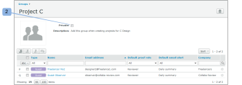

# Gruppen mit [!DNL Workfront Proof] als privat festlegen

>[!IMPORTANT]
>
>Dieser Artikel bezieht sich auf Funktionen im eigenständigen [!DNL Workfront Proof]. Informationen zu Proofing in [!DNL Adobe Workfront] finden Sie unter [Proofing](../../../review-and-approve-work/proofing/proofing.md).

Wenn Sie Ihre Gruppe als privat festlegen, können nur Sie die Gruppe anzeigen, verwenden, bearbeiten oder löschen. Wenn die Gruppe nicht privat ist, können alle Benutzer in Ihrem Konto die Gruppe sehen und verwenden.

## Einrichten einer neuen Gruppe als privat

So machen Sie eine neue Gruppe privat:

1. Navigieren Sie **[!UICONTROL Gruppen]** auf der linken Bildschirmseite.
1. Wählen Sie die **[!UICONTROL Privat]** auf der Seite [!UICONTROL Neue Gruppe] beim Einrichten der Gruppe aus. (1)

## Vorhandene Gruppe in „Privat“ umwandeln

So machen Sie eine vorhandene Gruppe privat:

1. Navigieren Sie **[!UICONTROL Gruppen]** auf der linken Bildschirmseite.
1. Aktivieren Sie die **[!UICONTROL Privat]** auf der Seite „Gruppendetails“. (2)

