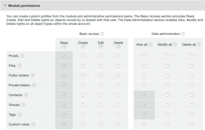

# Erstellen und Verwalten von benutzerdefinierten Profilen mithilfe von [!DNL Workfront Proof]

>[!IMPORTANT]
>
>Dieser Artikel bezieht sich auf Funktionen im eigenständigen [!DNL Workfront Proof]. Informationen zu Proofing in [!DNL Adobe Workfront] finden Sie unter [Proofing](../../../review-and-approve-work/proofing/proofing.md).

Rechnungsadministratoren und -administratoren können benutzerdefinierte Profile erstellen und verwalten, um festzulegen, was Benutzer im Konto Ihres Unternehmens und in den Kontoeinstellungen tun können.

Diese Funktion ist nur für Premium-Konten verfügbar.

## Modulberechtigungen {#module-permissions}

Mit Modulberechtigungen können Sie festlegen, welchen Zugriff Ihre Benutzer über ihre eigenen Elemente und über Elemente haben sollen, die anderen Benutzern im Konto gehören.

Im Abschnitt Grundlegender Zugriff wird festgelegt, ob Benutzer ihre eigenen Elemente im Konto lesen, erstellen, bearbeiten und löschen können.

Im [!UICONTROL Datenverwaltung] werden die Rechte festgelegt, die Benutzende gegenüber Elementen haben, die anderen Benutzenden im Konto gehören.

In beiden Abschnitten können Sie Rechte für die folgenden Elemente im Konto gewähren:

* Korrekturabzüge
Weitere Informationen finden Sie unter [Erstellen von Korrekturabzügen in [!DNL Workfront Proof]](../../../workfront-proof/wp-work-proofsfiles/create-proofs-and-files/generate-proofs.md).

* Dateien
Weitere Informationen finden Sie unter [Hochladen von Dateien und Web-Inhalten in [!DNL Workfront Proof]](../../../workfront-proof/wp-work-proofsfiles/create-proofs-and-files/upload-files-web-content.md).

* Öffentliche Ordner
Weitere Informationen finden Sie unter [ zu Ordnerberechtigungen in  [!DNL Workfront Proof]](../../../workfront-proof/wp-work-proofsfiles/organize-your-work/folder-permissions.md).

* Private Ordner
Weitere Informationen finden Sie unter [ zu Ordnerberechtigungen in  [!DNL Workfront Proof]](../../../workfront-proof/wp-work-proofsfiles/organize-your-work/folder-permissions.md).

* Kontakte
Weitere Informationen finden Sie unter [Kontakte](https://support.workfront.com/hc/en-us/sections/115000920808-Contacts).

* Gruppen
Weitere Informationen finden Sie unter [Gruppen](https://support.workfront.com/hc/en-us/sections/115000920828-Groups).

* Tags
Weitere Informationen finden Sie unter [Erstellen und Verwalten von Tags in [!DNL Workfront Proof]](../../../workfront-proof/wp-work-proofsfiles/organize-your-work/create-and-manage-tags.md).

* Benutzerdefinierte Ansichten
Weitere Informationen finden Sie unter [Erstellen und Verwalten von benutzerdefinierten Ansichten in [!DNL Workfront Proof]](../../../workfront-proof/wp-work-proofsfiles/manage-your-work/create-and-manage-custom-views.md).

## Administratorberechtigungen {#administrative-permissions}

In diesem Abschnitt können Sie Ihren Benutzern Administratorberechtigungen erteilen. Einige Berechtigungen verknüpfen und aktivieren Sie bei Auswahl automatisch andere Berechtigungen, die zur Ausführung der Aufgabe erforderlich sind. Wenn Sie beispielsweise zulassen, dass der Benutzer Berechtigungsprofile verwaltet, wird auch automatisch die Verwaltung der Benutzer im Konto aktiviert.

Sie können die folgenden Berechtigungen erteilen:

* Kontoeinstellungen verwalten
Weitere Informationen finden Sie unter [Kontoeinstellungen](https://support.workfront.com/hc/en-us/sections/115000912147-Account-settings).

* Verwalten von Benutzern
Weitere Informationen finden Sie unter [Benutzer](https://support.workfront.com/hc/en-us/sections/115000911887-Users).

* Entscheidungen verwalten
Weitere Informationen finden Sie [Entscheidung über einen Korrekturabzug in der Korrekturabzugsansicht treffen](../../../review-and-approve-work/proofing/reviewing-proofs-within-workfront/make-a-decision-on-a-proof/make-decisions-on-proof.md).

* Verwalten von Partnern
Weitere Informationen finden Sie unter [Partner](https://support.workfront.com/hc/en-us/sections/115000912107-Partner-accounts).

* Apps verwalten
Weitere Informationen finden Sie unter [Integrationen](https://support.workfront.com/hc/en-us/categories/115000588707-Integrations).

* Verwalten benutzerdefinierter Felder
Weitere Informationen finden Sie unter [Erstellen und Verwalten benutzerdefinierter Felder in [!DNL Workfront Proof]](../../../workfront-proof/wp-acct-admin/account-settings/create-and-manage-custom-fields.md).

* Dropzone verwalten
Weitere Informationen finden Sie unter [Der Ablagebereich](../../../workfront-proof/wp-work-proofsfiles/create-proofs-and-files/dropzone.md).

* Verwalten eines erweiterten Workflows
Weitere Informationen finden Sie unter [Automatisierter Workflow - Übersicht](../../../review-and-approve-work/proofing/proofing-overview/automated-workflow.md).

* SSO verwalten
Weitere Informationen finden Sie [Single Sign-On in [!DNL Workfront Proof]](../../../workfront-proof/wp-acct-admin/managing-security/single-sign-on-overview.md).

* Kontoverlauf anzeigen
Weitere Informationen finden Sie [Grundlegendes zum  [!DNL Workfront Proof] -Aktivitäts-Audit-Protokoll](../../../workfront-proof/wp-work-proofsfiles/basic-features/activity-audit-trail.md).

* Anzeigen von Kontosicherungen
Weitere Informationen finden Sie unter [Sichern  [!DNL Workfront Proof]  Daten](../../../workfront-proof/wp-work-proofsfiles/organize-your-work/back-up-data.md).

* Abrechnungen verwalten
Weitere Informationen finden Sie unter [Verwalten Ihrer Abrechnung](https://support.workfront.com/hc/en-us/sections/115000912187-Managing-your-billing).

* Erstellen von Satellitenkonten
Weitere Informationen finden Sie unter [Konfigurieren eines Satellitenkontos in [!DNL Workfront Proof]](../../../workfront-proof/wp-acct-admin/satellite-accounts/configure-sat-acct-in-wp.md).

* Papierkorb leeren
Weitere Informationen finden Sie unter [Wiederherstellen und Leeren des Papierkorbs in [!DNL Workfront Proof]](../../../workfront-proof/wp-work-proofsfiles/manage-your-work/restore-and-empty-trash.md).

* Berechtigungsprofile verwalten
Weitere Informationen finden Sie unter [Profile für Korrekturabzugsberechtigungen in [!DNL Workfront Proof]](../../../workfront-proof/wp-acct-admin/account-settings/proof-perm-profiles-in-wp.md).

* Analytics anzeigen

## Erstellen eines neuen benutzerdefinierten Profils

1. Navigieren Sie **[!UICONTROL Kontoeinstellungen]** und klicken Sie dann auf die Registerkarte **[!UICONTROL Profile]**.

1. Klicken Sie **[!UICONTROL Neues Profil erstellen]**.

1. Im Abschnitt **[!UICONTROL Profildetails]**:

   1. Geben **[!UICONTROL im Feld]** einen Namen für das benutzerdefinierte Profil an.
   1. Wählen Sie **[!UICONTROL Profil aktivieren]** aus. 

1. Im Abschnitt **[!UICONTROL Modulberechtigungen]**:

   1. Wählen Sie Berechtigungen für **Basiszugriff** aus.
   1. **Datenverwaltung**. Weitere Informationen finden Sie unter [Modulberechtigungen](#module-permissions)

1. Wählen Sie **[!UICONTROL Abschnitt]** Administratorberechtigungen“ Berechtigungen für Verwaltungsfunktionen aus.

   Weitere Informationen finden Sie unter [Administratorberechtigungen](#administrative-permissions).

1. Klicken Sie **[!UICONTROL Erstellen]**.
Das neue Profil ist jetzt auf der Registerkarte **[!UICONTROL Benutzer]** verfügbar.

1. (Optional) Weisen Sie das neue Profil neuen und vorhandenen Benutzerkonten zu.
Weitere Informationen finden Sie unter [Profile für Korrekturabzugsberechtigungen in [!DNL Workfront Proof]](../../../workfront-proof/wp-acct-admin/account-settings/proof-perm-profiles-in-wp.md).

## Profile aktivieren und deaktivieren {#enabling-and-disabling-a-profile}

1. Navigieren Sie zu **[!UICONTROL Kontoeinstellungen]** und klicken Sie dann auf die Registerkarte **[!UICONTROL Profile]**.

1. Wählen Sie das Profil aus, das Sie aktivieren oder deaktivieren möchten.
oder
Um mehrere Profile gleichzeitig zu aktivieren oder zu deaktivieren, wählen Sie die Profile manuell aus oder wählen Sie **[!UICONTROL Name]** aus, um alle benutzerdefinierten Profile auszuwählen.
   

1. Klicken Sie auf das **[!UICONTROL Mehr]**-Dropdown-Menü und dann auf eine der folgenden Optionen, je nachdem, ob Sie das Profil aktivieren oder deaktivieren möchten:

   * **Profile aktivieren:** Das Profil wird aktiv und in den [!DNL Workfront Proof] Menüs sichtbar.
   * **Profile deaktivieren:** Ein Bestätigungsfeld wird angezeigt. Wählen Sie **[!UICONTROL Ja]** zur Bestätigung aus. Das Profil wird inaktiv und wird aus den [!DNL Workfront Proof] entfernt.

     >[!NOTE]
     >
     >Ein deaktiviertes Profil kann Benutzern im Konto nicht mehr zugewiesen werden. Wenn im Konto bereits Benutzer mit diesem Profil vorhanden sind, wählen Sie ein anderes Profil für diese Benutzer aus, bevor das Profil deaktiviert wird.

     

## Kopieren eines Profils

Erstellen Sie Kopien eines vorhandenen Profils, um mehrere Profile mit ähnlichen Berechtigungen einzurichten.

1. Navigieren Sie **[!UICONTROL Kontoeinstellungen]** und klicken Sie dann auf die Registerkarte **[!UICONTROL Profile]**.

1. Klicken Sie auf den Namen des Profils und dann auf die Schaltfläche **[!UICONTROL Profil kopieren]**.

   

   Das kopierte Profil wird jetzt in der Profilliste angezeigt. Er hat den ursprünglichen Profilnamen mit dem Wort „Kopieren“ davor.

   

1. (Optional) Informationen zum Aktivieren des kopierten Profils finden Sie unter [Aktivieren und Deaktivieren eines Profils](#enabling-and-disabling-a-profile).
1. (Optional) Informationen zum Bearbeiten des kopierten Profils finden Sie unter [ eines Profils](#editing-a-profile).

## Profil bearbeiten {#editing-a-profile}

Wenn Sie ein Profil bearbeiten, werden Aktualisierungen auf alle Benutzenden angewendet, denen dieses Profil derzeit zugewiesen ist.

1. Navigieren Sie zu **[!UICONTROL Kontoeinstellungen]** und klicken Sie dann auf die Registerkarte **[!UICONTROL Profile]**.

1. Klicken Sie auf den Namen des Profils, das Sie bearbeiten möchten.
1. Nehmen Sie die erforderlichen Änderungen am Namen oder an den Berechtigungen für das Profil vor. Diese Änderungen werden automatisch gespeichert und aktualisiert.
Weitere Informationen zu Berechtigungen finden Sie unter [Modulberechtigungen](#module-permissions) und [Administratorberechtigungen](#administrative-permissions).

>[!NOTE]
>
>Standardprofile für [!DNL Workfront Proof] sind in der Liste der Profile sichtbar, können jedoch nicht geändert werden.

## Löschen eines Profils

1. Navigieren Sie zu **[!UICONTROL Kontoeinstellungen]** und klicken Sie dann auf die Registerkarte **[!UICONTROL Profile]**.

1. Wählen Sie das/die Profil(e) aus, das/die Sie löschen möchten.
1. Klicken Sie oben **[!UICONTROL der Seite]** das Symbol „Papierkorb“.

   

1. Klicken **** im **[!UICONTROL Bestätigungsdialogfeld]** auf „Ja“.

1. Wenn das Profil einem Benutzer zugewiesen ist, wählen Sie im Dropdown-Menü des Dialogfelds ein anderes Profil aus, das diesem Benutzer zugewiesen werden soll. Klicken Sie **[!UICONTROL Ja]** zur Bestätigung.

   

>[!NOTE]
>
>Es ist nicht möglich, Standardprofile aus dem Konto zu löschen. Es ist möglich, Standardprofile zu deaktivieren, wenn Sie sie nicht in Ihrem Konto verwenden möchten.

Weitere Informationen zum Deaktivieren von Profilen finden Sie unter [Aktivieren und Deaktivieren eines Profils](#enabling-and-disabling-a-profile).
