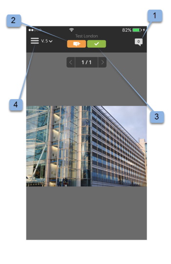
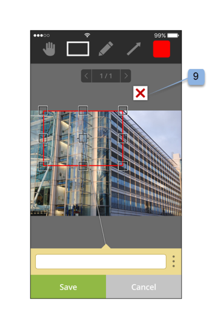
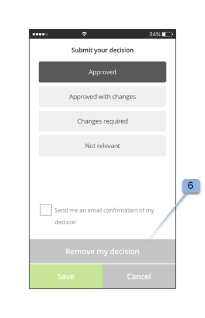

# Workfront-Proof-App

>[!IMPORTANT]
>
>Dieser Artikel bezieht sich auf die Funktionalität im eigenständigen Produkt [!DNL Workfront Proof]. Informationen zum Testen in [!DNL Adobe Workfront], siehe [Testversand](../../../review-and-approve-work/proofing/proofing.md).

Laden Sie die [!DNL Workfront Proof] Apps aus dem Apple App Store oder Google Store verwenden, um unabhängig von Ihrem Standort produktiv zu sein. Die [!DNL Workfront Proof] Das Programm verfügt über die folgenden Funktionen in iPhone und iPod Touch:

* Anzeigen, Überprüfen und Genehmigen von statischen und audiovisuellen Testsendungen
* Kommentare anzeigen, hinzufügen und beantworten
* Testsendungen über Ihr Dashboard und Ihre Ansichten verwalten

Sie müssen kein Benutzer von [!DNL Workfront Proof] (d. h. über eigene Anmeldedaten), um einen Testversand über die iOS-App zu überprüfen und zu genehmigen. Solange Sie die App auf Ihr iOS-Gerät herunterladen und über Ihre iOS-E-Mail-App auf Ihre persönliche URL zugreifen, können Sie sie unterwegs überprüfen und genehmigen.

## Geräteanforderungen

Erfordert iOS 7.0 oder höher. Android 4.0 und höher. Kompatibel mit iPhone, iPad und iPod touch.

## Herunterladen und Installieren des Programms

>[!IMPORTANT]
>
>Die mobile Workfront-Proof-App wird nicht mehr unterstützt und ist unverändert verfügbar.  Alle Probleme in der App werden nicht behoben.

Herunterladen [!DNL Workfront Proof] Mobile App direkt über [Apple App Store](https://itunes.apple.com/us/app/workfront-proof/id1030372728?mt=8) oder [Google Play Store](https://play.google.com/store/apps/details?id=com.proofhq.tabletapp).

Achten Sie bei iOS-Geräten darauf, die vorherigen [!DNL Workfront Proof] App für iOS-Geräte vor der Installation der neuen App.

Die [!DNL Workfront Proof] Das Programm erkennt automatisch, welchen Gerätetyp Sie verwenden. Wenn Sie die App auf Ihrem Tablet verwenden möchten, lesen Sie [[!DNL Workfront Proof] App für Tablets](../../../workfront-proof/wp-mobile/wp-mobile-apps/wp-mobile-app-tablet.md).

>[!NOTE]
>
>Aufgrund der Softwarebeschränkungen von Mobilgeräten ist es nicht möglich, SWF- oder Audiodateien wie MP3 auf iOS-Geräten zu überprüfen. Wenn Sie einen Testversand überprüfen möchten, der aus einer SWF-Datei oder einer Audiodatei auf einem Mobilgerät erstellt wurde, konvertieren Sie ihn vor dem Hochladen in das unterstützte Format [!DNL Workfront Proof].

## Erste Schritte mit der App

Sie müssen nicht [!DNL Workfront Proof] Benutzer verwenden, um die App zu verwenden. Installieren Sie einfach die App auf Ihrem Gerät und klicken Sie auf ein **[!UICONTROL Gehe zu Testversand]** in Ihrer E-Mail-Benachrichtigung. Die App startet automatisch und lädt den Testversand.

Wenn Sie [!DNL Workfront Proof] -Benutzer können Sie sich bei der App anmelden, bevor Sie Testsendungen öffnen. Mit dem Programm können Sie alle für Sie freigegebenen Testsendungen durchsuchen und einfach zwischen ihnen wechseln.

1. Öffnen Sie die App.
1. Geben Sie Ihre E-Mail-Adresse und Ihr Kennwort ein und tippen Sie auf **[!UICONTROL Anmelden]**.

   Oder

   Verwenden Sie Single Sign-On, sofern es auf Ihrer [!DNL Workfront Proof] -Konto.

   Sie können die **[!UICONTROL Kennwort vergessen]** -Option, wenn Sie sich nicht an Ihr Passwort erinnern.

## Das Dashboard

Nachdem Sie sich bei Ihrem [!DNL Workfront Proof] -Konto, wird das Dashboard angezeigt. Hier können Sie einfach auf Ihre Testsendungen zugreifen. Sie können eine der verfügbaren Ansichten, Meine Testsendungen und Alle Testsendungen öffnen. Alternativ können Sie auf den Namen eines Ihrer letzten Testsendungen tippen, um direkt zum Testversand-Viewer zu gelangen.

Standardmäßig öffnet das Dashboard die Ansicht Testsendungen insgesamt . Diese Ansicht zeigt alle Testsendungen, die Sie besitzen oder die für Sie freigegeben wurden. Sie können die Ansicht ändern, indem Sie auf die Leiste oben auf der Seite tippen, um ein Dropdown-Menü mit dem [!UICONTROL Einschaltzeit], [!UICONTROL Risiko], [!UICONTROL Verspätet] und [!UICONTROL Zuletzt] Optionen. Um einen Testversand aus einer beliebigen Ansicht zu öffnen, scrollen Sie in der Liste nach unten, um den gewünschten Testversand zu finden, und tippen Sie dann auf seinen Namen, um zum Testversand-Viewer zu wechseln.

| **Einschaltzeitansicht** | Zeigt Ihnen alle aktiven Testsendungen in Ihrem Konto an, zu denen Sie berechtigt sind und die keine Frist haben oder mehr als 24 Stunden bis zum Ablauf der Frist haben. |
|---|---|
| **Risikoansicht** | Zeigt alle Testsendungen an, deren Frist weniger als 24 Stunden beträgt. |
| **Verspätete Ansicht** | Listet alle Testsendungen auf, bei denen nicht alle Aktionen abgeschlossen sind, für die die Frist bereits überschritten wurde. |
| **Letzte Ansicht** | Umfasst die Testsendungen, auf die Sie vor Kurzem zugegriffen haben und die Ihnen gehören, die Berechtigungen zum Anzeigen gemäß Ihren Profilberechtigungen besitzen und die für Sie freigegeben wurden. Diese Ansicht zeigt nur die Testsendungen an, die Sie selbst geöffnet haben (entweder über die [!DNL Workfront Proof] Betrachter oder über die Seite &quot;Testversand-Details&quot;). |
| **Email-Link** | Um einen Testversand aus Ihrer E-Mail zu öffnen, öffnen Sie einfach die E-Mail in Ihrer E-Mail-App und klicken Sie auf die Schaltfläche [!UICONTROL Testversand durchführen] Button-Link in der E-Mail (1) und Sie gelangen zum Testversand im [!DNL Workfront Proof] App. |

{style=&quot;table-layout:auto&quot;}

## Überprüfen eines statischen Testversands in der App

Wenn Sie einen Testversand in der App öffnen, haben Sie folgende Möglichkeiten:

* Lesen und beantworten Sie Kommentare anderer validierungsverantwortlicher Benutzer (1 - die Ziffer, die im Symbol angezeigt wird, gibt die Anzahl der Kommentare an, die auf dem Testversand zurückgelassen wurden. Wenn keine Kommentare auf dem Testversand verblieben sind, zeigt diese Schaltfläche 0 an und wird ausgegraut.)
* Fügen Sie Kommentare und Markups hinzu (2).
* Die Sichtbarkeit der Schaltfläche Kommentar und Entscheidung hängt von Ihrer Testversandrolle ab.
* Entscheiden Sie (3).
* Gehen Sie zum Menü (4).
* Skalieren Sie den Testversand, indem Sie den Bildschirm drücken.
   

## Kommentare und Antworten hinzufügen

1. Wenn Sie einen Testversand geöffnet haben, tippen Sie auf die Schaltfläche **[!UICONTROL Kommentar hinzufügen]** Schaltfläche (1).

   

1. Geben Sie Ihren Kommentar ein (2).

   

1. Klicken Sie auf **[!UICONTROL Speichern]**.

## Kommentare lesen und beantworten

1. Öffnen Sie den Testversand, tippen Sie auf das Symbol &quot;Legende&quot;in der rechten oberen Ecke, um die Kommentarliste (1) anzuzeigen und den Kommentar auszuwählen, den Sie überprüfen möchten.
1. Tippen Sie auf die Nadel, um den zugehörigen Kommentar zu öffnen (2).

   

1. Führen Sie einen der folgenden Schritte aus:

   * Um auf einen Kommentar zu antworten, tippen Sie auf die **[!UICONTROL Antwort]** Schaltfläche (3).
   * Um zum Testversand-Bild zurückzukehren, tippen Sie auf die Schaltfläche [!UICONTROL Callout] Symbol.
   * Um den vollständigen Kommentar und seine Antworten anzuzeigen, tippen Sie auf den Kommentar selbst.

      

   * So wenden Sie eine Aktion auf einen Kommentar an:

      1. Öffnen Sie einen Kommentar.
      1. Tippen **[!UICONTROL Antwort]**.
      1. Öffnen Sie die [!UICONTROL Aktionen] rechts neben dem Textfeld (1).
      1. Tippen **[!UICONTROL Aktion hinzufügen]** Absatz 2.

         

         Weitere Informationen zu Aktionen finden Sie unter [Verwenden von Aktionen für Testversand-Kommentare](../../../review-and-approve-work/proofing/reviewing-proofs-within-workfront/comment-on-a-proof/use-actions-on-comments-in-viewer.md).

## Markierungen hinzufügen

Sie können ein Markup hinzufügen (z. B. ein Feld, das einen Bereich auf dem Testversand markiert) und einen Kommentar eingeben, der an das Markup angehängt ist. Sie können auch einen Kommentar abgeben, ohne eine Aufzählung hinzuzufügen. Und Sie können einem einzelnen Kommentar mehrere Markierungen hinzufügen.

1. Tippen Sie bei einem von Ihnen geöffneten Testversand auf **Kommentar hinzufügen** Absatz 1.

   

1. Wählen Sie zwischen [!UICONTROL Pan-Modus] Absatz 2 [!UICONTROL Rechteck-Werkzeug] Absatz 3 [!UICONTROL Freihand-Zeichnung] Absatz 4 oder [!UICONTROL Pfeil] Tool (5).

   Sie können auch die Linienfarbe des Markups (6) ändern.

1. Um eine Markierung auf den Testversand zu zeichnen, berühren Sie den Bildschirm und bewegen Sie dann den Finger über den Testversand.

   Sie müssen keinen Text hinzufügen, um Ihr Markup zu speichern (7).

1. Tippen **[!UICONTROL Abbrechen]** (8) , wenn Sie Ihr Markup verwerfen möchten.

   

   Wenn Sie einen Bereich auf dem Testversand markieren, wird automatisch das Kommentarfeld geöffnet. Sie können das erstellte Markup entfernen, indem Sie auf das Kreuz neben der Markup-Form (9) tippen.

   

## Entscheidungen über einen Testversand treffen

1. Öffnen Sie den Testversand im Proof-Viewer und tippen Sie auf [!UICONTROL Entscheidung] Schaltfläche (1).

   

1. Tippen Sie auf die Entscheidung, die Sie übermitteln möchten (2).
1. Tippen **[!UICONTROL Speichern]** um Ihre Entscheidung zu übermitteln.

   

   >[!NOTE]
   >
   >* Wenn für das Konto, in dem der Testversand erstellt wurde, eine Popup-Nachricht zur Entscheidung festgelegt wurde, wird diese ebenfalls in der iOS-App angezeigt, wenn über einen Testversand entschieden wird.
   >* Wenn Sie Entscheidungsgründe einrichten, werden diese im [!UICONTROL Entscheidung übermitteln] angezeigt, den Sie auswählen können.

   Wenn Sie bereits eine Entscheidung eingereicht haben und sie ändern oder entfernen möchten, können Sie dies einfach tun. Nach Vorlage einer Entscheidung wird eine neue Option **[!UICONTROL Meine Entscheidung entfernen]** (6) wird auf der [!UICONTROL Entscheidung übermitteln] angezeigt.

   

## Prüfen eines Audio- oder Videotests in der App

Die Überprüfung eines Audiomotivs in der iOS-App ist so einfach wie die Überprüfung einer statischen Datei:

1. Tippen Sie auf die [!UICONTROL play/pause] -Schaltfläche, um das Video wiederzugeben oder anzuhalten (1).
1. Um durch das Video zu navigieren, tippen Sie auf das [!UICONTROL Navigation] bar (2).
1. Um einen Kommentar zu hinterlassen, tippen Sie auf **[!UICONTROL Kommentar]** (3), folgen Sie dann den oben beschriebenen Anweisungen.

   Alle Kommentare oder Markierungen, die auf dem Testversand verbleiben, werden durch Pins entlang der Navigationsleiste (4) gekennzeichnet.

1. Wenn Sie die Kommentare zum Testversand lesen möchten, tippen Sie auf die Schaltfläche **[!UICONTROL Kommentare]** (5), folgen Sie dann den oben beschriebenen Anweisungen.
1. Um eine Entscheidung zu treffen, tippen Sie auf **[!UICONTROL Entscheidung]** (6) und folgen Sie dann den oben stehenden Anweisungen.

   
