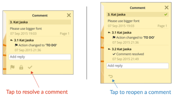

# [!DNL Workfront Proof] App für Tablets

>[!IMPORTANT]
>
>Dieser Artikel bezieht sich auf die Funktionalität im eigenständigen Produkt [!DNL Workfront Proof]. Informationen zum Testen in [!DNL Adobe Workfront], siehe [Testing](../../../review-and-approve-work/proofing/proofing.md).

Die [!DNL Workfront Proof] Mit dem Tablet-Programm können Sie Ihre Testsendungen bequem überprüfen und genehmigen, wenn Sie unterwegs sind. Die App steht allen Benutzern zum Download zur Verfügung. Sie müssen kein [!DNL Workfront Proof] -Benutzer, um Testsendungen auf Ihrem Tablet oder Telefon überprüfen zu können.

Sie können einfach auf die [!UICONTROL Testversand durchführen] in der E-Mail-Benachrichtigung, die sie erhalten, um den Testversand in der App zu öffnen.

[!DNL Workfront Proof] -Benutzer können sich bei der App anmelden und das Dashboard verwenden, um ihre Arbeit bequem zu verwalten.

## Geräteanforderungen

* iOS-Geräte: iPad 3, iPad Air, iPad mini
* Android-Geräte: Android OS Version 4.4+, 5+; Samsung Galaxy Tab 3+ (10.1&quot;)

Diese App wurde speziell für Tablets entwickelt. Wenn Sie [!DNL Workfront Proof] Laden Sie die iOS-App aus dem iTunes Store in Ihre iPhone herunter.

## App herunterladen

>[!IMPORTANT]
>
>Die mobile Workfront-Proof-App wird nicht mehr unterstützt und ist unverändert verfügbar.  Alle Probleme in der App werden nicht behoben.

Die [!DNL Workfront Proof] Die Tablet-App ist im Apple App Store und im Google Play Store verfügbar.

1. Klicken Sie auf den unten stehenden Link, um die App herunterzuladen und auf Ihrem Gerät zu installieren.

   

   

## Anmelden

Die [!DNL Workfront Proof] Mit dem Tablet-Programm erhalten Sie Zugriff auf das Dashboard mit den Testsendungen, die Ihre Aufmerksamkeit erfordern. Zugriff auf das Dashboard:

1. Führen Sie einen der folgenden Schritte aus:

   * Melden Sie sich mit Ihrem [!DNL Workfront Proof] Anmeldedaten.

     Wenn Sie eine Einladungs-E-Mail zum Testversand erhalten und auf Ihrem Mobilgerät geöffnet werden, gelangen Sie über den Link zum Testversand in der App. Sie müssen kein Benutzer sein, um Testsendungen durchführen zu können. Sie müssen die App jedoch auf Ihrem Gerät installiert haben, um sie anzeigen zu können.

   * Wenn Single Sign-On in Ihrem Konto aktiviert ist, tippen Sie auf diese Option auf dem Anmeldebildschirm.

     Sie gelangen auf die Anmeldeseite, auf der Sie nach Ihrer E-Mail-Adresse gefragt werden. Nach Eingabe Ihrer E-Mail-Adresse werden Sie auf die Seite Ihres Identitäts-Providers weitergeleitet, auf der Sie sich mit Ihrem Kennwort anmelden können.

     

## Das Dashboard

Wenn Sie bei Ihrer [!DNL Workfront Proof] Konto:

1. Aktivieren **[!UICONTROL Anmeldung beibehalten]** im Seitenleistenmenü unter **[!UICONTROL Einstellungen]**:

Die *[!UICONTROL Dashboard]* -Link führt Sie von jeder Ansicht in der App zurück zum Dashboard. Sie können es auch verwenden, um das Dashboard neu zu laden.

Andere Elemente des Dashboards sind die Suchleiste, mit der Sie das Konto nach dem Namen des Testversands durchsuchen können, sowie verschiedene Ansichten, die Ihnen bei der effektiven Verwaltung Ihrer Arbeitslast helfen.

## Verwalten des Workflows mithilfe von Dashboard-Ansichten

Ähnlich wie bei den Dashboard-Diagrammen in unserer Webanwendung zeigen wir in der Mobile App eine Liste von Testsendungen an, die für Sie freigegeben wurden. Die Willkommensnachricht oben auf der Seite gibt Ihnen die Gesamtzahl der Testsendungen und darunter die Anzahl der Testsendungen, in die wir unterteilen *Einschaltzeit*, *Risiko*, und *Verspätete Testsendungen*.

* **Bei Zeittests** sind die Testsendungen, für die entweder keine Frist festgelegt oder die Frist um mehr als 24 Stunden abgelaufen ist.
* **Risikoprüfungen** sind diejenigen, bei denen die Frist innerhalb der nächsten 24 Stunden liegt - der Fortschrittsbalken für diese Testsendungen ist orange.
* **Verspätete Testsendungen** sind die Testsendungen, die bereits die Frist überschritten haben - die Fortschrittsanzeige für diese Testsendungen ist rot. Nach Ablauf der Frist [!DNL Workfront Proof] sendet den verspäteten Entscheidungsträgern und dem Testversandinhaber eine automatisierte Erinnerungsmail.

Diese Testsendungen werden in separate Ansichten gruppiert, sodass Sie Ihre Arbeit bequem priorisieren können, angefangen bei den Testsendungen, die bereits über die Frist hinausgehen.

Eine weitere Ansicht, die Sie möglicherweise für nützlich halten, ist die Ansicht &quot;Zuletzt&quot;. Sie enthält die Testsendungen, auf die Sie kürzlich in der App zugegriffen haben. Wenn Sie denselben Testversand also erneut sehen möchten, können Sie ihn einfach in dieser Liste finden.

## Testsendungen in der App überprüfen

1. Klicken Sie auf den Namen des Testversands, um ihn im [!DNL Workfront Proof] Betrachter.

   Oder

   Um einen Testversand über eine E-Mail-Benachrichtigung zu öffnen, können die validierungsverantwortlichen Benutzer auf die **[!UICONTROL Testversand durchführen]** in der Benachrichtigung.
Wenn Sie [!DNL Workfront Proof] -Konto können Sie sich anmelden und über das Dashboard auf Ihren Testversand zugreifen.

   >[!NOTE]
   >
   >Sie müssen die App auf Ihrem Gerät installiert haben, damit Sie Testsendungen in [!DNL Workfront Proof], auch wenn Sie keine [!DNL Workfront Proof] -Konto.

   Wenn Sie zum ersten Mal einen Testversand öffnen, zeigen wir Ihnen eine Tour, die Ihnen bei den ersten Schritten mit der Überprüfung von Testsendungen in der App hilft.

   

1. Navigieren Sie in Ihrem Testversand:

   * Um zu einer bestimmten Seite des Testversands zu springen, wischen Sie seitlich oder verwenden Sie die [!UICONTROL Miniaturen] Liste.

     Sie können auch die Pfeile unten auf der Seite verwenden oder eine bestimmte Seitenzahl eingeben.

   * Um zu einer anderen Version des Testversands zu wechseln, verwenden Sie das Dropdown-Menü Version oben auf der Seite.
   * Um einzuzoomen, ziehen Sie den Bildschirm.
   * Um das Bild zu schwenken, halten Sie es gedrückt und bewegen Sie es, bis Sie die richtige Position finden.

     Die Überprüfung von Testsendungen in der mobilen App ist so einfach wie die Überprüfung von Testsendungen mithilfe des [!DNL Workfront Proof] Betrachter. Im Folgenden werden wir näher auf das Hinzufügen von Kommentaren und Markups, das Verwalten von Feedback und das Treffen von Entscheidungen eingehen. Außerdem werden wir verschiedene Optionen besprechen, die in der Seitenleiste der App verfügbar sind.

## Kommentar in der App

Das folgende Video zeigt Ihnen die Grundlagen zum Kommentieren in der App. Hier wird gezeigt, wie man einen Kommentar abgibt, wie man eine Antwort auf einen Kommentar veröffentlicht, wie man verschiedene Markups verwendet und sie löscht und wie man Kommentare bearbeitet und löscht.

Sie können nur Kommentare bearbeiten und löschen, wenn keine Antwort veröffentlicht wurde. Wenn Sie die [!UICONTROL Papierkorb] kann es sein, dass diese Option von Ihrem [!DNL Workfront Proof] Administrator.

Es gibt drei Anzeigeoptionen für Kommentare in der App. Sie können zwischen ihnen wechseln, indem Sie auf die Kommentarschaltfläche klicken.

* **[!UICONTROL Listenansicht]** zeigt eine Liste aller Kommentare an. Sie können sie durchsuchen, indem Sie entweder auf jeden Kommentar tippen oder auf die Pfeile nach oben und unten tippen.
* **[!UICONTROL Einzelne Kommentaransicht]** zeigt jeweils einen Kommentar an. Um zum nächsten Kommentar zu gelangen, tippen Sie auf den Pfeil am oberen Rand der Seite.
* **[!UICONTROL Ansicht &quot;Kommentare ausblenden&quot;]** blendet alle Kommentare aus.

Jedes Markup, das auf dem Testversand übrig bleibt, legt eine Nadel auf dem Bild ab. Um den mit dem Pin verknüpften Kommentar und das Markup anzuzeigen, tippen Sie einfach auf den Pin. Dies ist nur möglich, wenn das Bearbeitungsfeld für Kommentare geschlossen ist. Tippen Sie zum Schließen des Kommentarfelds auf [!UICONTROL x] im Kommentar oben links des Felds.

## Textanmerkungs-Tool

Testsendungen für unterwegs sind wirklich im [!DNL Workfront Proof] Tablet-App. Das Werkzeug für Textanmerkungen ist in der Markups-Symbolleiste verfügbar, nachdem Sie auf orange geklickt haben **[!UICONTROL Kommentar hinzufügen]** Schaltfläche.

1. Wählen Sie das Tool aus und tippen Sie dann auf das Wort, das Sie markieren möchten.
1. Halten Sie den Finger auf das Wort, bis die Hervorhebung verfügbar wird, und verwenden Sie die Schieberegler, um das ganze Wort bzw. die ganze Wortgruppe hervorzuheben, die Sie markieren möchten.

   Das Textwerkzeug bietet vier Optionen zur Auswahl:

   | **[!UICONTROL Hervorheben]** | Markiert den Text und kopiert ihn in das Kommentarfeld. |
   |---|---|
   | **[!UICONTROL Ersetzen]** | Fügt [ hinzu[!UICONTROL ERSETZEN]] und [[!UICONTROL MIT]] zusammen mit dem Text in das Kommentarfeld ein, was es Ihnen erleichtert, Ersatztext zu empfehlen. |
   | **[!UICONTROL Löschen]** | Striche durch den Text und Hinzufügungen [DELETE] zum Kommentarfeld. |
   | **[!UICONTROL Einfügen nach]** | Hinzufügungen [EINFÜGEN NACH] in das Kommentarfeld ein. |

   {style="table-layout:auto"}

1. (Optional) Um Text aus einem anderen Dokument einzufügen, das Sie auf Ihrem Tablet gespeichert haben, tippen Sie auf das Kommentarfeld und halten Sie den Finger auf das Kommentarfeld, bis eine Option zum Einfügen des aus dem Dokument kopierten Texts angezeigt wird.

## Verwalten von Kommentaren in der mobilen App

Nachdem jeder seine Kommentare und Markierungen auf dem Testversand hinterlassen hat, muss der Testversand-Manager sehr oft das Feedback durchlesen und entscheiden, welche Änderungen auf die nächste Testversion angewendet werden sollen. In [!DNL Workfront Proof] Sie können Aktionen für Kommentare verwenden, um jeden einzelnen Kommentar zu kennzeichnen und die Kommentare zu markieren, die bearbeitet werden sollen.

Aktionen bezüglich Kommentaren müssen in Ihrem Konto von der [!DNL Workfront Proof] Administrator und kann nur von Personen mit Bearbeitungsrechten für einen Testversand verwendet werden.

Wenn Sie an der Vorbereitung der nächsten Version Ihres Testversands arbeiten, können Sie die Kommentare sofort abrufen. Der Kommentar wird mit einem grünen Häkchen als aufgelöst markiert. Wenn Sie den Kommentar erneut öffnen müssen, können Sie auf den Pfeil am unteren Rand des Kommentarfelds klicken.

Wenn Sie verhindern möchten, dass andere Prüfer auf einen Kommentar-Thread reagieren, können Sie ihn sperren. Um dies zu erreichen, benötigen Sie Bearbeitungsrechte für den Testversand. Das Sperren des Kommentar-Threads ist sehr einfach. Sie müssen nur auf das Vorhängeschloss-Symbol unten im Kommentarfeld tippen.

## Überprüfen von Videotestsendungen

Das Überprüfen von Videos unterwegs ist einfach mit dem [!DNL Workfront Proof] Tablet-App. Im folgenden Video erfahren Sie, wie Sie in der App Kommentare, Markups und Entscheidungen treffen.

## Vergleichsmodus

Mit dem Vergleichsmodus in der Tablet-App können Sie zwei verschiedene Versionen eines Testversands oder zwei Testsendungen desselben Ordners einfach miteinander vergleichen.

>[!NOTE]
>
>Aufgrund der Einschränkungen von iOS ist der Vergleich von zwei Videos auf iPads nicht verfügbar. Es ist auf Tablets mit Android-Betriebssystemen verfügbar.

Der Vergleichsmodus ist in der oberen rechten Ecke des Bildschirms verfügbar.

Das Vergleichstool zeigt die beiden letzten Versionen des Testversands an.

1. Um die Versionen zu ändern, die Sie vergleichen möchten, verwenden Sie die Dropdowns Version oben auf der Seite.
1. Um einen anderen Testversand aus demselben Ordner auszuwählen, verwenden Sie den Ordner-Browser (das Ordnersymbol oben auf der Seite).

   
   
Mit dem Vergleichstool können Sie Versionen nebeneinander vergleichen, um zu überprüfen, ob die angeforderten Änderungen vorgenommen wurden. Wenn Sie die Navigation entsperren, können Sie verschiedene Seiten beider Versionen vergleichen.

   

   Jetzt können Sie verschiedene Seiten der Testsendungen vergleichen, die Sie sich ansehen. Sie können auch verschiedene Seiten desselben Testversands vergleichen, was hilfreich sein kann, wenn Sie Ihre Testsendungen auf Messaging und Markenkonsistenz überprüfen.

   

## Entscheidungsfindung in der App

1. Tippen Sie oben auf der Seite auf die grüne Entscheidungsschaltfläche .

   

   Wenn du das Grün nicht siehst **[!UICONTROL Finish-Überprüfung]** und Sie glauben, dass Sie eine Entscheidung über den Testversand treffen sollten, [!DNL Workfront Proof] Der Administrator kann Ihre Testversandrolle aktualisieren, wie hier beschrieben: [Verwalten von Proof-Rollen in [!DNL Workfront Proof]](../../../workfront-proof/wp-work-proofsfiles/share-proofs-and-files/manage-proof-roles.md).

## Die Seitenleiste des Testversand-Viewers

Die Seitenleiste enthält viele nützliche Funktionen. Je nach Ihren Berechtigungen für den Testversand werden Ihnen möglicherweise nicht alle angezeigt. Nachfolgend werden alle ausführlicher erläutert.

| Dashboard | Leitet Sie zurück zum Dashboard der Mobile App. |
|---|---|
| **[!UICONTROL Workflow]** | Zeigt Details zu den Prüfungsphasen an, zusammen mit einer Liste der Prüfer, ihrer Fristen, Fortschrittsbalken, Entscheidungen und der Anzahl der Kommentare und Antworten. |
| **[!UICONTROL Details]** | Zeigt Informationen über den Testversand, zusätzliche Freigabeoptionen und den Aktivitätsprüfpfad an. |
| **[!UICONTROL Freigeben]** | Zeigt die Testversand-URL und den Einbettungscode an. |
| **[!UICONTROL Benachrichtigungen]** | Hiermit können Sie Ihre E-Mail-Warnungen für den Testversand aktualisieren, den Sie gerade überprüfen. Dies ändert nichts an Ihren Standardeinstellungen. |
| **[!UICONTROL Sperren]** | Hiermit können Sie den Testversand sperren. Sie müssen über Bearbeitungsrechte für den Testversand verfügen, damit Sie diese Option sehen können. |
| **[!UICONTROL Löschen]** | Verschiebt den Testversand in den Ordner Papierkorb . Sie müssen über Bearbeitungsrechte für den Testversand verfügen, um ihn löschen zu können. |
| **[!UICONTROL Einstellungen]** | Sie können festlegen, dass auf dem Testversand Pins und/oder Markierungen angezeigt werden. Sie können auch [!UICONTROL Anmeldung beibehalten] um zu verhindern, dass Sie von der App abgemeldet werden. |
| **[!UICONTROL Hilfe]** | Ermöglicht es Ihnen, die App-Tour erneut anzuzeigen. |
| **[!UICONTROL Abmelden]** | Meldet Sie sich von der App und Ihrem Konto ab. |
