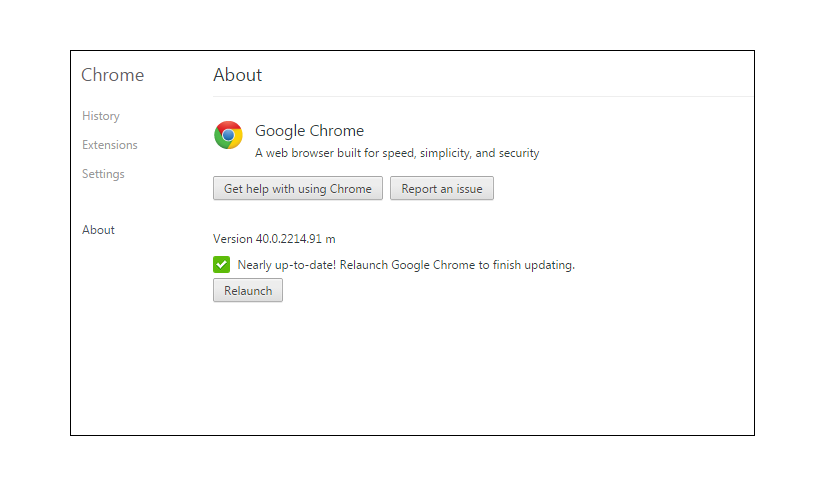

# Fehlerbehebung - [!DNL Workfront Proof] Proofing Viewer

<!-- Audited: 01/2024 -->

>[!IMPORTANT]
>
>Dieser Artikel bezieht sich auf Funktionen im eigenständigen [!DNL Workfront Proof]. Informationen zu Proofing in [!DNL Adobe Workfront] finden Sie unter [Proofing](../../../review-and-approve-work/proofing/proofing.md).

Wenn Ihr Korrekturabzugsinhalt nicht geladen wird und Sie nur eine leere Korrekturabzugsansicht sehen, liegt das höchstwahrscheinlich daran, dass diese Aktion lokal blockiert wird. Probieren Sie die folgenden möglichen Lösungen aus.

## Stellen Sie sicher, dass Ihre Browser-<!--and [!DNL Flash Player]--> auf dem neuesten Stand ist

Alle Entwickler arbeiten ständig an ihren Anwendungen und veröffentlichen regelmäßig neue Funktionen und Fehlerbehebungen für ihre Produkte. Dies dient dazu, das Benutzererlebnis zu verbessern und das Sicherheitsniveau beizubehalten, sodass es sich empfiehlt, nur die neuesten Versionen zu verwenden. Dies hilft auch, Konflikte zwischen den Anwendungen zu vermeiden.

<!--
### [!DNL Flash Player] Plugin Version

To check your current [!DNL Flash Player] version visit the [[!DNL Adobe] website](http://www.adobe.com/software/flash/about/).

If your version number differs from the one listed for your platform go to the [[!DNL Flash Player] download page](http://get.adobe.com/flashplayer/otherversions/) and get the latest version.

Please note: we do recommend using the original [!DNL Adobe] plugin, so if your browser uses a built-in solution deactivate it and install the [!DNL Adobe] solution.
-->

### Browser-Version

Normalerweise aktualisieren die meisten Browser automatisch, aber wenn Sie Probleme haben, sollten Sie überprüfen, welche Version Sie verwenden, und bei Bedarf ein Update durchführen.

Navigieren Sie in Ihrem Browser zu [!UICONTROL Menü] und suchen Sie die Option [!UICONTROL Info] (in einigen Fällen ist dies möglicherweise unter einem [!UICONTROL Hilfe]-Menü sichtbar). Im [!UICONTROL Info]-Popup finden Sie Informationen zur aktuellen Browser-Version sowie eine Option zum Aktualisieren/Suchen nach Aktualisierungen.

Zum Beispiel in Chrome:

Sobald Sie die neueste Browser-Version installiert haben, versuchen Sie, den Korrekturabzug erneut zu öffnen und zu überprüfen, ob das Problem behoben wurde.

<!--

## Ensure Your Local [!DNL Flash] Storage is Available

Our [!DNL Workfront Proof] Viewer is based on Flash, and we store some data about the proofs (i.e., comments, proof tiles, [!DNL Workfront Proof] Viewer settings) on your computer using [!DNL Flash Player]. If the [!DNL Workfront Proof] Viewer opens, but there is no content inside you will want to make sure that the Flash Storage is available on your machine and that [!DNL Workfront Proof] is allowed to use it.

If there is some storage allocated, but you're working with the bigger proofs with multiple pages and comments try to increase the [!DNL Flash] Storage and re-load your proof.

-->

## Identifizieren Sie, wo das Problem liegt

* Werden die Korrekturabzüge in einem anderen Browser geöffnet?
* Wenn Sie täglich einen Browser verwenden und Probleme mit der Anzeige der Korrekturabzüge dort haben, versuchen Sie, denselben Korrekturabzug in einem anderen Browser auf Ihrem Computer zu öffnen. Kopieren Sie dazu einfach den Link zum Korrekturabzug aus der URL-Leiste Ihres Haupt-Browsers und fügen Sie ihn in einen anderen Browser ein. Wenn der Korrekturabzug dort geöffnet wird, überprüfen Sie Ihre Hauptbrowser-Konfiguration, Plug-ins und Erweiterungen, da diese möglicherweise stören.
* Wir haben keinen bevorzugten Browser. Wenn jedoch in Ihrem aktuellen Browser Leistungsprobleme auftreten, empfehlen wir Ihnen, zu einem anderen Browser zu wechseln.
* Werden die Testsendungen auf einem anderen Gerät an Ihrem Standort durchgeführt?
Wenn der Korrekturabzug nicht in einem Browser auf Ihrem Computer geöffnet wird, versuchen Sie, ihn auf einem anderen Computer an Ihrem Standort und/oder außerhalb Ihres Standorts zu öffnen. Auf diese Weise können Sie feststellen, ob sich ein Problem auf Ihrem Computer oder in Ihrem lokalen Netzwerk befindet.
Wenn Ihre Sicherheitsstufe höher ist, werden Ihre Verbindungen zu [!DNL Workfront Proof] möglicherweise von folgenden Elementen blockiert:

   * Ihre lokale AV-Software
   * Ihre Netzwerksicherheitslösung
   * DNS-, Firewall- oder Proxy-Konfiguration
   * Dies sind die Einstellungen, die außerhalb unserer Kontrolle liegen. Es gibt verschiedene Sicherheitslösungen, und wir können nicht sagen, welche in Ihrem Netzwerk implementiert sind und welche möglicherweise Verbindungen zu [!DNL Workfront Proof] blockieren. Es liegt auch nicht an [!DNL Workfront Proof], über Ihre interne Sicherheitskonfiguration zu entscheiden. Wenn Sie Probleme beim Öffnen der Testsendungen auf mehreren Computern in Ihrem Standort/Netzwerk haben, empfehlen wir Ihnen, sich an Ihr IT-Team zu wenden, damit es die Netzwerkeinstellungen überprüfen und die [!DNL Workfront Proof] bei Bedarf autorisieren oder zur Zulassungsliste hinzufügen kann.

* Sind die Verbindungen zu [!DNL Workfront Proof] in Ihrem Netzwerk zulässig?
In die Korrekturabzugsansicht laden wir die Kacheln - Fragmente der Seiten. Wenn dieser Inhalt an Ihrem Ende nicht ordnungsgemäß geladen wird, kann es sein, dass einige Verbindungen zu [!DNL Workfront Proof] in Ihrem Netzwerk blockiert sind. Sie sollten sicherstellen, dass alle Verbindungen und alle Inhalte von *.proofhq.com zur Zulassungsliste hinzugefügt werden. Ihr IT-Team sollte Ihnen bei der Überprüfung helfen können.

## Plug-ins überprüfen

Wenn Ihr Browser auf dem neuesten Stand ist und Ihr Netzwerk die Verbindungen zu [!DNL Workfront Proof] nicht blockiert, kann es sein, dass Ihr Browser etwas enthält, das die Anzeige der Korrekturabzüge beeinträchtigt. In Ihrem Browser stehen häufig mehrere Plug-ins und Erweiterungen zur Verfügung, von denen einige die anderen stören oder mit ihnen in Konflikt stehen könnten.

Es empfiehlt sich, alle unbekannten Add-ons zu entfernen und nur die Add-ons zu behalten, die Sie verwenden und denen Sie vertrauen. Jeder Browser sollte Ihnen Optionen zum Überprüfen/Ändern/Löschen der Plug-ins und Erweiterungen bieten. Wir verwenden JavaScript, um den [!DNL Workfront Proof] Viewer zu laden. Daher sollten Sie insbesondere die Plug-ins überprüfen, die dies beeinflussen könnten.

Wenn ein bestimmtes Add-on das Laden der Korrekturabzüge beeinträchtigt, können Sie versuchen, die Details in der Browser-Konsole zu überprüfen.

In den meisten neueren Browsern stehen einige zusätzliche Entwickler-Tools zur Verfügung, die für eine erweiterte Fehlerbehebung verwendet werden können.

Wenn Sie Probleme beim Anzeigen der Korrekturabzüge haben:

* Öffnen Sie die Browser-Konsole und laden Sie den Korrekturabzug erneut.
* Überprüfen, ob Warnhinweise oder Meldungen in der Konsole vorhanden sind. Diese Details können dabei helfen, die Grundursache der Probleme zu identifizieren.
* Lassen Sie Ihr IT-Team die Ergebnisse analysieren. Sie sollten in der Lage sein, zu beraten und bei der Lösung der lokalen Probleme zu helfen.
* Teilen Sie die Ergebnisse mit unserem Support-Team. Wir helfen Ihnen gerne weiter.

## Einstellungen für gemischte Inhalte überprüfen

Alle Verbindungen zu [!DNL Workfront Proof] werden über HTTPS hergestellt. Im [!DNL Workfront Proof] Viewer laden wir die Kacheln jedoch über HTTP, und die Daten werden mit den Token gesichert. Dadurch werden gemischte Inhalte erstellt, die einige Browser oder Sicherheitslösungen möglicherweise blockieren (standardmäßig oder durch manuelle Konfiguration).

Wenn dies der Grund ist, warum die Korrekturabzüge nicht auf Ihrem Computer geöffnet werden (Sie sollten die entsprechenden Warnhinweise in der Browser-Konsole sehen können), autorisieren Sie solche Verbindungen für die [!DNL Workfront Proof] oder ändern Sie Ihre Einstellungen, um passive gemischte Inhalte auf Ihrem Computer zuzulassen. Der gemischte Inhalt kann von Ihrem Browser, Ihrer AV-Software oder der Netzwerkkonfiguration blockiert werden, um die genaue Ursache zu ermitteln. Wenden Sie sich an Ihr IT-Team bzw. Ihre Netzwerkadministratoren. Sie sollten auch bei der Aktivierung des gemischten Inhalts auf Ihrem Computer helfen können.

