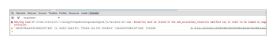

# Fehlerbehebung - [!DNL Workfront Proof] Testversand-Viewer

>[!IMPORTANT]
>
>Dieser Artikel bezieht sich auf die Funktionalität im eigenständigen Produkt [!DNL Workfront Proof]. Informationen zum Testen in [!DNL Adobe Workfront], siehe [Testing](../../../review-and-approve-work/proofing/proofing.md).

Wenn Ihr Testversand-Inhalt nicht geladen wird und Sie nur einen leeren Testversand-Viewer sehen können, liegt dies höchstwahrscheinlich daran, dass diese Aktion lokal blockiert wird. Probieren Sie die möglichen Lösungen unten aus.

## Sicherstellen des Browsers und [!DNL Flash Player] Versionen sind auf dem neuesten Stand

Alle Entwickler arbeiten ständig an ihren Anwendungen und veröffentlichen regelmäßig neue Funktionen und Fehlerbehebungen für ihre Produkte. Dies dient der Verbesserung des Benutzererlebnisses und der Aufrechterhaltung des Sicherheitsniveaus, sodass es Best Practice ist, nur die neuesten Versionen zu verwenden. Dies hilft auch, Konflikte zwischen den Anwendungen zu vermeiden.

<!--
### [!DNL Flash Player] Plugin Version

To check your current [!DNL Flash Player] version visit the [[!DNL Adobe] website](http://www.adobe.com/software/flash/about/).

If your version number differs from the one listed for your platform go to the [[!DNL Flash Player] download page](http://get.adobe.com/flashplayer/otherversions/) and get the latest version.

Please note: we do recommend using the original [!DNL Adobe] plugin, so if your browser uses a built-in solution deactivate it and install the [!DNL Adobe] solution.
-->

### Browserversion

Heutzutage werden die meisten Browser automatisch aktualisiert. Wenn Sie jedoch Probleme haben, sollten Sie überprüfen, welche Version Sie verwenden, und bei Bedarf aktualisieren.

Navigieren Sie im Browser zu [!UICONTROL Menü] und suchen Sie nach [!UICONTROL Info] -Option (in einigen Fällen kann dies unter [!UICONTROL Hilfe] Menü). Im [!UICONTROL Info] -Popup finden Sie Informationen über die aktuelle Browserversion sowie eine Option zum Aktualisieren/Überprüfen auf Updates.

Siehe in Chrome:

Sobald Sie über die neuesten [!DNL Flash Player] -Plug-in und die installierte Browser-Version versuchen, Ihren Testversand erneut zu öffnen und zu sehen, ob das Problem behoben wurde.

## Sicherstellen der lokalen [!DNL Flash] Speicher ist verfügbar

Unsere [!DNL Workfront Proof] Der Viewer basiert auf Flash und wir speichern einige Daten über die Testsendungen (z. B. Kommentare, Testkacheln, [!DNL Workfront Proof] Viewer-Einstellungen) auf Ihrem Computer mithilfe von [!DNL Flash Player]. Wenn die Variable [!DNL Workfront Proof] Der Viewer wird geöffnet. Sie sollten jedoch sicherstellen, dass der Flash-Speicher auf Ihrem Computer verfügbar ist und dass [!DNL Workfront Proof] darf sie verwenden.

Wenn etwas Speicherplatz zugewiesen ist, Sie jedoch mit größeren Testsendungen mit mehreren Seiten und Kommentaren arbeiten, versuchen Sie, die [!DNL Flash] Speichern und laden Sie Ihren Testversand erneut.

Bitte sehen Sie sich unsere [Probleme bei der Anzeige von Testsendungen - [!DNL Flash] Freigegebene Objekte - Erklärung](../../../workfront-proof/wp-tech-corner/troubleshooting/view-proof-flash-shared-object.md) für die detaillierten Anweisungen.

## Ermitteln, wo das Problem liegt

* Werden die Testsendungen in einem anderen Browser geöffnet?
* Wenn Sie täglich einen Browser verwenden und Probleme mit der Anzeige der Testsendungen haben, versuchen Sie, denselben Testversand in einem anderen Browser auf Ihrem Computer zu öffnen. Kopieren Sie dazu einfach den Testversand-Link aus der URL-Leiste Ihres Hauptbrowsers und fügen Sie ihn in einen anderen Browser ein. Wenn der Testversand dort geöffnet wird, überprüfen Sie Ihre wichtigsten Browserkonfigurationen, Plugins und Erweiterungen, da diese möglicherweise stören.
* Wir haben keinen bevorzugten Browser, aber wenn Sie Leistungsprobleme in Ihrem aktuellen Browser haben, empfehlen wir Ihnen, zu einem anderen Browser zu wechseln.
* Werden die Testsendungen auf einem anderen Computer an Ihrem Standort geöffnet?
Wenn Ihr Testversand nicht in einem Browser auf Ihrem Computer geöffnet wird, versuchen Sie, ihn auf einem anderen Computer an Ihrem Standort und/oder außerhalb Ihres Standorts zu öffnen. Auf diese Weise können Sie feststellen, ob ein Problem auf Ihrem Computer liegt oder in Ihrem lokalen Netzwerk auftritt.
Wenn Ihr Sicherheitsniveau höher ist, werden Ihre Verbindungen zu [!DNL Workfront Proof] kann blockiert werden durch:

   * Ihre lokale AV-Software
   * Ihre Netzwerksicherheitslösung
   * DNS, Firewall oder Proxy-Konfiguration
   * Dies sind die Einstellungen, die uns nicht zu verantworten haben. Es gibt verschiedene Sicherheitslösungen, und wir können nicht feststellen, welche in Ihrem Netzwerk implementiert sind und welche Verbindungen blockieren können [!DNL Workfront Proof]. Sie hat auch nicht die Aufgabe, [!DNL Workfront Proof] um über Ihre interne Sicherheitskonfiguration zu entscheiden. Wenn Sie Probleme beim Öffnen der Testsendungen auf mehreren Computern in Ihrem Standort/Netzwerk haben, empfehlen wir Ihnen, sich an Ihr IT-Team zu wenden, damit es die Netzwerkeinstellungen überprüfen und die [!DNL Workfront Proof] auf die Zulassungsliste klicken, falls erforderlich.

* Sind die Verbindungen zu [!DNL Workfront Proof] in Ihrem Netzwerk zugelassen?
Innerhalb des Testversand-Viewers laden wir die Kacheln - Fragmente der Seiten. Wenn dieser Inhalt nicht auf Ihrem Ende geladen wird, kann es sein, dass einige Verbindungen zu [!DNL Workfront Proof] in Ihrem Netzwerk blockiert sind. Sie sollten sicherstellen, dass alle Verbindungen und alle Inhalte von *.proofhq.com der Zulassungsliste hinzugefügt werden. Ihr IT-Team sollte in der Lage sein, bei der Überprüfung dieser Situation behilflich zu sein.

## Plugins überprüfen

Wenn Ihr Browser und [!DNL Flash Player] -Plug-in auf dem neuesten Stand ist und Ihr Netzwerk die Verbindungen zu [!DNL Workfront Proof] Es kann in Ihrem Browser etwas geben, das sich auf die Anzeige der Testsendungen auswirkt. Heutzutage gibt es mehrere Plugins und Erweiterungen in Ihrem Browser, und einige von ihnen stören oder stehen in Konflikt mit anderen.

Die Best Practice besteht darin, alle unbekannten Add-ons zu entfernen und nur die von Ihnen verwendeten und vertrauenswürdigen zu behalten. Jeder Browser sollte Ihnen Optionen zum Aktivieren/Ändern/Löschen der Plug-ins und Erweiterungen bieten. Unsere [!DNL Workfront Proof] Der Viewer basiert auf [!DNL Flash] und wir verwenden JavaScript, um den Viewer zu laden, sodass Sie besonders die Plugins überprüfen möchten, die sich auf diese auswirken könnten.

Wenn es ein bestimmtes Add-on gibt, das das Laden der Testsendungen stört, können Sie versuchen, die Details in der Browser-Konsole zu überprüfen.

In den meisten neueren Browsern sind einige zusätzliche Entwicklertools verfügbar, die für eine erweiterte Fehlerbehebung verwendet werden können.

Wenn Sie Probleme mit der Anzeige der Testsendungen haben:

* Öffnen Sie die Browser-Konsole und laden Sie den Testversand erneut.
* Überprüfen Sie, ob Warnhinweise oder Meldungen in der Konsole vorhanden sind. Diese Details können dabei helfen, die Hauptursache der Probleme zu ermitteln.
* Bitten Sie Ihr IT-Team, die Ergebnisse zu analysieren. Sie sollten in der Lage sein, das lokale Problem zu lösen und zu unterstützen.
* Teilen Sie die Ergebnisse mit unserem Support-Team. Gerne helfen wir Ihnen weiter.

## Überprüfen der Einstellungen für gemischte Inhalte

Alle Verbindungen zu [!DNL Workfront Proof] sind über HTTPS. In der [!DNL Workfront Proof] Betrachter: Wir laden die Kacheln über HTTP und die Daten werden mit den Token gesichert. Dadurch werden gemischte Inhalte erstellt, die von einigen Browsern oder Sicherheitslösungen blockiert werden können (standardmäßig oder gemäß manueller Konfiguration).

Wenn dies der Grund ist, warum die Testsendungen nicht auf Ihrem Computer geöffnet werden (Sie sollten die entsprechenden Warnhinweise in der Browser-Konsole sehen können), autorisieren Sie diese Verbindungen für [!DNL Workfront Proof] oder ändern Sie Ihre Einstellungen, um passiven gemischten Inhalt auf Ihrem Computer zuzulassen. Der gemischte Inhalt kann von Ihrem Browser, Ihrer AV-Software, Ihrer Netzwerkkonfiguration usw. blockiert werden. Um die Ursache zu bestimmen, wenden Sie sich bitte an Ihr IT-Team/Ihre Netzwerkadministratoren. Sie sollten auch bei der Aktivierung des gemischten Inhalts auf Ihrem Computer helfen können.

