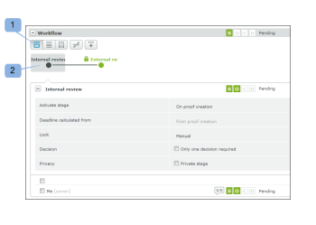
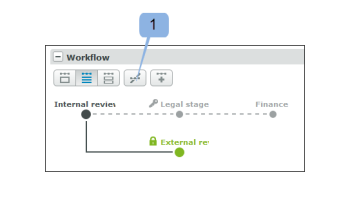
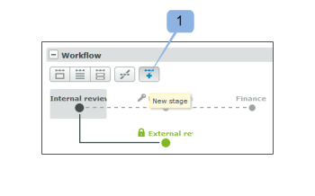

# Verwalten eines Korrekturabzugs, der mit einem automatisierten Workflow in [!DNL Workfront Proof] konfiguriert wurde

>[!IMPORTANT]
>
>Dieser Artikel bezieht sich auf Funktionen im eigenständigen [!DNL Workfront Proof]. Informationen zu Proofing in [!DNL Adobe Workfront] finden Sie unter [Proofing](../../../review-and-approve-work/proofing/proofing.md).

Den Fortschritt Ihrer automatisierten Workflow-Korrekturabzüge können Sie im Abschnitt Workflow der Seite [!UICONTROL Korrekturabzugsdetails“ &#x200B;]. Sie können die in den einzelnen Phasen durchgeführten Arbeiten anzeigen und die Phasen im Korrekturabzug ändern, hinzufügen, starten und sperren.

## Anzeigen eines automatisierten Workflows

Sie können Ihren automatisierten Workflow auf drei Arten anzeigen:

* [Einen Schritt im Detail anzeigen](#view-a-stage-in-detail)
* [Alle Stadien anzeigen](#view-all-stages)
* [Alle Stadien im Detail anzeigen](#view-all-stages-in-detail)

### Einen Schritt im Detail anzeigen {#view-a-stage-in-detail}

1. Klicken Sie auf die Schaltfläche oben im Bereich (1).

   Sie können mithilfe des Diagramms zwischen den Phasen wechseln. Die Phase, die Sie anzeigen, ist grau hervorgehoben (2).

1. Um einen anderen Schritt anzuzeigen, wählen Sie ihn im Diagramm aus.

### Alle Stadien anzeigen {#view-all-stages}

So zeigen Sie alle Phasen eines automatisierten Workflows an:

1. Klicken Sie auf die Schaltfläche oben auf der Seite (3).

   Alle Phasen des automatisierten Workflows werden im Abschnitt aufgelistet, die Details sind jedoch ausgeblendet.

1. Um die Details eines Schritts anzuzeigen, klicken Sie auf das Pluszeichen neben dem Namen jedes Schritts (4).

### Alle Stadien im Detail anzeigen {#view-all-stages-in-detail}

So zeigen Sie alle Phasen Ihres automatisierten Workflows im Detail an:

1. Klicken Sie auf die Schaltfläche oben auf der Seite (5).

   Auf dieser Seite werden alle Phasen Ihres automatisierten Workflows mit erweiterten Details jedes Schritts angezeigt.

   Sie können die Details der einzelnen Stadien ausblenden, indem Sie auf das Minussymbol (6) klicken.

## Verwenden des Diagramms eines automatisierten Workflows

Das Diagramm Ihres [!UICONTROL Workflows] wird oben im Abschnitt Workflow angezeigt.

So blenden Sie das Diagramm aus

1. Klicken Sie auf **[!UICONTROL Schaltfläche „Ausblenden]** (1).

Die Schritte im Diagramm sind wie folgt gekennzeichnet:

- Ein aktiver Schritt

- Ein inaktiver Schritt\
  - eine private Bühne

  - eine gesperrte Bühne

Die Linien zwischen den Stadien stellen die Abhängigkeiten zwischen den Stadien dar. Die Linien, die zu inaktiven Stufen führen, sind gepunktet, bis die Stufe aktiviert ist.

Wenn Sie den Mauszeiger über eine Phase im Diagramm bewegen, wird der Fortschritt der Phase angezeigt. Wenn die Phase nicht aktiv ist und Sie über Bearbeitungsrechte für die Phase verfügen, können Sie die Phase über die Schaltfläche [!UICONTROL Phase starten] vom Popup aus starten. Auf ähnliche Weise wird die Option zum Sperren eines aktiven Schritts angezeigt.

Weitere Informationen zur Fortschrittsleiste finden Sie unter  [Anzeigen des Fortschritts und Status eines Korrekturabzugs in  [!DNL Workfront] -](../../../workfront-proof/wp-work-proofsfiles/manage-your-work/view-progress-and-status-of-proof.md).

## Neues Stadium hinzufügen

Sie können Ihrem automatisierten Workflow über die Seite [!UICONTROL Korrekturabzugsdetails“ einen neuen Schritt &#x200B;].

1. Klicken Sie auf **[!UICONTROL Schaltfläche „Neues]**&quot; (1).

Im Feld **Neues Stadium** können Sie die Details und Einstellungen für das Stadium angeben.

## Stadieneinstellungen verwalten

Auf der Seite Details können Sie die Einstellungen für jedes Stadium ändern (wenn Sie Bearbeitungsrechte haben):

* Frist für die Etappe ändern, hinzufügen oder entfernen (1)
* Phase sperren (2) - Diese Option wird angezeigt, wenn die Phase aktiv ist. Bei inaktiven Phasen wird die Option zum Starten der Phase angezeigt
* Änderung der Einstellungen durch Inline-Bearbeitung (3)
* Aktivieren oder deaktivieren Sie Nur eine einzige für das Stadium erforderliche Entscheidung (4)
* Ändern der Privatsphäre der Bühne (5)

Sie können die Reviewer auch zwischen verschiedenen Phasen verschieben, indem Sie sie einfach von einem Schritt in den nächsten ziehen und ablegen. Die verfügbaren Phasen werden blau hervorgehoben, wobei die Ablagebereiche für jede Phase deutlich markiert sind.

## Staging-Optionen

Das [!UICONTROL Aktionen]-Menü (1) für jede Phase bietet die folgenden Optionen:

* Nachricht an alle (2) - Sie können eine Erinnerungs-E-Mail an alle Reviewer auf der Bühne senden
* Freigeben (3) - Sie können der Phase neue Validierungsverantwortliche hinzufügen
* Schritt (4) löschen - Wenn sich der/die Verantwortliche für den Korrekturabzug auf dieser Phase befindet, werden Sie aufgefordert, eine neue Phase auszuwählen
