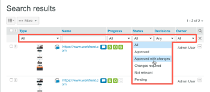

# Suchen [!DNL Workfront] Korrekturabzugs

>[!IMPORTANT]
>
>Dieser Artikel bezieht sich auf Funktionen im eigenständigen [!DNL Workfront Proof]. Informationen zu Proofing in [!DNL Adobe Workfront] finden Sie unter [Proofing](../../../review-and-approve-work/proofing/proofing.md).

Sie können auf der gesamten [!DNL Workfront Proof] Site nach den folgenden Inhaltstypen suchen:

* Korrekturabzüge (einschließlich archivierter Korrekturabzüge)
* Dateien
* Ordner
* Tags
* Testversand-Betreff
* Testversandnachricht
* Benutzerdefinierte Felder
* Name des Erstellers
* Elemente, die für Sie freigegeben wurden

So durchsuchen Sie die [!DNL Workfront Proof]-Site:

1. Geben Sie den Text ein, nach dem Sie suchen möchten, und drücken Sie dann die **[!UICONTROL Eingabetaste]**.\
   Beachten Sie Folgendes zu Suchergebnissen:

   * Das Such-Tool sucht nach Elementen, die alle eingegebenen Keywords enthalten. Um Suchergebnisse zu minimieren und die Suchgenauigkeit zu maximieren, stellen Sie sicher, dass Sie die Keywords richtig schreiben und Leerzeichen zwischen ihnen hinzufügen.
   * Die Suchergebnisse werden nach Relevanz sortiert.
   * Sie können die Suchergebnisse reduzieren, indem Sie weitere Keywords in das Suchfeld einfügen (durch ein Leerzeichen getrennt) und dann erneut suchen. Die neue Suche wird nur für Elemente durchgeführt, die bereits in den Suchergebnissen angezeigt werden.
   * Wenn Sie den Namen einer früheren Korrekturabzugsversion in das Suchfeld eingeben, wird die neueste Version dieses Korrekturabzugs in den Suchergebnissen angezeigt.
   * Übergeordnete Ordner und Unterordner werden getrennt aufgelistet.

1. (Optional) Sortieren Sie in den angezeigten Suchergebnissen nach Spalten, indem Sie auf die Kopfzeile am oberen Rand einer Spalte klicken. (Optional) Fügen Sie Ihren Ergebnissen eine Filterung hinzu, indem Sie auf [!UICONTROL Suchen]-Symbol am Ende der Kopfzeile klicken. 

Dadurch werden Dropdown-Menüs hinzugefügt, in denen Sie Filter auswählen können, um Ihre Suche einzugrenzen.
1. 

1. (Optional) Grenzen Sie Ihre Suche ein, indem Sie die Registerkarte [!UICONTROL Tags] öffnen und auf ein Tag in der Navigations-Seitenleiste auf der linken Seite klicken. Elemente, die mit diesem Tag verknüpft sind, werden in den Suchergebnissen angezeigt.\
   \
   Der Tag-Name wird im Suchfeld oben rechts in Workfront Proof angezeigt. Sie können Ihre Suche einschränken, indem Sie zusätzliche Tags auswählen oder weitere Keywords in das Suchfeld eingeben. Sie können ein Tag aus dem Suchfeld entfernen, indem Sie auf das x neben dem Tag-Namen klicken.

Informationen zur Suche nach Text im Korrekturabzugsinhalt finden Sie unter [Inhalt im Korrekturabzug suchen](../../../review-and-approve-work/proofing/reviewing-proofs-within-workfront/review-a-proof/search-in-a-proof.md).
