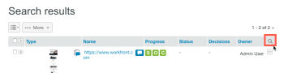

# Suchen [!DNL Workfront] Testversand

>[!IMPORTANT]
>
>Dieser Artikel bezieht sich auf die Funktionalität im eigenständigen Produkt [!DNL Workfront Proof]. Informationen zum Testen in [!DNL Adobe Workfront], siehe [Testing](../../../review-and-approve-work/proofing/proofing.md).

Sie können in der [!DNL Workfront Proof] Site:

* Testsendungen (einschließlich archivierter Testsendungen)
* Dateien
* Ordner
* Tags
* Testversand-Betreff
* Testversandnachricht
* Benutzerdefinierte Felder
* Name des Erstellers
* Elemente, die für Sie freigegeben wurden

So durchsuchen Sie die [!DNL Workfront Proof] Site:

1. Geben Sie den Text ein, nach dem Sie suchen möchten, und drücken Sie dann die **[!UICONTROL Eingabe]**.\
   Beachten Sie Folgendes zu Suchergebnissen:

   * Das Suchwerkzeug findet Elemente, die alle eingegebenen Suchbegriffe enthalten. Um Suchergebnisse zu minimieren und die Suchgenauigkeit zu maximieren, stellen Sie sicher, dass Sie die Suchbegriffe richtig buchstabieren und Leerzeichen dazwischen einfügen.
   * Die Suchergebnisse werden nach Relevanz sortiert.
   * Sie können die Suchergebnisse reduzieren, indem Sie weitere Suchbegriffe in das Suchfeld einfügen (durch ein Leerzeichen getrennt) und dann erneut suchen. Die neue Suche wird nur für die bereits in den Suchergebnissen angezeigten Elemente durchgeführt.
   * Wenn Sie den Namen einer früheren Testversand-Version in das Suchfeld eingeben, wird die neueste Version dieses Testversands in den Suchergebnissen angezeigt.
   * Übergeordnete Ordner und Unterordner werden separat aufgeführt.

1. (Optional) Sortieren Sie in den angezeigten Suchergebnissen nach Spalte, indem Sie oben in einer Spalte auf die Kopfzeile klicken. (Optional) Fügen Sie Ihren Ergebnissen eine Filterung hinzu, indem Sie auf die [!UICONTROL suchen] -Symbol am Ende der Kopfzeile. 

Dadurch werden Dropdown-Menüs hinzugefügt, in denen Sie Filter auswählen können, um Ihre Suche einzuschränken.
1. 

1. (Optional) Schränken Sie Ihre Suche ein, indem Sie die [!UICONTROL Tags] und klicken Sie auf ein Tag in der Navigationsseitenleiste auf der linken Seite. Mit diesem Tag verknüpfte Elemente werden in den Suchergebnissen angezeigt.\
   \
   Der Tag-Name wird im Suchfeld in der rechten oberen Ecke von Workfront Proof angezeigt. Sie können Ihre Suche verfeinern, indem Sie zusätzliche Tags auswählen oder weitere Keywords in das Suchfeld eingeben. Sie können ein Tag aus dem Suchfeld entfernen, indem Sie auf das x-Symbol neben dem Tag-Namen klicken.

Informationen zur Textsuche in Testsendungen finden Sie unter [Inhalt in einem Testversand durchsuchen](../../../review-and-approve-work/proofing/reviewing-proofs-within-workfront/review-a-proof/search-in-a-proof.md).
