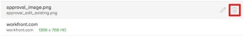

# Erstellen von Korrekturabzügen in [!DNL Workfront Proof]

>[!IMPORTANT]
>
>Dieser Artikel bezieht sich auf Funktionen im eigenständigen [!DNL Workfront Proof]. Informationen zu Proofing in [!DNL Adobe Workfront] finden Sie unter [Proofing](../../../review-and-approve-work/proofing/proofing.md).

[!DNL Workfront Proof] können Sie Korrekturabzüge aus Dokumenten oder Websites erstellen und diese Korrekturabzüge für andere freigeben. Die folgenden Schritte beschreiben die verschiedenen verfügbaren Konfigurationsoptionen:

## Erzeugen eines Korrekturabzugs für ein Dokument

1. Führen Sie einen der folgenden Schritte aus, um mit der Erstellung eines neuen Korrekturabzugs zu beginnen und die Seite [!UICONTROL Neuer Korrekturabzug] anzuzeigen:

   * Klicken Sie oben links auf **[!UICONTROL Seite auf]** Schaltfläche „Neuer Korrekturabzug“.
   * Klicken Sie im **[!UICONTROL Dashboard]** auf der Registerkarte **[!UICONTROL Übersicht]** auf den Link **[!UICONTROL Neuer Korrekturabzug]**.

   * Senden über Ablagebereich (Enterprise-Funktion).
   * Die **[!UICONTROL Neuer Korrekturabzug]** wird angezeigt.

1. Um ein oder mehrere Dokumente zu prüfen, fügen Sie die zu prüfenden Dokumente auf eine der folgenden Arten hinzu (wiederholen Sie diesen Vorgang, um mehrere zu prüfende Dokumente hinzuzufügen):

   * Ziehen Sie ein Dokument aus Ihrem Dateisystem in den Drag-and-Drop-Bereich im Bereich **[!UICONTROL Dateien hinzufügen]**.
   * Klicken Sie in den Drag-and-Drop-Bereich im Bereich **[!UICONTROL Dateien hinzufügen]**, suchen Sie das Dokument, das Sie aus dem Dateisystem auf Ihre Workstation hochladen möchten, und wählen Sie es aus.

     

1. Um eine oder mehrere Websites zu prüfen, geben Sie die URL der Website, die Sie prüfen möchten, im Bereich **[!UICONTROL Dateien hinzufügen]** an und drücken Sie dann die **[!UICONTROL Eingabetaste]**.

1. (Optional) Wiederholen Sie diesen Vorgang, um dem Korrekturabzug mehrere Websites hinzuzufügen.

   Weitere Informationen zu Proofing-Websites finden Sie unter [Erstellen eines Korrekturabzugs für eine URL](#generate-a-proof-for-a-url).

   

1. (Optional) Ändern der Dateinamen von hochgeladenen Dateien:

   1. Bewegen Sie den Mauszeiger über den Dokumentnamen, den Sie in der Dokumentliste im Bereich **[!UICONTROL Dateien hinzufügen]** ändern möchten, und klicken Sie dann auf das Symbol **[!UICONTROL Bearbeiten]**.

      

   1. Geben Sie im Feld **[!UICONTROL Name des Korrekturabzugs]** einen neuen Namen ein und klicken Sie dann auf **[!UICONTROL Fertig]**.

   1. (Optional) Um Dateien aus dem Upload zu löschen, bewegen Sie den Mauszeiger über das Dokument, das Sie in der Dokumentliste im Bereich **[!UICONTROL Dateien hinzufügen]** löschen möchten, und klicken Sie dann auf das Symbol **[!UICONTROL Löschen]**.

      

   1. (Optional) Aktivieren Sie die Option **[!UICONTROL Alle kompatiblen Dateien in einem Korrekturabzug kombinieren]**.

      **Wenn diese Option aktiviert ist:** Alle statischen Dateien und Websites sind in einem einzigen Korrekturabzug verfügbar und Sie können bis zu 50 Dateien gleichzeitig hochladen.

      >[!NOTE]
      >
      >Interaktive Dateien, einschließlich Videos und interaktiver Websites, können nicht in einem einzigen Korrekturabzug kombiniert werden.

      **Wenn diese Option deaktiviert ist:** Alle Dokumente und Websites werden als individuelle Korrekturabzüge generiert, und Sie können bis zu 20 Dateien gleichzeitig hochladen.

      So kombinieren Sie alle hochgeladenen Dateien und Websites in einem einzigen Korrekturabzug:

      1. Aktivieren Sie die Option **[!UICONTROL Alle kompatiblen Dateien in einem Korrekturabzug]**.
      1. Geben Sie im Feld **[!UICONTROL Name des Korrekturabzugs]** einen neuen Namen für den kombinierten Korrekturabzug ein.
      1. Ordnen **[!UICONTROL im Bereich „Dateien hinzufügen]** die enthaltenen Dateien neu an, indem Sie eine Datei an die gewünschte Reihenfolge ziehen. Die Reihenfolge der Dateien entspricht der Seitenreihenfolge des kombinierten Korrekturabzugs. Weitere Informationen zur Erstellung kombinierter Korrekturabzüge finden Sie unter [Erstellen eines mehrseitigen Korrekturabzugs](../../../review-and-approve-work/proofing/creating-proofs-within-workfront/create-multi-page-proof.md).

1. (Optional) Wenn Sie einen automatisierten Workflow mit mehreren Phasen verwenden möchten, wählen Sie im Abschnitt **[!UICONTROL Workflow]** eine der folgenden Optionen aus:

   * **Einfach:** Wählen Sie diese Option aus, um Benutzer festzulegen, die unmittelbar nach der Erstellung Zugriff auf den Korrekturabzug haben möchten. Sie können den Korrekturabzug für mehrere Benutzer freigeben.

     Weitere Informationen zur Freigabe eines Korrekturabzugs finden Sie unter „Hinzufügen von Benutzern zu einem Korrekturabzug“ in [Freigeben eines Korrekturabzugs für [!DNL Adobe Workfront]](../../../review-and-approve-work/proofing/managing-proofs-within-workfront/share-a-proof-in-workfront.md).

   * **Automatisiert:** Wählen Sie diese Option aus, um die Überprüfung und Genehmigung von Inhalten zu verwalten, wenn Sie komplexe Prüfprozesse haben oder wenn Sie Inhalte regelmäßig zur Überprüfung an dieselben Personengruppen senden. Bei einem automatisierten Workflow durchläuft der Korrekturabzug alle Phasen bis zur endgültigen Genehmigung. Die relevanten Benutzer werden jedes Mal benachrichtigt, wenn sie eine Genehmigung einholen müssen.

     Weitere Informationen zum Erstellen eines automatisierten Workflows finden Sie unter [Einrichten eines Korrekturabzugs mit einem automatisierten Workflow in [!DNL Workfront Proof]](../../../workfront-proof/wp-work-proofsfiles/automated-workflow/set-up-proof-auto-workflow.md#create2).

1. Wählen Sie aus, ob E-Mail-Benachrichtigungen und eine benutzerdefinierte Nachricht an die im vorherigen Schritt ausgewählten Benutzer gesendet werden sollen:

   * **Empfänger über diesen Korrekturabzug informieren:** Wählen Sie diese Option, um Benutzern eine E-Mail-Benachrichtigung zu senden. Wenn **[!UICONTROL Einfache Freigabe]** im Abschnitt **[!UICONTROL Workflow]** ausgewählt ist, wird bei der Erstellung des Korrekturabzugs eine E-Mail-Benachrichtigung gesendet. Wenn **[!UICONTROL Automatisierter Workflow]** im Abschnitt **[!UICONTROL Workflow]** ausgewählt ist, wird eine E-Mail-Benachrichtigung gesendet, wenn der Korrekturabzug in den Schritt des automatisierten Workflows eintritt, mit dem der Benutzer verknüpft ist.

   * **Benutzerdefinierte Nachricht hinzufügen:** Sie diese Option aus, um eine benutzerdefinierte Nachricht in die Benachrichtigung aufzunehmen. Sie können einen Betreff und einen Nachrichtentext angeben. Der Nachrichtentext kann Rich-Text-Formatierungen wie fett, Aufzählungszeichen und Hyperlinks enthalten.

1. Wählen Sie eine der folgenden Korrekturabzugseinstellungen aus:

   <table style="table-layout:auto"> 
    <col> 
    <col> 
    <tbody> 
     <tr> 
      <td role="rowheader">Anmeldung verlangen - Korrekturabzug kann nur für andere Benutzer freigegeben werden</td> 
      <td> 
<strong>Anmeldung erforderlich - Korrekturabzug kann nur für andere Benutzer freigegeben werden:</strong> Wenn diese Option aktiviert ist, können nur [!DNL Workfront Proof] Benutzer den Korrekturabzug anzeigen.
 
Diese Option ist standardmäßig deaktiviert. Jede Person mit der URL kann den Korrekturabzug anzeigen.
 
Wenn diese Option ausgewählt ist:
 
       <ul> 
        <li>Benutzende können sich nur dann beim Korrekturabzug anmelden, wenn sie zum Korrekturabzug hinzugefügt wurden.</li> 
        <li>Abonnements können nicht aktiviert werden.</li> 
       </ul> </td> 
     </tr> 
     <tr> 
      <td role="rowheader">Für diesen Korrekturabzug ist nur eine Entscheidung erforderlich</td> 
      <td> 
Wenn diese Option ausgewählt ist, wird die Überprüfung abgeschlossen, nachdem einer der Entscheidungsträger seine Entscheidung getroffen hat.
 
Diese Option ist standardmäßig deaktiviert.
 </td> 
     </tr> 
     <tr> 
      <td role="rowheader">Entscheidungen müssen elektronisch signiert werden</td> 
      <td>Benutzer müssen ihren Benutzernamen und ihr Kennwort angeben, wenn sie sich für einen Korrekturabzug entscheiden.</td> 
     </tr> 
     <tr> 
      <td role="rowheader">Korrekturabzug sperren, wenn alle erforderlichen Entscheidungen getroffen werden</td> 
      <td> 
<strong></strong> Wenn diese Einstellung aktiviert ist, wird der Status des Korrekturabzugs gesperrt, nachdem alle Entscheidungen getroffen wurden. Der Status wird automatisch von entsperrt in gesperrt geändert, wenn die endgültige genehmigende Person ihre Entscheidung trifft.
 
Diese Option ist standardmäßig deaktiviert.
 </td> 
     </tr> 
     <tr> 
      <td role="rowheader">Originaldatei herunterladen</td> 
      <td> 
<strong></strong> Wenn diese Option ausgewählt ist, können Prüfer die Originaldatei, aus der der Korrekturabzug erstellt wurde, herunterladen.
 
Wenn diese Option deaktiviert ist, ist das Download-Symbol nicht mehr sichtbar. Diese Option ist standardmäßig aktiviert.
 </td> 
     </tr> 
     <tr> 
      <td role="rowheader">Korrekturabzug über eine öffentliche URL oder einen Einbettungs-Code freigeben</td> 
      <td>Wenn diese Option ausgewählt ist, kann der Korrekturabzug über eine öffentliche URL oder einen Einbettungs-Code freigegeben werden.</td> 
     </tr> 
     <tr> 
      <td role="rowheader">Testversand über eine öffentliche URL oder einen Einbettungs-Code abonnieren</td> 
      <td> 
Wenn diese Option ausgewählt ist, können Personen, die dem Korrekturabzug nicht explizit hinzugefügt wurden, den Korrekturabzug abonnieren. Der Person, die den Korrekturabzug abonniert, wird die Rolle und die E-Mail-Adresse zugewiesen, die Sie in den folgenden Einstellungen definieren:
 
       <ul> 
        <li><strong>Abonnentenrolle</strong>: Die Standardrolle für den Korrekturabzug, die allen Reviewern zugewiesen ist, die den Korrekturabzug abonnieren.</li> 
        <li><strong>E-Mail-Warnhinweiseinstellungen für Abonnenten</strong>: Der E-Mail-Warnhinweis, der standardmäßig allen Reviewern zugewiesen wird, die den Testversand abonniert haben.</li> 
        <li> 
<strong>Zugriff auf Korrekturabzug über einen E-Mail-Link erforderlich für</strong>: Konfigurieren Sie, ob der Abonnent eine E-Mail mit einem Link zum Korrekturabzug erhält. Sie können <strong>Keine E-Mail</strong> (für den Zugriff auf den Korrekturabzug ist kein E-Mail-Link erforderlich), <strong>Nur E-Mail-Benachrichtigung über den Korrekturabzug</strong> (der Abonnent erhält einen Link zum Korrekturabzug per E-Mail ohne Bestätigung) oder <strong>E-Mails zur Validierung und Benachrichtigung über den Korrekturabzug</strong> (der Abonnent erhält einen Link zum Korrekturabzug per E-Mail und muss auf den Link klicken, um auf den Korrekturabzug zuzugreifen; Ziel dieser Option ist es sicherzustellen, dass die Person eine korrekte E-Mail-Adresse eingegeben hat, auf die er Zugriff hat).
 
Hinweis: Wenn an die Korrekturabzüge ein automatisierter Workflow angehängt ist, generieren alle Abonnements Bestätigungs-E-Mails an den Testversand-Eigentümer, damit dieser entscheiden kann, zu welchem Schritt die Person hinzugefügt werden soll.
 </li> 
       </ul> </td> 
     </tr> 
    </tbody> 
   </table>

1. Klicken Sie **[!UICONTROL Korrekturabzug erstellen]**.

   Workfront erstellt nun einen Korrekturabzug für die ausgewählten Dokumente oder Websites. Je nach Dateigröße und -typ variiert die Verzögerungszeit beim Hochladen eines Dokuments. Seien Sie geduldig, da die Generierung größerer Dateien länger dauert. Wenn Sie die Seite verlassen, erstellt Workfront weiterhin die Datei. Die maximale Größe des Datei-Uploads beträgt 4 GB.

   Klicken Sie nach der Erstellung des Korrekturabzugs auf **[!UICONTROL Zum Korrekturabzug gehen]**, um das Korrekturabzugswerkzeug zu starten.

   

   Das Dokument wird im Proofing-Tool angezeigt.

   Benutzer, für die das Proofing nicht aktiviert ist, können weiterhin das Dokument anzeigen und Kommentare zum Korrekturabzug abgeben.

## Erstellen eines Korrekturabzugs für eine URL {#generate-a-proof-for-a-url}

Sie können zum ersten Mal einen Korrekturabzug für eine URL generieren. Sie können auch eine neue Version eines URL-Korrekturabzugs generieren, für den zuvor ein Korrekturabzug generiert wurde.

>[!NOTE]
>
>Sie können einen interaktiven Korrekturabzug für eine URL nur generieren, wenn Ihre [!DNL Workfront] mit einem [!DNL Workfront Proof] Premium-Konto integriert ist. Wenn Sie Proofing nicht wie in diesem Abschnitt erläutert verwenden können, wenden Sie sich an Ihren Systemadministrator.

So erstellen Sie einen Korrekturabzug für eine URL:

1. Führen Sie einen der folgenden Schritte aus, um mit der Erstellung eines neuen Korrekturabzugs zu beginnen und die Seite [!UICONTROL Neuer Korrekturabzug] anzuzeigen:

   * Klicken Sie oben links auf **[!UICONTROL Seite auf]** Schaltfläche „Neuer Korrekturabzug“.
   * Klicken Sie im **[!UICONTROL Dashboard]** auf der Registerkarte **[!UICONTROL Übersicht]** auf den Link **[!UICONTROL Neuer Korrekturabzug]**.

   * Senden über Ablagebereich (Enterprise-Funktion).

1. (Bedingt) Auf der **[!UICONTROL Neuer Korrekturabzug]** Seite, die angezeigt wird, um eine neue Version eines vorhandenen Korrekturabzugs zu erstellen:

   1. Wählen Sie den URL-Korrekturabzug aus, dem Sie eine neue Version hinzufügen möchten.
   1. Klicken Sie auf **[!UICONTROL Schaltfläche]** Neue Version“ oben auf der Seite.

      

1. Geben Sie auf der Seite Neue Korrekturabzugsversion , die angezeigt wird, im Bereich „Dateien hinzufügen“ die URL der Website **[!UICONTROL , für die Sie einen Korrekturabzug erstellen möchten]** und drücken Sie dann die **[!UICONTROL Eingabetaste]**.

1. (Optional) Wiederholen Sie diesen Vorgang, um dem Korrekturabzug mehrere Websites hinzuzufügen.

   

1. Klicken Sie auf die Website in der Dokumentliste im Bereich **[!UICONTROL Dateien hinzufügen]**.

   

1. Geben Sie einen **[!UICONTROL Korrekturabzugsnamen]** für den Korrekturabzug an.

   Standardmäßig ist der Name des Korrekturabzugs mit dem der Site-URL identisch.

1. Wählen Sie **[!UICONTROL Optionen]** Website-Inhalte verarbeiten“ aus:

   <table style="table-layout:auto"> 
    <col> 
    <col> 
    <tbody> 
     <tr> 
      <td role="rowheader">Screenshot aufzeichnen</td> 
      <td>Erstellt einen Korrekturabzug für ein statisches Bild der Titelseite der URL.</td> 
     </tr> 
     <tr> 
      <td role="rowheader">Interaktiv</td> 
      <td> 
Erstellt einen Korrekturabzug, mit dem Überprüfende auf der Website navigieren, HTML5-Bilder, Flash-Elemente usw. anzeigen können.
 
Um einen interaktiven Korrekturabzug zu erstellen, muss die Website mit einem sicheren Protokoll (https) gehostet werden. Darüber hinaus können Websites, die nicht in einen iframe eingebettet werden können, nicht als interaktiver Korrekturabzug generiert werden (iframe-Einbettungsbeschränkungen werden von der Website gesteuert, die Sie einbetten möchten).
 
Nachdem der erste Korrekturabzug erstellt wurde, kann diese Einstellung beim Erstellen nachfolgender Versionen nicht mehr geändert werden.
 
Weitere Informationen zum interaktiven Proofing finden Sie unter <a href="#generate-a-proof-for-interactive-content" class="MCXref xref">Erstellen eines Korrekturabzugs für interaktive Inhalte</a>.
 </td> 
     </tr> 
     <tr> 
      <td role="rowheader">Screenshot-Auflösung</td> 
      <td> 
(Diese Option ist für interaktive Korrekturabzüge nicht verfügbar.) Sie können die Auflösung anpassen, in der Ihre Inhalte angezeigt werden, oder Sie können mehrere Auflösungen auswählen.
 
Dadurch können Benutzende, die den Korrekturabzug überprüfen, sehen, wie Inhalte auf verschiedenen Geräten angezeigt werden, z. B. in verschiedenen Größen von Smartphones, Tablets und Monitoren.
 
Wenn Sie mehrere Auflösungen auswählen, wird für jede ausgewählte Auflösung ein separater Korrekturabzug erstellt.
 
Wenn Benutzende den Korrekturabzug kommentieren, wird die aktuelle Bildschirmauflösung automatisch im Kommentar angezeigt, um sicherzustellen, dass andere Benutzende wissen, mit welcher Auflösung der Kommentar verbunden ist.
 </td> 
     </tr> 
     <tr> 
      <td role="rowheader">Nach Unterseiten suchen</td> 
      <td>(Diese Option ist für interaktive Korrekturabzüge nicht verfügbar.) Wählen Sie diese Option aus, um durch Seiten der Website zu navigieren. Sie können die Website von der Hauptseite aus auf bis zu zwei Ebenen erweitern. Bewegen Sie den Mauszeiger über eine Seite, um die URL der Seite anzuzeigen. Wählen Sie nur die Seiten aus, die Sie prüfen möchten. Jede ausgewählte Seite wird standardmäßig als einzelner Korrekturabzug erstellt. Alternativ können Sie die Option <strong>In einzelnen Korrekturabzug kombinieren</strong> aktivieren, um alle ausgewählten Seiten in einem einzigen Korrekturabzug zu kombinieren.</td> 
     </tr> 
    </tbody> 
   </table>

1. (Optional) Konfigurieren Sie erweiterte Proofing-Optionen, z. B. die Freigabe des Korrekturabzugs, das Hinzufügen eines automatisierten Workflows oder das Einrichten von Zugriffs- und Abonnementeinstellungen. Weitere Informationen zu diesen Optionen finden Sie in den folgenden Artikeln:

   * [Freigeben eines Korrekturabzugs für [!DNL Adobe Workfront]](../../../review-and-approve-work/proofing/managing-proofs-within-workfront/share-a-proof-in-workfront.md)
   * [Einrichten eines Korrekturabzugs mit einem automatisierten Workflow in [!DNL Workfront Proof]](../../../workfront-proof/wp-work-proofsfiles/automated-workflow/set-up-proof-auto-workflow.md)
   * [Konfigurieren der Zugriffs- und Abonnementeinstellungen für einen Testversand](../../../review-and-approve-work/proofing/managing-proofs-within-workfront/configure-access-subscription-settings-proof.md)

1. Klicken Sie **[!UICONTROL Fertig]**.

   Wenn Sie eine neue Version zu einem vorhandenen URL-Korrekturabzug hinzufügen, werden alle Optionen, die für den ursprünglichen Korrekturabzug oder die vorherige Version konfiguriert wurden, in dieser Version beibehalten. Wenn Sie eine neue Version zu einem vorhandenen URL-Korrekturabzug hinzufügen, werden alle Optionen, die für den ursprünglichen Korrekturabzug oder die vorherige Version konfiguriert wurden, in dieser Version beibehalten.

1. Klicken Sie **[!UICONTROL Korrekturabzug erstellen]**.

## Erstellen eines Korrekturabzugs für interaktive Inhalte {#generate-a-proof-for-interactive-content}

Für die Nutzung dieser Funktion ist ein Pro Workfront-Plan oder höher erforderlich. Weitere Informationen zu den verschiedenen verfügbaren Plänen finden Sie unter [Workfront-Pläne](https://www.workfront.com/plans).

Weitere Informationen zu interaktiven Inhalten finden Sie unter [Übersicht über Korrekturabzüge für interaktive Inhalte](../../../review-and-approve-work/proofing/proofing-overview/interactive-content-proofs.md).

* [Hinzufügen interaktiver Inhalte als URL](#add-interactive-content-as-a-url)
* [Hinzufügen interaktiver Inhalte als ZIP-Datei](#add-interactive-content-as-a-zip-file)

### Hinzufügen interaktiver Inhalte als URL {#add-interactive-content-as-a-url}

Informationen zum Hinzufügen eines interaktiven URL-Korrekturabzugs finden Sie unter [Erstellen eines Korrekturabzugs für eine URL](#generate-a-proof-for-a-url).

### Hinzufügen interaktiver Inhalte als ZIP-Datei {#add-interactive-content-as-a-zip-file}

1. Bereiten Sie Ihren Inhalt vor, indem Sie eine ZIP-Datei im Bundle erstellen.

   Informationen zu den Spezifikationen der ZIP-Datei finden Sie [Informationen zum Vorbereiten interaktiver Inhalte in einer ZIP-Datei für das Proofing](../../../review-and-approve-work/proofing/proofing-overview/interactive-content-proofs.md#howtoprepareaninteractiveziparchive) im Artikel [Übersicht über Korrekturabzüge für interaktive Inhalte](../../../review-and-approve-work/proofing/proofing-overview/interactive-content-proofs.md).

1. Führen Sie einen der folgenden Schritte aus, um mit der Erstellung eines neuen Korrekturabzugs zu beginnen und die Seite [!UICONTROL Neuer Korrekturabzug] anzuzeigen:

   * Klicken Sie oben links auf **[!UICONTROL Seite auf]** Schaltfläche „Neuer Korrekturabzug“.
   * Klicken Sie im **[!UICONTROL Dashboard]** auf der Registerkarte **[!UICONTROL Übersicht]** auf den Link **[!UICONTROL Neuer Korrekturabzug]**.

   * Senden über Ablagebereich (Enterprise-Funktion).

1. Ziehen Sie auf der ]**&quot;**[!UICONTROL  Korrekturabzug“ Ihr interaktives ZIP-Bundle per Drag-and-Drop in den Bereich **[!UICONTROL Dateien hinzufügen]**.

1. (Optional) Konfigurieren Sie erweiterte Proofing-Optionen, z. B. die Freigabe des Korrekturabzugs, das Hinzufügen eines automatisierten Workflows oder das Einrichten von Zugriffs- und Abonnementeinstellungen. Weitere Informationen zu diesen Optionen finden Sie in den folgenden Artikeln:

   * [Freigeben eines Korrekturabzugs für [!DNL Adobe Workfront]](../../../review-and-approve-work/proofing/managing-proofs-within-workfront/share-a-proof-in-workfront.md)
   * Im Artikel
   * [Konfigurieren der Zugriffs- und Abonnementeinstellungen für einen Testversand](../../../review-and-approve-work/proofing/managing-proofs-within-workfront/configure-access-subscription-settings-proof.md)

1. Klicken Sie **[!UICONTROL Korrekturabzug erstellen]**.

   Workfront erstellt nun einen Testversand für das .zip-Bundle. Je nach Bundle-Größe variiert die Verzögerungszeit beim Hochladen eines Dokuments. Die Generierung größerer Dateien dauert länger. Wenn Sie die Seite verlassen, erstellt Workfront weiterhin die Datei. Die maximale Größe des Datei-Uploads beträgt 4 GB.

   Nachdem der Korrekturabzug erstellt wurde, können Sie auf die Schaltfläche **[!UICONTROL Zum Korrekturabzug gehen]** klicken, die angezeigt wird, um den Korrekturabzug zu öffnen.
