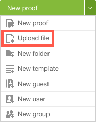

# Hochladen von Dateien und Webinhalten in [!DNL Workfront Proof]

>[!IMPORTANT]
>
>Dieser Artikel bezieht sich auf die Funktionalität im eigenständigen Produkt [!DNL Workfront Proof]. Informationen zum Testen in [!DNL Adobe Workfront], siehe [Testversand](../../../review-and-approve-work/proofing/proofing.md).

Sie können Dateien in [!DNL Workfront Proof] ohne einen Testversand zu erstellen. Sie können auch URLs für Websites und andere Webinhalte zu [!DNL Workfront Proof].

## Über das Hochladen einer Datei ohne Testversand

In einigen Fällen können Sie eine Datei zu [!DNL Workfront Proof] und erstellen Sie gleichzeitig einen Testversand (siehe [Testsendungen generieren in [!DNL Workfront Proof]](../../../workfront-proof/wp-work-proofsfiles/create-proofs-and-files/generate-proofs.md)).

In anderen Fällen können Sie eine Datei zu [!DNL Workfront Proof] ohne einen Testversand zu erstellen.

Dies ist beispielsweise nützlich, wenn Sie keine Testversandrechte haben, aber eine Datei zur Überprüfung für Benutzer bereitstellen müssen, die über Testversandrechte verfügen. einer dieser Benutzer den Testversand erstellen kann, nachdem Sie ihn hochgeladen haben.

Außerdem können Sie [!DNL Workfront Proof] als Cloud-Speicher für Dateien, ohne Testsendungen für sie zu erstellen. Einige Organisationen verwenden [!DNL Workfront Proof] alle digitalen Materialien für ein Projekt zusammenzuhalten, auch wenn einige davon, wie interne Dokumente über das Projekt, nicht geprüft werden müssen.

## Hochladen von Dateien und Hinzufügen von URLs

Hochladen einer Datei in [!DNL Workfront Proof]:

1. In der linken oberen Ecke von [!DNL Workfront Proof]klicken Sie auf den Abwärtspfeil **[!UICONTROL Neuer Testversand]** und klicken Sie auf **[!UICONTROL Datei hochladen]** im angezeigten Menü.\
   

1. Die **[!DNL New File]** angezeigt.
1. Führen Sie einen der folgenden Schritte aus, um den zum Testen benötigten Inhalt hochzuladen oder hinzuzufügen:

   * Ziehen Sie die Datei(en) per Drag-and-Drop in den **[!UICONTROL Dateien hier ablegen]** ankreuzen. Oder klicken Sie auf **[!UICONTROL Dateien auswählen]**, suchen und wählen Sie sie aus.

   * Sie können diesen Schritt wiederholen, um beliebig viele Dateien hinzuzufügen. Die Dateien, die Sie hochladen, werden in Ihrem Konto als einzelne Dateien und nicht als zusammengeführte Datei angezeigt.

   * Wenn Sie eine Datei aus einer URL erstellen, geben Sie die URL in das Feld ein, das **www.yoursite.com**. Wenn Sie fertig sind, drücken Sie die **[!UICONTROL Eingabe]** oder klicken Sie am Ende des Feldes auf die Schaltfläche mit dem grünen Pfeil.\

      Sie können mehrere Dateien gleichzeitig erstellen, indem Sie mehrere durch Leerzeichen getrennte URLs eingeben.

1. Geben Sie im unten stehenden Feld die E-Mail-Adresse der validierungsverantwortlichen Benutzer ein, die die Dateien zum Testen benötigen **[!UICONTROL Freigeben]**.\
   Wenn Sie diese Schritte ausführen, erhalten diese Empfänger eine E-Mail mit den Downloadlinks für die Dateien.\
   Sie können die Dateien für Kontakte, Gruppen und Partner freigeben (siehe [Kontakte](https://support.workfront.com/hc/en-us/sections/115000920808-Contacts),  [Gruppen](https://support.workfront.com/hc/en-us/sections/115000920828-Groups)und [Partnerkonten](https://support.workfront.com/hc/en-us/sections/115000912107-Partner-accounts)).

1. (Optional) Sie können **[!UICONTROL Personen per E-Mail benachrichtigen]** , wenn Sie einen benutzerdefinierten Betreff und eine Nachricht zur E-Mail hinzufügen möchten, die von den Empfängern der Dateien empfangen wurde. Siehe [Freigeben von Dateien in Workfront Testversand](../../../workfront-proof/wp-work-proofsfiles/share-proofs-and-files/share-files.md) für weitere Informationen.

1. (Optional) Unter **[!UICONTROL Organisieren]** können Sie einen Ordner auswählen oder erstellen, um die hochgeladenen Dateien zu organisieren. Sie können auch Tags hinzufügen, um die Dateien einfach zu identifizieren und zu finden.
1. Tags sind einfache Wörter oder Wortkombinationen, mit denen Sie den Inhalt einer Datei beschreiben können. Sie erleichtern die Suche nach dem, was Sie benötigen.

   >[!NOTE]
   >
   > Ordner, die Sie hinzufügen [!DNL Workfront Proof] nur Teil des Prüfsystems sind; sie sind nicht Teil des Dateiordnersystems, auf das Sie auf Ihrem Computer oder auf den Servern Ihres Unternehmens zugreifen.

1. Klicken Sie auf **[!UICONTROL Speichern]**.
