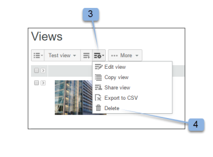

# Erstellen und Verwalten von benutzerdefinierten Ansichten in [!DNL Workfront Proof]

>[!IMPORTANT]
>
>Dieser Artikel bezieht sich auf Funktionen im eigenständigen [!DNL Workfront Proof]. Informationen zu Proofing in [!DNL Adobe Workfront] finden Sie unter [Proofing](../../../review-and-approve-work/proofing/proofing.md).

Sie können benutzerdefinierte Ansichten Ihrer Dateien und Testsendungen erstellen, um die gewünschten Elemente so aufzulisten, wie sie angezeigt werden sollen. Sie können die Informationen in Ihrer benutzerdefinierten Ansicht auch als Bericht exportieren (in CSV, kommagetrenntem Wert, Dateiformat).

>[!NOTE]
>
>Benutzerdefinierte Ansichten sind nur für ausgewählte und Premium-Pläne verfügbar. Für ein Angebot wenden Sie sich bitte an unser Vertriebsteam.

## Erstellen einer benutzerdefinierten Ansicht

Beim Erstellen einer benutzerdefinierten Ansicht haben Sie folgende Möglichkeiten:

* Ob Testsendungen, Dateien oder beides einbezogen werden sollen
* Welche Spalten angezeigt werden
* Welche Spalte sortiert werden soll nach
* Die Sortierreihenfolge der Spalte (aufsteigend oder absteigend)
* Welche Filtertypen verwendet werden müssen, um zu bestimmen, welche Informationen in der Ansicht enthalten sind?

Nachdem die benutzerdefinierte Ansicht erstellt wurde, kann sie sofort verwendet werden. Der Name der neuen Ansicht ist auch im Dropdown-Menü unter der Überschrift Meine benutzerdefinierten Ansichten (unter den Standardansichten) enthalten.

Erstellen einer benutzerdefinierten Ansicht:

1. Navigieren Sie zur Seite **[!UICONTROL Ansichten]**.
1. Weitere Informationen zu Ansichten finden Sie unter [Elemente auf der Seite „Ansichten“ in  [!DNL Workfront Proof]](../../../workfront-proof/wp-work-proofsfiles/manage-your-work/manage-items-on-views-page.md).
1. Führen Sie einen der folgenden Schritte aus, je nachdem, ob Sie eine neue benutzerdefinierte Ansicht von Grund auf neu erstellen möchten, oder erstellen Sie eine neue benutzerdefinierte Ansicht basierend auf einer vorhandenen Standardansicht:

   * So erstellen Sie eine neue benutzerdefinierte Ansicht basierend auf einer vorhandenen Standardansicht: Wählen Sie aus dem Dropdown-Menü die vorhandene Standardansicht aus, die Sie als Grundlage für Ihre neue benutzerdefinierte Ansicht verwenden möchten. Klicken Sie auf das **[!UICONTROL Ansichtseinstellungen]** und dann auf **[!UICONTROL Kopieren]**, um eine neue benutzerdefinierte Ansicht anzuzeigen.

   * 

   * So erstellen Sie eine neue benutzerdefinierte Ansicht von Grund auf: Klicken Sie auf das Symbol **[!UICONTROL Neue Ansicht]** .
   * 

1. Geben **[!UICONTROL im Abschnitt]** die folgenden Informationen an:

   * **[!UICONTROL Name]** (erforderlich): Der Name für die neue Ansicht. Verwenden Sie einen eindeutigen Namen, damit Benutzer die benutzerdefinierte Ansicht im Dropdown-Menü der Ansichten einfach finden können.
   * **[!UICONTROL Elemente]**: Wählen Sie aus, ob sowohl Korrekturabzüge als auch Dateien, nur Korrekturabzüge oder nur Dateien in der Ansicht enthalten sein sollen. Standardmäßig sind sowohl Korrekturabzüge als auch Dateien enthalten.

1. Legen **[!UICONTROL im Abschnitt „Spalten]** fest, welche Spalten Sie in die benutzerdefinierte Ansicht aufnehmen möchten.

   1. Klicken Sie auf das Nach-rechts-Symbol.
   1. 

   1. Doppelklicken Sie auf den Namen der ausgewählten Spalte.
   1. Sie müssen mindestens eine Spalte auswählen. Eine Spalte kann nur einmal hinzugefügt werden.
   1. Wählen Sie im Bereich **[!UICONTROL Verfügbare Spalten]** eine Spalte aus, die Sie in die neue Ansicht aufnehmen möchten.
   1. Die Spalten werden von der Liste **[!UICONTROL Verfügbare Spalten]** in die Liste **[!UICONTROL Ausgewählte Spalten]** verschoben.

   1. Sie können aus den Standardspalten auswählen oder Sie können benutzerdefinierte Felder und Entscheidungsgründe als Spalten in Ihrer benutzerdefinierten Ansicht auswählen. (Wenn Sie diese in Ihrem Konto konfiguriert haben, werden sie unter dem Bereich Standardliste der verfügbaren Spalten angezeigt.)
   1. Standardspalten, die Sie einbeziehen können

      <table style="table-layout:auto">
      <thead>

      </thead>
      <tbody>  
      <tr>   
      <td><strong>Name des aktiven Stadiums</strong></td>   
      <td>Name der aktiven Phase im automatisierten Workflow.</td>  
      </tr>  
      <tr>   
      <td><strong>Kommentare</strong></td>   
      <td>Die Anzahl der eingegangenen Kommentare.</td>
      </tr>  
      <tr>   
      <td><strong>Zähler</strong></td>
      <td>Zeigt eine Anzahl der Korrekturabzüge an, die in Ihr Konto hochgeladen wurden (in den Kontoeinstellungen muss die Option „Zähler für Korrekturabzüge“ aktiviert sein).</td>
      </tr>
      <tr>
      <td><strong>Erstellt</strong></td>
      <td>Datum und Uhrzeit der Erstellung des Elements.</td>
      </tr>
      <tr>
      <td><strong>Erstellerin oder Ersteller</strong></td>
      <td>Der Benutzer, der das Element erstellt hat.</td>
      </tr>
      <tr>
      <td><strong>[!UICONTROL Datum zum Korrekturabzug hinzugefügt]</strong></td>
      <td>Das Datum, an dem Sie zum Korrekturabzug hinzugefügt wurden. </td>
      </tr>
      <tr>
      <td><strong>Frist</strong></td>
      <td>Die Frist für den gesamten Testversand.</td>
      </tr>
      <tr>
      <td><strong>Entscheidungen</strong></td>
      <td>Die Anzahl der von der erwarteten Anzahl getroffenen Entscheidungen (z. B. 0 von 1, 1 von 1 usw.)</td>
      </tr>
      <tr>
      <td><strong>[!UICONTROL Downloads]</strong></td>
      <td>Die Häufigkeit, mit der die Originaldatei heruntergeladen wurde.</td>
      </tr>
      <tr>
      <td><strong>Dateiname</strong></td>
      <td>Der Name der Datei oder des Korrekturabzugs.</td>
      </tr>
      <tr>
      <td><strong>Ordner</strong></td>
      <td>Der das Element enthaltende Ordner.</td>
      </tr>
      <tr>
      <td><strong>Letzte Aktivität</strong></td>
      <td>Datum und Uhrzeit der letzten Aktivität auf dem Element.</td>
      </tr>
      <tr>
      <td><strong>Neueste Entscheidung zu</strong></td>
      <td>Datum und Uhrzeit der letzten Entscheidung.</td>
      </tr>
      <tr>
      <td><strong>Meine Frist</strong></td>
      <td>Ihre eigene Frist für die Korrekturabzüge, in der Sie explizit als Prüfende Person/genehmigende Person hinzugefügt werden (falls angewendet).</td>
      </tr>
      <tr>
      <td><strong>Besitzerin bzw. Besitzer</strong></td>
      <td>Der Besitzer des Elements.</td>
      </tr>
      <tr>
      <td><strong>Inhaberland</strong></td>
      <td>Das Land, das im System für den Eigentümer des Nachweises registriert ist. </td>
      </tr>
      <tr>
      <td><strong>Übergeordneter Korrekturabzug</strong></td>
      <td>Der Name des übergeordneten Korrekturabzugs.</td>
      </tr>
      <tr>
      <td><strong>Fortschritt</strong></td>
      <td>
Fortschrittsleiste. Zeigt Korrekturabzüge an, die noch nicht gestartet, geöffnet, kommentiert oder entschieden wurden.

Diese Informationen sind nicht sortiert.
</td>
      </tr>
      <tr>
      <td><strong>Name des Korrekturabzugs</strong></td>
      <td>Der Name des Testversands.</td>
      </tr>
      <tr>
      <td><strong>Testversand-Typ</strong></td>
      <td>
Der Typ des Korrekturabzugs: statische Datei, statische Webseite, interaktive Webseite (.zip-Upload), interaktive Webseite (https), Video, Audio und Andere. 

Kombinierte Korrekturabzüge werden als „Kombinierter Korrekturabzug-Typ“ gekennzeichnet. Dateityp des Testversands.
</td>
      </tr>
      <tr>
      <td><strong>Dateigröße (MB)</strong></td>
      <td>
Dateigröße des Korrekturabzugs im Verhältnis zur Festplattenauslastung.

Diese Informationen wurden für die aktuelle Version des Testversands bereitgestellt. Wenn es keine aktuelle Version gibt, ist sie für die neueste Version vorgesehen.
</td>
      </tr>
      <tr>
      <td>
 

<strong>Deadline - Aktives Stadium</strong>
</td>
      <td>Frist für Phasen des automatisierten Workflows.</td>
      </tr>
      <tr>
      <td><strong>Name der Phase</strong></td>
      <td>Name jedes Schritts im automatisierten Workflow. Dazu gehören vergangene, aktive und zukünftige Stadien.</td>
      </tr>
      <tr>
      <td><strong>Status</strong></td>
      <td>aktiv, gesperrt, Entwurf oder übermittelt.</td>
      </tr>
      <tr>
      <td><strong>Status</strong></td>
      <td>Ausstehend, Änderungen erforderlich, Mit Änderungen genehmigt, Genehmigt oder Nicht relevant.</td>
      </tr>
      <tr>
      <td><strong>Tags</strong></td>
      <td>Alle Tags, die mit dem Element verbunden sind.</td>
      </tr>
      <tr>
      <td><strong>Bevorstehende Stadiennamen</strong></td>
      <td> Name jedes Schritts, der noch nicht im automatisierten Workflow gestartet wurde. </td>
      </tr>
      <tr>
      <td><strong>Versionszähler</strong></td>
      <td> Die Anzahl der Versionen des Elements. </td>
      </tr>
      <tr>
      <td><strong>Versionsnummer des Testversands</strong></td>
      <td><i>Die Versionsnummer des Testversands.</i></td>
      </tr> 
      </tbody>
      </table>

   1. (Optional) Führen Sie einen der folgenden Schritte aus, um die Spalte in den Bereich **[!UICONTROL Ausgewählte Spalten]** zu verschieben, sodass sie in der neuen Ansicht enthalten ist:

      * Ordnen Sie alle Spalten in der Liste **[!UICONTROL Ausgewählte Spalten]** neu an.
      * Die Reihenfolge, in der die Spalten in der Liste **[!UICONTROL Ausgewählte Spalten]** angezeigt werden, bestimmt die Reihenfolge, in der die Spalten in der benutzerdefinierten Ansicht angezeigt werden.
      * Die Spalten sind in der Liste **[!UICONTROL Ausgewählte Spalten]** in der Reihenfolge sichtbar, in der Sie sie aus der Liste **[!UICONTROL Verfügbare Spalten]** hinzugefügt haben.

      * Um eine Spalte in der Liste **[!UICONTROL Ausgewählte Spalten]** neu anzuordnen, wählen Sie den Namen der Spalte aus und ziehen Sie sie in der Liste nach oben oder unten.

      * Entfernen Sie eine Spalte aus der **[!UICONTROL Ausgewählte Spalten]** Liste, indem Sie auf den Namen der ausgewählten Spalte und dann auf den **[!UICONTROL Nach-links]** Pfeil klicken. Alternativ können Sie auf den Namen der ausgewählten Spalte doppelklicken (die Spalte wird zurück in die Liste &quot;**[!UICONTROL Spalten“]**).

      * Eine Spalte kann nur einmal hinzugefügt werden. Wenn Sie beispielsweise die Spalte Kommentare von [!UICONTROL Verfügbar] in [!UICONTROL Ausgewählte Spalten] verschieben, wird der Name dieser Spalte aus der Liste [!UICONTROL Verfügbare Spalten] entfernt.

1. Geben **[!UICONTROL im Abschnitt]** die folgenden Informationen an:

   * **Sortieren nach:** Verwenden Sie die Registerkarte [!UICONTROL Sortieren], wenn Sie eine bestimmte Reihenfolge festlegen möchten, in der Elemente in Ihrer benutzerdefinierten Ansicht aufgeführt werden. Wenn Sie keine Spalte zum Sortieren auswählen, lautet die Standardeinstellung Keine Spalte, d. h. keine spezielle Sortierspalte oder -reihenfolge.
   * Nur die Spalten, die Sie auf der Registerkarte [!UICONTROL Spalten] ausgewählt haben, sind in der [!UICONTROL Sortieren nach Spalte] enthalten.
   * **Aufsteigend oder absteigend** Wählen Sie aus, ob die Spalte standardmäßig entweder auf- oder absteigend sortiert werden soll.

1. Im Abschnitt **[!UICONTROL Filter]** können Sie ein oder mehrere Kriterien für die Auswahl von Elementen definieren, die in Ihre benutzerdefinierte Ansicht aufgenommen werden sollen. Filter sind besonders hilfreich, wenn Sie Ihre benutzerdefinierte Ansicht als Bericht verwenden möchten.
1. Um alle Elemente in Ihre benutzerdefinierte Ansicht aufzunehmen, überspringen Sie den Abschnitt **[!UICONTROL Filter]**.
1. Verfügbare Filter:

   * **Feld** Wählen Sie das Feld für diesen Filter aus (Kommentare ist das Standardfeld). Die Liste Feld enthält alle Standardfelder (wie auf der Registerkarte [!UICONTROL Spalten]). Die Liste ist nicht auf die Spalten beschränkt, die zur Anzeige ausgewählt wurden.
   * **Operator** Die für den Filter verfügbaren Operatoren hängen vom ausgewählten Feldtyp ab. Wählen Sie einen Operator aus, der die Beziehung zwischen dem Feld und dem Wertfeld anzeigt. Sie werden diese Informationen später ausfüllen.
   * **Wert** Wählen Sie den ausgewählten Wert in diesem Feld aus oder geben Sie ihn entsprechend dem ausgewählten Feld und dem ausgewählten Operator ein. Je nach ausgewähltem Operator kann es ein Wertefeld, zwei oder gar keinen geben. Siehe Beispiele unten.
   * **Filter werden mithilfe der folgenden Logik angewendet:** Filterkriterien zwischen verschiedenen Feldern verwenden den AND-Operator. Mehrere Filterkriterien, die dasselbe Feld verwenden, verwenden den OR-Operator für dasselbe Feld.

     Wenn Sie nur Korrekturabzüge mit null Kommentaren anzeigen möchten, wählen Sie die folgenden Werte aus:

      * Feld: comments
      * Operator: Gleich
      * Wertfeld: 0

     Wenn Sie nur Korrekturabzüge mit zwei oder mehr Kommentaren anzeigen möchten, wählen Sie die folgenden Werte aus:

      * Feld: comments
      * Operator: Größer oder gleich
      * Wertfeld: 2

     Wenn Sie nur Korrekturabzüge mit 1 bis 4 Kommentaren anzeigen möchten, wählen Sie die folgenden Werte aus:

      * Feld: comments
      * Operator: zwischen
      * Wertfeld (erstes Feld): 1
      * Wertfeld (zweites Feld): 4

        Sie können einen Filter, den Sie Ihrer benutzerdefinierten Ansicht ohne Probleme hinzugefügt haben, ändern oder ihn entfernen, indem Sie auf das Kreuz-Symbol neben dem Filter [!UICONTROL Setup] klicken.

        Da die Feldliste nicht auf die Spalten beschränkt ist, die Sie auf der Registerkarte [!UICONTROL Spalten] ausgewählt haben, sollten Sie beim Erstellen eines Filters vorsichtig sein, der eine Spalte enthält, die Sie nicht zur Anzeige in Ihrer benutzerdefinierten Ansicht ausgewählt haben. Beispielsweise wählt der folgende Filter für die Ansicht alle Korrekturabzüge mit einem Versionszählerwert von 2 oder mehr aus:

         * Feld = Versionszähler
         * Operator = größer oder gleich
         * Wertfeld = 2

           >[!NOTE]
           >
           >Sie können einen Filter, den Sie Ihrer benutzerdefinierten Ansicht ohne Probleme hinzugefügt haben, ändern oder ihn entfernen, indem Sie auf das Kreuz-Symbol neben dem Filter [!UICONTROL Setup] klicken.

1. Wählen Sie **[!UICONTROL Abschnitt]** Freigabe“ aus, welche Benutzer in Ihrem Konto Ihre benutzerdefinierte Ansicht sehen können.
1. Benutzerdefinierte Ansichten sind spezifisch für den Benutzer, der sie erstellt. Standardmäßig ist die neue benutzerdefinierte Ansicht nur für den Ersteller sichtbar. Sie können Ihre benutzerdefinierte Ansicht jedoch freigeben, indem Sie eine der folgenden Optionen auswählen:

   * **Nur Sie können diese benutzerdefinierte Ansicht sehen** (Standard): Wählen Sie diese Option, wenn die benutzerdefinierte Ansicht nur für Sie verfügbar sein soll.
   * **Alle Benutzer können diese benutzerdefinierte Ansicht sehen**: Wählen Sie diese Option, um die benutzerdefinierte Ansicht für alle Benutzer in Ihrem Konto verfügbar zu machen.
   * **Benutzer auswählen, die diese benutzerdefinierte Ansicht sehen können**: Wählen Sie diese Option, um die benutzerdefinierte Ansicht nur für bestimmte Benutzer verfügbar zu machen.
   * Geben Sie zunächst den Namen oder die E-Mail-Adresse des Benutzers ein, dem Sie Zugriff auf die benutzerdefinierte Ansicht gewähren möchten, und klicken Sie dann auf den Namen, wenn er in der Dropdown-Liste angezeigt wird.
   * Wenn Sie Ihre Ansicht an dieser Stelle nicht für andere Benutzer freigeben, können Sie dies später tun, indem Sie die benutzerdefinierte Ansicht bearbeiten.

1. Klicken Sie auf **[!UICONTROL Erstellen]**.
1. Die benutzerdefinierte Ansicht wird angezeigt und ist auf der [!DNL Views] verfügbar. Weitere Informationen zu Ansichten finden Sie unter [Elemente auf der Seite  [!DNL Views]  in  [!DNL Workfront Proof]](../../../workfront-proof/wp-work-proofsfiles/manage-your-work/manage-items-on-views-page.md).

## Bearbeiten benutzerdefinierter Ansichten

Sie können eine benutzerdefinierte Ansicht einfach bearbeiten. So bearbeiten Sie eine benutzerdefinierte Ansicht:

1. Navigieren Sie zur Seite **[!UICONTROL Ansichten]**.\
   Weitere Informationen zu Ansichten finden Sie unter [Elemente auf der Seite „Ansichten“ in  [!DNL Workfront Proof]](../../../workfront-proof/wp-work-proofsfiles/manage-your-work/manage-items-on-views-page.md).

1. Klicken Sie auf die Schaltfläche [!UICONTROL Ansichten] (1)
1. Wählen Sie die Ansicht, die Sie bearbeiten möchten, aus dem Dropdown-Menü aus.\
   

1. Klicken Sie auf **[!UICONTROL Schaltfläche „Ansichtsoptionen]** und dann auf **[!UICONTROL Ansicht bearbeiten]**.\
   \
   Die Seite Benutzerdefinierte Ansicht bearbeiten wird angezeigt.

1. Klicken Sie auf das Menü [!UICONTROL Aktionen]. 3)\
   Diese Schaltfläche ist nur verfügbar, wenn Sie die Spalte Korrekturabzugsname in Ihre Ansicht aufnehmen.
1. Wählen [!UICONTROL Ansicht bearbeiten] aus dem Menü aus. 4) \
   

1. Die Seite Benutzerdefinierte Ansicht bearbeiten wird angezeigt.

>[!NOTE]
>
>Wenn Sie die benutzerdefinierte Ansicht bearbeiten, werden die Spalten in der Liste Ausgewählte Spalten automatisch in alphabetischer Reihenfolge angeordnet. Sie müssen sie bei Bedarf neu anordnen, bevor Sie die Ansicht aktualisieren.

## Kopieren benutzerdefinierter Ansichten

Mit der Funktion Ansicht kopieren können Sie ganz einfach eine Kopie einer vorhandenen benutzerdefinierten Ansicht erstellen. Dies ist beispielsweise dann nützlich, wenn Sie für alle Designer separate Ansichten einrichten möchten, wobei jede Ansicht mit Ausnahme des Testversand-Inhabers (Designer) identisch ist.

Kopieren einer benutzerdefinierten Ansicht:

1. Navigieren Sie zur Seite **[!UICONTROL Ansichten]**.\
   Weitere Informationen zu Ansichten finden Sie unter [Elemente auf der Seite „Ansichten“ in  [!DNL Workfront Proof]](../../../workfront-proof/wp-work-proofsfiles/manage-your-work/manage-items-on-views-page.md).

1. Klicken Sie auf die Schaltfläche **[!UICONTROL Ansichten]**. 1)
1. Wählen Sie Ihre benutzerdefinierte Ansicht aus der Liste aus. 2)
1. Klicken Sie auf **[!UICONTROL Menü]** Aktionen“. 3)\
   Diese Schaltfläche ist nur verfügbar, wenn Sie die Spalte Korrekturabzugsname in Ihre Ansicht aufnehmen.

1. Wählen [!UICONTROL Kopieren] aus dem Menü aus. 4)\
   

1. Auf der Seite Benutzerdefinierte Ansicht kopieren werden alle ursprünglichen Einstellungen ausgefüllt. Ändern Sie die benutzerdefinierte Ansicht gemäß Ihrer Wahl und klicken Sie auf die Schaltfläche **[!UICONTROL Ansicht kopieren]**. Sie werden sofort zu Ihrer neuen Ansicht weitergeleitet.\
   

## Freigeben benutzerdefinierter Ansichten

Mit der Funktion Ansicht freigeben können Sie eine Ansicht für andere Benutzer in Ihrem Konto freigeben, falls Sie diese nicht bereits im Abschnitt Freigabe für die Ansicht ausgewählt haben. Wenn Sie eine benutzerdefinierte Ansicht für andere Benutzer freigeben, wird die Ansicht im Abschnitt &quot;[!UICONTROL &#x200B; benutzerdefinierten Ansichten] des Dropdown-Menüs „Ansichten“ angezeigt.

So geben Sie eine benutzerdefinierte Ansicht für andere Benutzer frei:

1. Navigieren Sie zur Seite **[!UICONTROL Ansichten]**.\
   Weitere Informationen zu Ansichten finden Sie unter [Elemente auf der Seite „Ansichten“ in  [!DNL Workfront Proof]](../../../workfront-proof/wp-work-proofsfiles/manage-your-work/manage-items-on-views-page.md).

1. Klicken Sie auf die Schaltfläche **[!UICONTROL Ansichten]** (1)
1. Benutzerdefinierte Ansicht aus der Liste auswählen (2)
1. Klicken Sie auf **[!UICONTROL Menü]** Aktionen“. 3)\
   Diese Schaltfläche ist nur verfügbar, wenn Sie die Spalte Korrekturabzugsname in Ihre Ansicht aufnehmen.

1. Wählen [!UICONTROL Ansicht freigeben] aus dem Menü aus (4)
1. Die Seite Benutzerdefinierte Ansicht bearbeiten wird angezeigt.
1. Wählen Sie im Abschnitt [!UICONTROL Freigabe] die Benutzer aus, für die Sie die Ansicht freigeben möchten, und klicken Sie auf **[!UICONTROL Ansicht aktualisieren]**.

   

## Exportieren von benutzerdefinierten Ansichten in CSV-Dateien

So exportieren Sie die Daten aus einer benutzerdefinierten Ansicht in eine CSV-Datei:

1. Navigieren Sie zur Seite **[!UICONTROL Ansichten]**.\
   Weitere Informationen zu Ansichten finden Sie unter [Elemente auf der Seite „Ansichten“ in  [!DNL Workfront Proof]](../../../workfront-proof/wp-work-proofsfiles/manage-your-work/manage-items-on-views-page.md).

1. Klicken Sie auf die Schaltfläche **[!UICONTROL Ansichten]**. 1)
1. Wählen Sie Ihre benutzerdefinierte Ansicht aus der Liste aus. 2)
1. Klicken Sie auf **[!UICONTROL Menü]** Aktionen“. 3)\
   Diese Schaltfläche ist nur verfügbar, wenn Sie die Spalte Korrekturabzugsname in Ihre Ansicht aufnehmen.

1. Wählen Sie [!UICONTROL &#x200B; Menü &#x200B;]In CSV exportieren) aus. 4)\
   \
   In einem separaten Browser-Fenster wird „Bericht wird generiert: 100 %&quot; plus die Anzahl der Datensätze (die Anzahl der in Ihrem benutzerdefinierten Bericht enthaltenen Elemente) angezeigt

1. (Bedingt) Wenn eine Sicherheitsmeldung angezeigt wird, die angibt, dass der Bericht-Download derzeit blockiert ist, klicken Sie auf , damit der Download fortgesetzt werden kann.
1. Klicken Sie **[!UICONTROL Speichern]** wenn das Fenster Datei-Download angezeigt wird, in dem Sie gefragt werden, ob Sie die Datei öffnen oder speichern möchten.
1. Wählen Sie einen Speicherort auf Ihrem Computer aus und speichern Sie die Datei.

## Löschen benutzerdefinierter Ansichten

Sie können eine benutzerdefinierte Ansicht einfach löschen. Gehen Sie dazu folgendermaßen vor:

1. Navigieren Sie zur Seite **[!UICONTROL Ansichten]**.\
   Weitere Informationen zu Ansichten finden Sie unter [Elemente auf der Seite „Ansichten“ in  [!DNL Workfront Proof]](../../../workfront-proof/wp-work-proofsfiles/manage-your-work/manage-items-on-views-page.md).

1. Klicken Sie auf die Schaltfläche **[!UICONTROL Ansichten]**.
1. Wählen Sie Ihre benutzerdefinierte Ansicht aus der Liste aus
1. Klicken Sie auf **[!UICONTROL Menü]** Aktionen“. 3)\
   Diese Schaltfläche ist nur verfügbar, wenn Sie die Spalte Korrekturabzugsname in Ihre Ansicht aufnehmen.

1. Wählen [!UICONTROL &#x200B; im &#x200B;] die Option „Löschen“ aus. 4)\
   

1. Klicken Sie **[!UICONTROL (]**), um zu bestätigen, dass Sie die aktuelle benutzerdefinierte Ansicht löschen möchten\
   

1. Die Standardansicht Alle Elemente wird angezeigt und die gelöschte benutzerdefinierte Ansicht wird nicht mehr im Dropdown **[!UICONTROL Menü]** Ansichten“ angezeigt.
