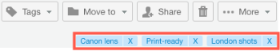

# Verwalten von Dateien in [!DNL Workfront Proof]

>[!IMPORTANT]
>
>Dieser Artikel bezieht sich auf die Funktionalität im eigenständigen Produkt [!DNL Workfront Proof]. Informationen zum Testen innerhalb von [!DNL Adobe Workfront] finden Sie unter [Testversand](../../../review-and-approve-work/proofing/proofing.md).

Sie können Informationen zu den in Workfront Proof hochgeladenen Dateien (nicht Testsendungen) verwalten, freigeben und anzeigen (siehe [Dateien und Webinhalte hochladen in [!DNL Workfront Proof]](../../../workfront-proof/wp-work-proofsfiles/create-proofs-and-files/upload-files-web-content.md)).

1. Klicken Sie im linken Navigationsbereich auf den Abwärtspfeil rechts neben **[!UICONTROL Ansichten]** und klicken Sie dann im Dropdown-Menü auf **[!UICONTROL Dateien]** .

1. Klicken Sie auf die Schaltfläche **[!UICONTROL Mehr]** für die Datei und dann im angezeigten Menü auf **[!UICONTROL Dateidetails anzeigen]** .\
   \
   Im sich öffnenden Fenster können Sie Details zur Datei anzeigen und bearbeiten. Sie können beispielsweise den Dateinamen oben im Fenster, den [!DNL Workfront Proof] **Ordner**, der die Datei speichert, und den **Eigentümer** der Datei ändern.\
   

1. (Optional) Wenn Sie über Bearbeitungsrechte für die Datei verfügen, verwenden Sie die Aktionsschaltflächen in der oberen rechten Ecke, um die Datei zu verwalten und freizugeben:

* **[!UICONTROL Tags]**. Verwalten Sie auf die Datei angewendete Tags.\
   \
   Unter den Aktionsschaltflächen können Sie alle Tags anzeigen, die auf die Datei angewendet wurden. Sie können ein unerwünschtes Tag entfernen, indem Sie auf das x daneben klicken.\
   

* **[!UICONTROL Verschieben nach]**. Organisieren Sie Ihre Dateien in Ordnern. Sie können eine Datei zwischen vorhandenen Ordnern verschieben oder sie in einem neuen Ordner ablegen.\
   

* **[!UICONTROL Share]**. Geben Sie Dateien für andere Personen frei. [!DNL Workfront Proof] sendet eine E-Mail-Benachrichtigung mit einer benutzerdefinierten Nachricht und Downloadlinks an die Empfänger.\
   

* **[!UICONTROL Löschen]**. Sie können die Datei löschen, indem Sie sie in den Papierkorb verschieben. Beachten Sie, dass die Datei auf Ihre Speicherbegrenzung angerechnet wird, bis der Papierkorb geleert ist (siehe [Den Papierkorb wiederherstellen und in  [!DNL Workfront Proof]](../../../workfront-proof/wp-work-proofsfiles/manage-your-work/restore-and-empty-trash.md) leeren).\
   

* **[!UICONTROL Mehr]**. In dieser Dropdown-Liste können Sie auf **[!UICONTROL In Testversand konvertieren]** klicken, um einen Testversand für eine Datei zu erstellen (siehe [Testsendungen in  [!DNL Workfront Proof]](../../../workfront-proof/wp-work-proofsfiles/create-proofs-and-files/generate-proofs.md) generieren). Die Datei muss unsere Dateitypanforderungen für Testsendungen erfüllen (siehe [Unterstützte Testversanddateitypen und Größenbeschränkungen - Übersicht](../../../review-and-approve-work/proofing/proofing-overview/supported-proofing-file-types.md)). Wenn der Dateiname mit dem Namen eines vorhandenen Testversands übereinstimmt, zeigt [!DNL Workfront Proof] eine Nachricht mit einem Link an, über den Sie die Datei in eine **[!UICONTROL neue Version]** dieses Testversands konvertieren können (siehe ).\
   

  >[!TIP]
  >
  >Für Dateien, die über ein anderes [!DNL Workfront Proof] -Konto freigegeben wurden (und nicht in Ihr eigenes Konto hochgeladen wurden), ist die Konvertierung nur für Unternehmenspläne verfügbar.

  Sie können auch auf **[!UICONTROL Herunterladen]** klicken, um die Originaldatei auf Ihren Computer herunterzuladen.

1. (Optional) Öffnen Sie den Abschnitt &quot;**[!UICONTROL Für]** freigegeben&quot;, um die Benutzer aufzulisten, für die die Datei freigegeben wurde.

   Sie können einen Benutzer mit dem Symbol **[!UICONTROL Mehr]** rechts **[!UICONTROL Nachricht]** oder **[!UICONTROL Entfernen]** über das Symbol Mehr löschen.

   

   Wenn Sie sich für die Nachricht eines dieser Benutzer entscheiden, wird die Seite &quot;**[!DNL Message all]**&quot; angezeigt, auf der Sie mehrere Nachrichten gleichzeitig senden können.

1. Öffnen Sie den Abschnitt **[!UICONTROL Aktivität]** , um alle Aktivitäten in der Datei aufzulisten, einschließlich Uhrzeit, Datum und Person, die die Aktion ausgeführt hat. Zu den Aktivitäten gehören:

   * Datei hochgeladen
   * Neue Personen hinzugefügt
   * Personen entfernt
   * Datei heruntergeladen

1. Öffnen Sie den Abschnitt **[!UICONTROL Nachrichten]** , um Nachrichten zu verfolgen, die Benutzer in Verbindung mit der Datei gesendet haben. Sie können den Inhalt einer Nachricht anzeigen, indem Sie rechts auf das Symbol &quot;i&quot;klicken.
