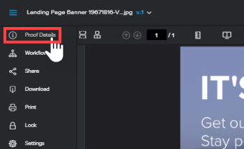

# Verwalten von Korrekturabzugsdetails in [!DNL Workfront Proof]

>[!IMPORTANT]
>
>Dieser Artikel bezieht sich auf Funktionen im eigenständigen [!DNL Workfront Proof]. Informationen zu Proofing in [!DNL Adobe Workfront] finden Sie unter [Proofing](../../../review-and-approve-work/proofing/proofing.md).

Auf [!UICONTROL &#x200B; Seite „Korrekturabzugsdetails] können Sie einen vorhandenen Korrekturabzug verwalten. Sie können beispielsweise neue Prüfer hinzufügen, die Frist ändern, die ursprünglich für den Korrekturabzug festgelegten Einstellungen ändern und überprüfen, welche Aktivität in diesem Korrekturabzug stattgefunden hat.

Die Seite [!UICONTROL Korrekturabzugsdetails] ist besonders nützlich für Personen, die für Projekte verantwortlich sind und alle Änderungen in einem Korrekturabzug nachverfolgen müssen. Auf dieser Seite finden sie alles, was sie über einen Korrekturabzug wissen müssen, mit nur wenigen Klicks.

Informationen zum Verwalten automatisierter Workflow-Korrekturabzüge finden Sie unter [Verwalten eines Korrekturabzugs, der mit einem automatisierten Workflow in konfiguriert wurde [!DNL Workfront Proof]](../../../workfront-proof/wp-work-proofsfiles/automated-workflow/manage-proof-configured-auto-workflow.md).

## Öffnen der Seite mit den Korrekturabzugsdetails über eine Ansichtsliste

1. Klicken Sie auf **[!UICONTROL Mehr]** (drei Punkte) rechts neben dem Korrekturabzug und dann auf **[!UICONTROL Details des Korrekturabzugs anzeigen]**.

## Öffnen der Seite „Korrekturabzugsdetails“ über die Korrekturabzugsanzeige

1. Wenn die linke Symbolleiste nicht angezeigt wird, klicken Sie auf **[!UICONTROL Menü]**-Symbol in der linken oberen Ecke.\
   

1. Bewegen Sie den Mauszeiger über die linke Symbolleiste und klicken Sie dann auf **[!UICONTROL Details des Korrekturabzugs]**.\
   

   >[!NOTE]
   >
   >Nur [!DNL Workfront Proof] Benutzer haben über die Korrekturabzugsansicht Zugriff auf die Seite mit den Korrekturabzugsdetails. Weitere Informationen finden [&#x200B; unter &#x200B;](https://support.workfront.com/hc/en-us/sections/115000911887-Users)Benutzer“.

   Siehe auch [Bearbeiten von Korrekturabzugphasen und &#x200B;](../../../review-and-approve-work/proofing/managing-proofs-within-workfront/edit-proof-stages-and-reviewers.md) und [Konfigurieren der Korrekturabzugseinstellungen in [!DNL Workfront Proof]](../../../workfront-proof/wp-work-proofsfiles/manage-your-work/configure-proof-settings.md).

## Informationen und Optionen auf der Seite Korrekturabzugsdetails

Auf der Seite mit den Details zum Testversand finden Sie folgende Informationen. Wenn Sie Bearbeitungsrechte für den Korrekturabzug haben, können Sie einige dieser Details bearbeiten. [!DNL Workfront Proof] speichert Ihre Änderungen automatisch. Weitere Informationen finden Sie unter [Korrekturabzugsberechtigungen in [!DNL Workfront Proof]](../../../workfront-proof/wp-acct-admin/account-settings/proof-perm-profiles-in-wp.md) und [Rollen für Korrekturabzüge verwalten in [!DNL Workfront Proof]](../../../workfront-proof/wp-work-proofsfiles/share-proofs-and-files/manage-proof-roles.md).

>[!NOTE]
>
>Möglicherweise werden nicht alle Elemente auf der Seite angezeigt, da die verfügbare Option von Ihrer Rolle beim Korrekturabzug, Ihrem Berechtigungsprofil und den Einstellungen beim Korrekturabzug abhängt. Weitere Informationen finden Sie unter [Verwalten von Korrekturabzugsrollen in [!DNL Workfront Proof]](../../../workfront-proof/wp-work-proofsfiles/share-proofs-and-files/manage-proof-roles.md), [Korrekturabzugsberechtigungsprofile in [!DNL Workfront Proof]](../../../workfront-proof/wp-acct-admin/account-settings/proof-perm-profiles-in-wp.md) und [Konfigurieren der Korrekturabzugseinstellungen in Workfront Proof](../../../workfront-proof/wp-work-proofsfiles/manage-your-work/configure-proof-settings.md).

* Name des Korrekturabzugs: [!DNL Workfront Proof] erstellt den Namen des Korrekturabzugs (groß gedruckt in der oberen linken Ecke) anhand des Namens der Originaldatei, mit der der Korrekturabzug erstellt wurde, es sei denn, der Korrekturabzug wird bei der Erstellung benannt. Klicken Sie auf den Namen hier, um ihn zu bearbeiten.
* Grundlegende Informationen zum Korrekturabzug:

   * **Ordner** Wenn der Korrekturabzug in einem Ordner gespeichert ist, werden der Name des Ordners zusammen mit der Anzahl der Personen angezeigt, für die der Ordner freigegeben wurde. Sie können den Speicherort des Korrekturabzugs an einen anderen Speicherort hier ändern. Weitere Informationen finden Sie unter [Ordner in verwalten [!DNL Workfront Proof]](../../../workfront-proof/wp-work-proofsfiles/organize-your-work/manage-folders.md).

   * **Dateiname**: Bei kombinierten Korrekturabzügen können Sie **[!UICONTROL Zum Anzeigen klicken]** eine Liste der im Korrekturabzug enthaltenen Dateien anzeigen.

   * **Verantwortlicher:** Person, der der Korrekturabzug gehört. Hier können Sie einen anderen Verantwortlichen für den Testversand auswählen. Weitere Informationen finden Sie unter [Profile für Korrekturabzugsberechtigungen in [!DNL Workfront Proof]](../../../workfront-proof/wp-acct-admin/account-settings/proof-perm-profiles-in-wp.md).

   * **Delegiert:** Wenn die Abwesenheitsfunktion aktiviert ist, wird der delegierte Inhaber des Korrekturabzugs angezeigt. Weitere Informationen finden Sie unter &quot;[&#x200B; von Verantwortlichen für temporäre Korrekturabzüge in  [!DNL Workfront Proof]](../../../workfront-proof/wp-getstarted/personal-settings/designate-temp-proof-owners.md).

   * **Erstellt** Uhrzeit und Datum, an dem der Korrekturabzug hochgeladen wurde.
   * **State:** Aktueller Status des Korrekturabzugs. Sie können den Status des Korrekturabzugs hier ändern. Weitere Informationen finden Sie unter [Anzeigen des Fortschritts und Status eines Korrekturabzugs in [!DNL Workfront Proof]](../../../workfront-proof/wp-work-proofsfiles/manage-your-work/view-progress-and-status-of-proof.md).

   * **ID**: Eine eindeutige Nummer, die jedem in [!DNL Workfront Proof] erstellten Korrekturabzug zugewiesen ist.

* Aktionsschaltflächen oberhalb der grundlegenden Details des Korrekturabzugs:

   * **[!UICONTROL Zum Korrekturabzug wechseln]**: Öffnet den Korrekturabzug in der Korrekturabzugsansicht.
   * **[!UICONTROL Freigeben]**: Ermöglicht das Freigeben des Korrekturabzugs für Prüfende. Siehe [Freigeben eines Korrekturabzugs in [!DNL Workfront Proof]](../../../workfront-proof/wp-work-proofsfiles/share-proofs-and-files/share-proof.md).

   * **[!UICONTROL Herunterladen]**: Ermöglicht es Ihnen, für kombinierte Korrekturabzüge einzelne Dateien (in eine ZIP-Datei gepackt) herunterzuladen. Siehe [Herunterladen von in gespeicherten Dateien [!DNL Workfront Proof]](../../../workfront-proof/wp-work-proofsfiles/manage-your-work/download-files-stored.md).

   * **[!UICONTROL Kommentare]**. Ermöglicht die Erstellung eines druckbaren Berichts über den Testversand, der alle Entscheidungen, Kommentare und Markierungen enthält. Siehe [Drucken und Exportieren von Kommentaren in [!DNL Workfront Proof]](../../../workfront-proof/wp-work-proofsfiles/organize-your-work/print-and-export-comments.md).

   * **[!UICONTROL Mehr]**: Dieses Menü bietet mehrere Aktionen.

      * **[!UICONTROL In Excel exportieren]**: Informationen zum Exportieren eines Korrekturabzugs nach Excel finden Sie unter [Drucken und Exportieren von Kommentaren in [!DNL Workfront Proof]](../../../workfront-proof/wp-work-proofsfiles/organize-your-work/print-and-export-comments.md).

      * **[!UICONTROL Diese Version kopieren]** und **[!UICONTROL Mit neuer Datei kopieren]**: Informationen zum Kopieren einer Version eines Korrekturabzugs finden Sie unter [Kopieren von Korrekturabzügen in  [!DNL Workfront Proof]](../../../workfront-proof/wp-work-proofsfiles/create-proofs-and-files/copy-proofs.md).

      * **[!UICONTROL Sperren]**: Durch das Sperren eines Korrekturabzugs wird dieser aus dem aktiven in einen gesperrten Status verschoben.

        Wenn ein Korrekturabzug gesperrt ist, ist es nicht mehr möglich, den Korrekturabzug zu kommentieren und Entscheidungen zu treffen. Sie können einen Korrekturabzug so einstellen, dass er bei allen Entscheidungen automatisch gesperrt wird, indem Sie diese Einstellung auf den Korrekturabzug anwenden.

      * Wenn Sie eine neue Version eines Korrekturabzugs hochladen, wird die vorherige Version automatisch gesperrt. Weitere Informationen finden Sie unter .
      * **[!UICONTROL Frühere Version ändern]**: dient der Verknüpfung separater Korrekturabzüge als Versionen innerhalb derselben Korrekturabzugskette (wobei alle Markierungen und Kommentare für jeden Korrekturabzug beibehalten werden). Dies muss über die Seite mit den Korrekturabzugsdetails des Korrekturabzugs erfolgen, bei dem es sich um die neueste Version des Korrekturabzugs handelt. Weitere Informationen [&#x200B; Sie unter „Verwalten  [!DNL Workfront Proof]](../../../workfront-proof/wp-work-proofsfiles/manage-your-work/manage-proof-versions.md) Korrekturabzugsversionen in“.

      * **[!UICONTROL Link zur vorherigen Version entfernen]**: Hiermit können Sie die Verknüpfung des aktuell angezeigten Korrekturabzugs mit dem übergeordneten Korrekturabzug (frühere Version) aufheben, ohne ihn mit einem anderen Korrekturabzug in Ihrem Konto zu verknüpfen. Weitere Informationen finden Sie unter [Verwalten von Korrekturabzugsversionen in [!DNL Workfront Proof]](../../../workfront-proof/wp-work-proofsfiles/manage-your-work/manage-proof-versions.md) in [Verwalten von Korrekturabzugsversionen in [!DNL Workfront Proof]](../../../workfront-proof/wp-work-proofsfiles/manage-your-work/manage-proof-versions.md).

      * **[!UICONTROL In automatisierten Workflow konvertieren]**: Hiermit können Sie den Workflow für den Korrekturabzug von „Standard“ in „Automatisiert“ konvertieren. Weitere Informationen finden Sie unter [Automatisierter Workflow - Übersicht](../../../review-and-approve-work/proofing/proofing-overview/automated-workflow.md).
   * **[!UICONTROL Workflow]**-Abschnitt: Hier können Sie den Fortschritt und die Frist für den Testversand überprüfen und die Einstellungen der Workflow-Phasen und der einzelnen Validierungsverantwortlichen ändern.

     Die Workflow-Phasen werden automatisch erstellt, indem die Validierungsverantwortlichen anhand der für sie festgelegten Fristen gruppiert werden. Sie können Personen zu Stadien hinzufügen, indem Sie die Frist für die Stadien festlegen (vorausgesetzt, das Fristdatum liegt nicht in der Vergangenheit). Sie können auch den Fortschritt und die Entscheidungen einzelner Reviewer im Korrekturabzug überprüfen und ihre Rollen im Korrekturabzug und in E-Mail-Warnhinweisen ändern.

     Informationen zum Bearbeiten eines Schritts finden Sie unter [Bearbeiten von Korrekturabzugsschritten und Prüfer](../../../review-and-approve-work/proofing/managing-proofs-within-workfront/edit-proof-stages-and-reviewers.md).

     >[!NOTE]
     >
     >Sie müssen über Bearbeitungsrechte für den Korrekturabzug verfügen, um die Korrekturabzugsschritte und die Details der Prüfer zu bearbeiten. Weitere Informationen finden [&#x200B; unter „Verwalten von Korrekturabzug [!DNL Workfront Proof]](../../../workfront-proof/wp-work-proofsfiles/share-proofs-and-files/manage-proof-roles.md)Rollen in und [Profile für Korrekturabzugsberechtigungen in  [!DNL Workfront Proof]](../../../workfront-proof/wp-acct-admin/account-settings/proof-perm-profiles-in-wp.md)&quot;.

   * Abschnitt **[!UICONTROL Weitere Freigabeoptionen]**: Ermöglicht die Aktivierung der Korrekturabzugs-URL und des Einbettungs-Codes. Wenn Sie die Basecamp-Integration mit [!DNL Workfront] Korrekturabzug verwenden, können Sie den Korrekturabzug auch zu einem [!DNL Basecamp] Projekt hinzufügen, das Projekt ändern, dem der Korrekturabzug hinzugefügt wurde (klicken Sie auf **[!UICONTROL Bearbeiten]**), und auf den Korrekturabzug in Basecamp zugreifen (klicken Sie auf den bereitgestellten Link).

   * **[!UICONTROL Einstellungen]** Abschnitt: Hiermit können Sie Einstellungen ändern, wie unter [[!UICONTROL Konfigurieren von &#x200B;] in [!DNL Workfront Proof]](../../../workfront-proof/wp-work-proofsfiles/manage-your-work/configure-proof-settings.md) beschrieben.

   * **[!UICONTROL Aktivität]** Abschnitt: Zeigt eine Liste aller Aktionen an, die am Korrekturabzug in chronologischer Reihenfolge ausgeführt wurden, und bietet einen Audit-Trail für den Korrekturabzug. Dazu gehören das Datum und die Details aller kürzlich durchgeführten Aktivitäten im Testversand. Neben dem Abschnitt [!UICONTROL Nachrichten] bietet der Abschnitt [!UICONTROL Aktivität] einen vollständigen Überblick über den Überprüfungsprozess des Testversands, der insbesondere für die für den Genehmigungsprozess zuständigen Projektmanager nützlich ist.
   * **[!UICONTROL Nachrichten]** Abschnitt: Listet die Details aller E-Mail-Aktivitäten für den Testversand auf. Weitere Informationen finden Sie unter [Konfigurieren von E-Mail-Benachrichtigungseinstellungen in [!DNL Workfront Proof]](../../../workfront-proof/wp-emailsntfctns/email-alerts/config-email-notification-settings-wp.md).

     Sie können auch die gesamte an die Validierungsverantwortlichen gesendete Nachricht anzeigen, indem Sie den Mauszeiger über das Symbol „i“ rechts neben der Nachricht bewegen und dann auf **[!UICONTROL Vollständige Nachricht anzeigen]** klicken.
