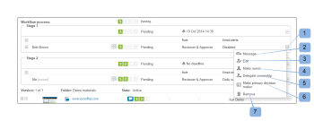

# Anzeigen des Fortschritts und Status eines Korrekturabzugs in [!DNL Workfront Proof]

>[!IMPORTANT]
>
>Dieser Artikel bezieht sich auf Funktionen im eigenständigen [!DNL Workfront Proof]. Informationen zu Proofing in [!DNL Adobe Workfront] finden Sie unter [Proofing](../../../review-and-approve-work/proofing/proofing.md).

## Verstehen des Korrekturabzugsstatus

Der Korrekturabzug-Fortschritt gibt die Arbeit an, die an einem Korrekturabzug durchgeführt wurde, und zwar ab dem Zeitpunkt, zu dem Sie den Korrekturabzug an Prüfende senden, bis zu dem Zeitpunkt, zu dem sie eine Entscheidung über den Korrekturabzug treffen.

* [Verlaufssymbole](#progress-icons)
* [Stufen des Korrekturabzugs](#levels-of-proof-progress)

### Verlaufssymbole {#progress-icons}

Die Fortschrittssymbole S, O, C und D werden in der Fortschrittsleiste angezeigt und geben den Fortschritt des Korrekturabzugs an.

Sie geben die folgenden Informationen zu einem Korrekturabzug an:

<table style="table-layout:auto"> 
 <col> 
 <col> 
 <thead> 
  <tr> 
   <td> 
<strong>Progress icon</strong> 
 </td> 
   <td> 
<strong>Beschreibung</strong> 
 </td> 
  </tr> 
 </thead> 
 <tbody> 
  <tr> 
   <td> 
  
 </td> 
   <td> 
<strong>Gesendet</strong>. Der Testversand wurde an die Validierungsverantwortlichen gesendet.
 </td> 
  </tr> 
  <tr> 
   <td> 
  
 
 
 </td> 
   <td> 
<strong>Geöffnet</strong>. Ein Prüfer hat die Seite mit den Korrekturabzugsdetails oder den Korrekturabzug selbst in der Korrekturabzugsansicht geöffnet.
 </td> 
  </tr> 
  <tr> 
   <td> 
  
 </td> 
   <td> 
<strong>Kommentare</strong>. Prüfer (Benutzer, die Kommentare abgeben können) haben Kommentare zum Korrekturabzug abgegeben.
 
Wenn für den Korrekturabzug keine Validierungsverantwortlichen bestimmt wurden, wird dieses Symbol nicht angezeigt.
 </td> 
  </tr> 
  <tr> 
   <td> 
  
 </td> 
   <td> 
<strong>Entscheidung</strong>. Ein Prüfer hat eine Entscheidung über den Korrekturabzug getroffen.
 
Wenn für den Korrekturabzug keine genehmigenden Personen (Entscheidungsträger) bestimmt sind, wird dieses Symbol nicht angezeigt. 
 </td> 
  </tr> 
 </tbody> 
</table>

Diese Symbole können in den folgenden Farben angezeigt werden, um bestimmte Informationen über den Fortschritt des Korrekturabzugs anzuzeigen:

* **Grün**. Fertig stellen.
* **Weiß**. Nicht abgeschlossen.
* **Orange**. Nicht abgeschlossen und die Frist beträgt weniger als 24 Stunden.
* **Rot**. Nicht abgeschlossen und Frist überschritten.

### Stufen des Korrekturabzugs {#levels-of-proof-progress}

Workfront Proof verwendet die Fortschrittssymbole, um den Fortschritt eines Korrekturabzugs auf jeder der folgenden Ebenen zu verfolgen:

* Für jeden Prüfer basierend auf der Aktivität dieser Person im Testversand.
* Für jeden Schritt wird auf der Grundlage des Fortschritts der Prüfer auf der Stufe ermittelt, der beim Proofing-Prozess am meisten zurückliegt. Weitere Informationen finden Sie unter [Automatisierte Workflow-Phasen - Übersicht](../../../review-and-approve-work/proofing/proofing-overview/stages.md).
* Für den Testversand auf der Grundlage des Fortschritts des Schritts (Gruppe von Prüfern), der beim Testversand am meisten zurückliegt.

Angenommen, drei Prüfer eines Korrekturabzugs müssen eine Entscheidung treffen, um zu zeigen, wie [!DNL Workfront Proof] den Fortschritt anhand des Überprüfers oder der Phase bestimmt, die am meisten hinterherhinkt. Wenn zwei von ihnen ihre Entscheidung getroffen haben, die dritte jedoch nicht, wird in der Fortschrittsleiste für den Testversand aufgrund der ausstehenden Entscheidung kein grünes D angezeigt.

Wenn für einen Korrekturabzug die Einstellung [!UICONTROL Primärer Entscheidungsträger] ausgewählt ist und der primäre Entscheidungsträger eine Entscheidung übermittelt, wird das Feld D in der Fortschrittsleiste des Korrekturabzugs für alle Prüfer grün, da keine anderen Entscheidungen erforderlich sind.

Wenn für einen Korrekturabzug die Einstellung [!UICONTROL Nur eine Entscheidung erforderlich] ausgewählt ist und ein Validierungsverantwortlicher eine Entscheidung einreicht, wird das Feld D in der Fortschrittsleiste des Korrekturabzugs für alle Validierungsverantwortlichen grün, da keine anderen Entscheidungen erforderlich sind.

## Grundlagen zum Teststatus

Der Korrekturabzugsstatus zeigt den Status der Entscheidungen an, die für den Korrekturabzug erforderlich sind.

\
Die Standardstatusoptionen sind:

* Ausstehend
* Genehmigt
* Genehmigt mit Änderungen
* Erforderliche Änderungen
* Nicht relevant

Wenn benutzerdefinierte Entscheidungen in Ihrem Konto konfiguriert sind, spiegeln die Statusoptionen Ihre benutzerdefinierten Entscheidungseinstellungen wider.

Der Status des Testversands wird vom Teilnehmer mit dem „Worst Case“-Status gesteuert. Angenommen, es gibt drei Entscheidungen zum Korrekturabzug: zwei haben den Status **Akzeptiert** und eine den Status **Abgelehnt**. Die „Worst-Case“-Entscheidung „Abgelehnt“ übertrifft die anderen Entscheidungen, und der Gesamtstatus des Nachweises wird als &quot;**&quot;**.

## Anzeigen von Fortschritt und Status {#viewing-progress-and-status}

Sie können den Fortschritt und Status für Korrekturabzüge, Phasen und Prüfer in jedem Schritt anzeigen.

* [Korrekturabzug-Zusammenfassung](#proof-summary)
* [Menü „Staging-Aktionen“](#stage-actions-menu)
* [Im [!UICONTROL Zusammenfassung] können Sie auch auf die Reviewer-Aktionsmenüs zugreifen, sofern Sie über Bearbeitungsrechte für den Korrekturabzug verfügen. Weitere Informationen finden Sie unter Profile für Korrekturabzugsberechtigungen in Workfront Proof und Rollen für Korrekturabzüge verwalten in Workfront Proof. Das [!UICONTROL Reviewer-Aktionen]-Menü (1) wird angezeigt, wenn Sie den Mauszeiger über die Details des Reviewers bewegen. Es bietet Ihnen folgende Möglichkeiten:](#in-the-summary-section-you-can-also-access-the-reviewer-actions-menus-provided-you-have-edit-rights-on-the-proof-for-more-information-see-proof-permissions-profiles-in-workfront-proof-and-manage-proof-roles-in-workfront-proof-the-reviewer-actions-menu-1-appears-when-you-hover-over-the-reviewer-s-details-and-allows-you-to)
* [Aktionsmenü für Korrekturabzüge](#proof-actions-menu)

### Korrekturabzug-Zusammenfassung {#proof-summary}

Jeder Korrekturabzug im Ordner verfügt über eine erweiterbare Zusammenfassung, mit der Sie die Details des Korrekturabzugs schnell anzeigen und bearbeiten können.

So erweitern oder reduzieren Sie die Zusammenfassung:

1. Klicken Sie auf den Pfeil links neben dem Korrekturabzug im Dashboard oder in einer beliebigen Listenansicht.

Die Zusammenfassung umfasst Folgendes:

* Workflow (2)
* Version (3)
* Ordner (4)
* Bundesland (5)\
   

In der Zusammenfassung können Sie die folgenden Details Ihres Korrekturabzugs anzeigen und bearbeiten:

* Testversand-Fortschritt (1)
* Fortschritt jeder Phase (2)
* Frist für die Etappe (3)
* Reviewer-Details:

   * Anzahl der Kommentare und Antworten der einzelnen Prüfer (4)
   * Fortschritt der einzelnen Validierungsverantwortlichen (5)
   * Entscheidung (Wenn eine Entscheidung elektronische Signaturen enthält, wird neben der Entscheidung ein Symbol angezeigt, das dies angibt.) (6)
   * Rolle im Testversand (7)
   * E-Mail-Warnhinweiseinstellungen (8)

>[!NOTE]
>
>Ihre Möglichkeit, die Details des Korrekturabzugs zu bearbeiten, hängt von Ihren Rechten für den Korrekturabzug ab (siehe [Berechtigungen für Korrekturabzüge in Profilen [!DNL Workfront Proof]](../../../workfront-proof/wp-acct-admin/account-settings/proof-perm-profiles-in-wp.md) und [Rollen für Korrekturabzüge verwalten in [!DNL Workfront Proof]](../../../workfront-proof/wp-work-proofsfiles/share-proofs-and-files/manage-proof-roles.md)).

### Menü [!UICONTROL Staging-])  {#stage-actions-menu}

Jede Phase Ihres Workflows verfügt über ein separates Menü, mit dem Sie Massenaktionen für die Validierungsverantwortlichen in dieser Phase durchführen können.

Das [!UICONTROL Staging-]&quot; wird angezeigt, wenn Sie den Mauszeiger über den Staging-Abschnitt (1) bewegen. Es bietet Ihnen folgende Möglichkeiten

* [!UICONTROL Nachricht alle] (2)
* [!UICONTROL Freigabe] (3)
* [!UICONTROL Phase löschen] (4)

>[!NOTE]
>
>Die Verfügbarkeit dieser Optionen hängt von Ihren Berechtigungen für den Korrekturabzug ab (siehe [Berechtigungen für Korrekturabzüge in Profilen [!DNL Workfront Proof]](../../../workfront-proof/wp-acct-admin/account-settings/proof-perm-profiles-in-wp.md) und [Rollen für Korrekturabzüge verwalten in [!DNL Workfront Proof]](../../../workfront-proof/wp-work-proofsfiles/share-proofs-and-files/manage-proof-roles.md)).

Im Abschnitt Zusammenfassung können Sie auch auf die Reviewer-Aktionsmenüs zugreifen, sofern Sie über Bearbeitungsrechte für den Korrekturabzug verfügen. Weitere Informationen finden Sie unter [Korrekturabzugsberechtigungen in [!DNL Workfront Proof]](../../../workfront-proof/wp-acct-admin/account-settings/proof-perm-profiles-in-wp.md) und [Rollen für Korrekturabzüge verwalten in [!DNL Workfront Proof]](../../../workfront-proof/wp-work-proofsfiles/share-proofs-and-files/manage-proof-roles.md). Das Reviewer-Aktionsmenü (1) wird angezeigt, wenn Sie den Mauszeiger über die Details des Reviewers bewegen. Es bietet Ihnen folgende Möglichkeiten:

* Senden einer Nachricht an den Validierer (2)
* Details des Reviewers bearbeiten (3)- ermöglicht die Bearbeitung des Anzeigenamens, der Rolle des Korrekturabzugs und des E-Mail-Warnhinweises für diesen Reviewer
* Als Besitzer des Testversands festlegen (4)
* Sie zum primären Entscheidungsträger machen (5)
* Aus dem Testversand entfernen (6)

>[!NOTE]
>
>Die Sichtbarkeit dieser Optionen hängt von Ihren Rechten auf dem Korrekturabzug ab (siehe [Berechtigungen für Korrekturabzüge in Profilen [!DNL Workfront Proof]](../../../workfront-proof/wp-acct-admin/account-settings/proof-perm-profiles-in-wp.md) und [Rollen für Korrekturabzüge verwalten in [!DNL Workfront Proof]](../../../workfront-proof/wp-work-proofsfiles/share-proofs-and-files/manage-proof-roles.md)).

### Aktionsmenü für Korrekturabzüge {#proof-actions-menu}

Jeder Korrekturabzug verfügt außerdem über ein Menü (1), in dem Sie die folgenden Aktionen ausführen können:

* Sie können auf die Seite mit den Korrekturabzugsdetails zugreifen (2)
* Korrekturabzug für andere Personen freigeben (3)
* Senden einer Nachricht an validierungsverantwortliche Benutzer (4)
* Erstellen einer neuen Version des Testversands (5)
* Testversand kopieren (6)
* Originaldatei herunterladen (7)
* Korrekturabzugs-Links freigeben (8)
* Kommentare drucken (9)
* Excel-Zusammenfassung des Testversands anfordern (10)
* Korrekturabzug sperren (11)
* Löschen des Korrekturabzugs (12)

>[!NOTE]
>
>Die Verfügbarkeit dieser Optionen hängt von Ihren Berechtigungen für den Korrekturabzug ab (siehe [Berechtigungen für Korrekturabzüge in Profilen [!DNL Workfront Proof]](../../../workfront-proof/wp-acct-admin/account-settings/proof-perm-profiles-in-wp.md) und [Rollen für Korrekturabzüge verwalten in [!DNL Workfront Proof]](../../../workfront-proof/wp-work-proofsfiles/share-proofs-and-files/manage-proof-roles.md)).

Weitere Informationen zur Anzeige des Korrekturabzugsfortschritts und -status in [!DNL Workfront] finden Sie unter [Anzeigen von Fortschritt und Status](#viewing-progress-and-status).

Weitere Informationen zur Anzeige von Fortschritt und Status im Desktop Proofing Viewer finden Sie unter [Überprüfen eines Workflows im Proofing Viewer](../../../workfront-proof/wp-work-proofsfiles/review-proofs-wpv/review-workflow.md).
