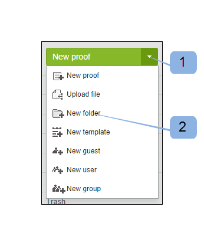

# Erstellen von Ordnern in [!DNL Workfront Proof]

>[!IMPORTANT]
>
>Dieser Artikel bezieht sich auf die Funktionalität im eigenständigen Produkt [!DNL Workfront Proof]. Informationen zum Testen innerhalb von [!DNL Adobe Workfront] finden Sie unter [Testversand](../../../review-and-approve-work/proofing/proofing.md).

## Erstellen eines neuen Ordners der obersten Ebene {#creating-a-new-top-level-folder}

1. Klicken Sie in der Seitenleiste auf den Dropdown-Pfeil (1) neben der grünen Schaltfläche **[!UICONTROL Neuer Testversand]**.
1. Wählen Sie **[!UICONTROL Neuer Ordner]** aus. Absatz 2\
   Die Seite [!UICONTROL Neuer Ordner] wird angezeigt.

1. Fahren Sie mit [Konfigurieren des neuen Ordners](#configuring-the-new-folder) fort.\
   

## Erstellen eines neuen Unterordners {#creating-a-new-sub-folder}

Sie können Unterordner auf eine der folgenden Arten erstellen:

* [Erstellen eines Unterordners auf der Seite Ordnerdetails](#creating-a-sub-folder-from-the-folder-details-page)
* [Erstellen eines Unterordners auf der Seite &quot;Kontoordner&quot;](#creating-a-sub-folder-from-the-account-folders-page)

>[!NOTE]
>
>Wenn Sie einen neuen Unterordner erstellen, wird die Freigabeliste vom übergeordneten Ordner übernommen.

### Erstellen eines Unterordners auf der Seite [!UICONTROL Ordnerdetails] {#creating-a-sub-folder-from-the-folder-details-page}

Weitere Informationen zur Seite [!UICONTROL Ordnerdetails] finden Sie unter [Verwalten von Ordnern und deren Inhalt in Workfront Proof](../../../workfront-proof/wp-work-proofsfiles/organize-your-work/manage-folders-and-contents.md).

So erstellen Sie einen Unterordner auf der Seite [!UICONTROL Ordnerdetails] :

1. Klicken Sie in der Seitenleiste auf den Ordnernamen in der Liste [!UICONTROL Meine Ordner] (1), um auf die Ordnerdetailseite zuzugreifen.

1. Klicken Sie oben auf der Seite auf die neue Unterordnerschaltfläche (2).\
   In der Liste der Elemente im Ordner wird ein neuer Ordner angezeigt.
1. Geben Sie einen Namen für den neuen Unterordner ein. Absatz 3
1. Drücken Sie die Taste **[!UICONTROL Enter]**.\
   Oder\
   Klicken Sie außerhalb des Ordnernamen-Felds auf .

1. (Optional) Bearbeiten Sie die Details des neuen Unterordners auf der Seite Ordnerdetails .
1. Fahren Sie mit [Konfigurieren des neuen Ordners](#configuring-the-new-folder) fort.

### Erstellen eines Unterordners auf der Seite &quot;Kontoordner&quot; {#creating-a-sub-folder-from-the-account-folders-page}

1. Klicken Sie in der Seitenleiste auf die Ordner [Ihr Kontoname] , um auf die Seite &quot;Kontoordner&quot;(1) zuzugreifen.\
   

1. Suchen Sie den Ordner, dem Sie einen Unterordner hinzufügen möchten, und öffnen Sie das Menü [!UICONTROL actions] (2).
1. Wählen Sie [!UICONTROL Neuer Unterordner] aus dem Menü (3)\
   Die Seite [!UICONTROL Neuer Ordner] wird angezeigt.
1. Fahren Sie mit [Konfigurieren des neuen Ordners](#configuring-the-new-folder) fort.

## Konfigurieren des neuen Ordners {#configuring-the-new-folder}

Nachdem Sie mit der Erstellung eines neuen Ordners begonnen haben (wie unter [Erstellen eines neuen Ordners der obersten Ebene](#creating-a-new-top-level-folder) oder [Erstellen eines neuen Unterordners](#creating-a-new-sub-folder) beschrieben), können Sie die Konfigurationsoptionen wie in diesem Abschnitt beschrieben festlegen.

* [Breadcrumb-Navigation](#breadcrumb-navigation) (1)
* [Ordnerdetails](#folder-details) (2)
* [Client-Details](#client-details) (3)
* [Share](#share) (4)

### Breadcrumb-Navigation {#breadcrumb-navigation}

Die Breadcrumb-Navigation zeigt Ihnen, ob Sie einen Ordner der obersten Ebene oder einen Unterordner erstellen. (1)

### Ordnerdetails {#folder-details}

In diesem Abschnitt können Sie dem Ordner, den Sie erstellen, die folgenden Informationen hinzufügen (und überprüfen):

* Ordnername - dieses Feld ist obligatorisch (1)
* Wenn Sie auf den Link [!UICONTROL Liste anzeigen] (2) klicken, wird ein Popup mit einer Liste von Personen angezeigt, für die dieser Ordner freigegeben ist. Diese Informationen sind besonders nützlich, wenn Sie Unterordner erstellen, da Unterordner automatisch für dieselben Personen freigegeben werden wie der übergeordnete Ordner.
* Beschreibung (3) - Hier können Sie eine kurze Beschreibung des Ordners hinzufügen. Diese wird auf der Seite Ordnerdetails angezeigt.
* Machen Sie den Ordner privat (4) - durch Anklicken des Kontrollkästchens wird dieser Ordner privat (sodass nur für Personen sichtbar ist, für die Sie den Ordner explizit freigeben, und für die Benutzer in Ihrem Konto mit den Profilen von [Profilberechtigungsprofilen in [!DNL Workfront Proof]](../../../workfront-proof/wp-acct-admin/account-settings/proof-perm-profiles-in-wp.md), [Profilberechtigungsprofilen in [!DNL Workfront Proof]](../../../workfront-proof/wp-acct-admin/account-settings/proof-perm-profiles-in-wp.md) oder [Profilberechtigungen in [!DNL Workfront Proof]](../../../workfront-proof/wp-acct-admin/account-settings/proof-perm-profiles-in-wp.md) ). Weitere Informationen zu privaten und öffentlichen Ordnern in Workfront Proof finden Sie unter [Grundlegendes zu Ordnerberechtigungen in  [!DNL Workfront Proof]](../../../workfront-proof/wp-work-proofsfiles/organize-your-work/folder-permissions.md) .

### Client-Details {#client-details}

In diesem Abschnitt können Sie die Details Ihres Clients ausfüllen. Auf diese Weise können Sie die Seite Meine Ordner nach Client-/Projektname sortieren:

* Kundenname (1)
* Projektname (2)

### Freigeben {#share}

Im Abschnitt [!UICONTROL Freigabe] haben Sie folgende Möglichkeiten:

* Weisen Sie einen neuen Eigentümer des Ordners zu (1) - der Ersteller des Ordners bleibt im Ordner aufgeführt und kann nicht entfernt werden. Sie können jedoch einen anderen Benutzer in Ihrem Konto zum Eigentümer machen, der ihm Bearbeitungsrechte für den Ordner gewährt.
* Geben Sie den Ordner für andere [!DNL Workfront Proof] -Benutzer frei, indem Sie deren E-Mail-Adresse (2) eingeben. Beachten Sie, dass Ordner nur für Personen freigegeben werden können, die über eigene [!DNL Workfront Proof] -Anmeldungen verfügen.
* Legen Sie die Berechtigungen für die Personen fest, für die Sie den Ordner freigeben (3). Dies ist nützlich, um private Ordner für Benutzer aus Ihrem Konto freizugeben. Sie können entscheiden, ob Benutzer mit dem Profil [Profile für Testberechtigungen in [!DNL Workfront Proof]](../../../workfront-proof/wp-acct-admin/account-settings/proof-perm-profiles-in-wp.md) Elemente im Ordner erstellen, bearbeiten und löschen dürfen.
* Entfernen Sie einen Benutzer aus der Liste der Ordnerfreigabe, indem Sie auf das Papierkorbsymbol (4) rechts neben dem Namen des Benutzers klicken.
* Entfernen Sie alle Ordner aus der Ordnerfreigabe, indem Sie auf das oberste Papierkorbsymbol (5) klicken. Beachten Sie, dass Sie den Ersteller oder Eigentümer des Ordners nicht entfernen können.

Weitere Informationen finden Sie unter [Ordner in  [!DNL Workfront Proof]](../../../workfront-proof/wp-work-proofsfiles/organize-your-work/share-folders.md) freigeben .

