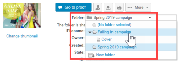

# Verwalten Sie Ordner und deren Inhalte in [!DNL Workfront Proof]

>[!IMPORTANT]
>
>Dieser Artikel bezieht sich auf die Funktionalität im eigenständigen Produkt [!DNL Workfront Proof]. Informationen zum Testen in [!DNL Adobe Workfront], siehe [Testversand](../../../review-and-approve-work/proofing/proofing.md).

Einer der Vorteile der Organisation Ihrer Projekte und Testsendungen in Ordnern besteht darin, sie in der [!UICONTROL Ordnerdetails] Seite. Diese Seite ist ein Kontrollzentrum für Ihr Projekt. Von hier aus können Sie bequem einzelne Testsendungen und Dateien verwalten sowie Massenaktionen durchführen.

## Gruppieren von Elementen, damit die Prüfer gemeinsam daran arbeiten können

Sie können Ordner verwenden, um Testsendungen zu gruppieren, an denen Prüfer zusammenarbeiten sollen. Wenn ein Überprüfer einen der Testsendungen im Ordner öffnet, um den Testversand-Viewer zu starten, sind alle anderen Testsendungen im Ordner verfügbar. Der Überprüfer kann an jedem Testversand im Ordner arbeiten, ohne den Testversand-Viewer zu verlassen. Weitere Informationen finden Sie unter [Arbeiten mit mehreren Testsendungen im Testversand-Viewer](../../../workfront-proof/wp-work-proofsfiles/review-proofs-wpv/work-with-multiple-proofs.md).

## Hinzufügen neuer Elemente zu einem Ordner

Wenn Sie einen Testversand erstellen oder eine Datei hochladen, können Sie den Ordner auswählen, in dem Sie die Datei im [!UICONTROL Organisieren] im Abschnitt [!UICONTROL Neuer Testversand] oder [!UICONTROL Neue Datei] Seite.

Weitere Informationen finden Sie unter [Testsendungen generieren in [!DNL Workfront Proof]](../../../workfront-proof/wp-work-proofsfiles/create-proofs-and-files/generate-proofs.md) oder [Hochladen von Dateien und Webinhalten in [!DNL Workfront Proof]](../../../workfront-proof/wp-work-proofsfiles/create-proofs-and-files/upload-files-web-content.md).

>[!NOTE]
>
>Wenn Sie sich derzeit den Ordner ansehen, dem Sie ein neues Element hinzufügen möchten, wird dieser Ordner automatisch im [!UICONTROL Organisieren] beim Öffnen der Seite Neuer Testversand oder der [!UICONTROL Neue Datei] Seite.

## Hinzufügen vorhandener Elemente zu einem Ordner

Sie können eine vorhandene Datei oder einen Testversand zu einem Ordner hinzufügen.

Weitere Informationen finden Sie unter [Verwalten von Dateien in [!DNL Workfront Proof]](../../../workfront-proof/wp-work-proofsfiles/manage-your-work/manage-files.md) oder [Testversanddetails in Workfront Testversand verwalten](../../../workfront-proof/wp-work-proofsfiles/manage-your-work/manage-proof-details.md).

1. (Bedingt) Führen Sie einen der folgenden Schritte aus:

   * Wenn Sie einem Ordner einen Testversand hinzufügen, gehen Sie zu [!UICONTROL Testversanddetails] Seite wie in [[!UICONTROL Details des Testversands verwalten] in [!DNL Workfront Proof]](../../../workfront-proof/wp-work-proofsfiles/manage-your-work/manage-proof-details.md)
   * Wenn Sie eine Datei zu einem Ordner hinzufügen, gehen Sie zur Seite Dateidetails , wie unter [Verwalten von Dateien in [!DNL Workfront Proof]](../../../workfront-proof/wp-work-proofsfiles/manage-your-work/manage-files.md).&quot;

1. Klicken Sie auf den Namen der **Ordner** wo sich die Datei oder der Testversand befindet, klicken Sie auf den Namen des Ordners, in den Sie sie verschieben möchten.\
   

## Verschieben von Elementen aus einem Ordner

1. (Bedingt) Führen Sie einen der folgenden Schritte aus:

   * Wenn Sie einen Testversand aus einem Ordner verschieben, wechseln Sie zum [!UICONTROL Testversanddetails] Seite wie in [[!UICONTROL Details des Testversands verwalten] in [!DNL Workfront Proof]](../../../workfront-proof/wp-work-proofsfiles/manage-your-work/manage-proof-details.md)\

      Oder\
      Wenn Sie eine Datei aus einem Ordner verschieben, gehen Sie zur Seite Dateidetails , wie unter [Verwalten von Dateien in [!DNL Workfront Proof]](../../../workfront-proof/wp-work-proofsfiles/manage-your-work/manage-files.md).&quot;

1. Klicken Sie auf den Namen der **Ordner** wo sich die Datei oder der Testversand befindet, klicken Sie auf **[!UICONTROL Verschieben nach]** > **[!UICONTROL (Kein Ordner ausgewählt)]**.\
   

## Verwalten eines Ordners und seiner Elemente im [!UICONTROL Ordnerdetails] Seite

Sie können Ihre Dateien einfach über die [!UICONTROL Ordnerdetails] Seite.

>[!NOTE]
>
>Wenn Sie nicht der Ersteller oder Eigentümer der Datei sind, hängen die verfügbaren Optionen von Ihrem Benutzer ab [Profile für Testberechtigungen in [!DNL Workfront Proof]](../../../workfront-proof/wp-acct-admin/account-settings/proof-perm-profiles-in-wp.md).

1. Im **[!UICONTROL Ordner]** Registerkarte im linken Navigationsmenü auf einen beliebigen Ordner klicken, um die [!UICONTROL Ordnerdetails] Seite.
1. Wenn der Ordner nur archivierte Testsendungen enthält, wird oben auf der Seite eine gelbe Meldung angezeigt. Wenn Sie auf den Link in der Nachricht klicken, ändert sich die Ordneransicht in [!UICONTROL Archivierte Testsendungen] anzeigen.
1. Klicken **[!UICONTROL Ordnerdetails]** und führen Sie dann einen der folgenden Schritte mit dem Ordner aus, indem Sie die angezeigten Optionen verwenden:

   * Fügen Sie das Miniaturbild für den Ordner hinzu oder ändern Sie es.
   * Anzeigen oder Bearbeiten der **Beschreibung**, **Übergeordneter Ordner**, **Inhaber**, **Client** oder **Projekt** mit dem Ordner verknüpft ist.

   * Ordner erstellen **Privat**.
   * Ermitteln, wann der Ordner war **Erstellt**.
   * Den Namen des Ordners anzeigen **Ersteller**.

1. (Optional) Um Informationen zu ändern, die mit einem Element im Ordner verknüpft sind, klicken Sie auf die **[!UICONTROL Mehr]** rechts neben dem Element angezeigt, und verwenden Sie dann eine der angezeigten Optionen.\
   \
   Die angezeigten Optionen hängen davon ab, ob es sich bei dem Element um einen Testversand oder eine Datei handelt.

   * **[!UICONTROL Anzeigen von Testversand-Details]** oder **[!UICONTROL Dateidetails anzeigen]**: Öffnet die Seite mit Details zum Testversand oder Dateidetails . Weitere Informationen finden Sie unter [Verwalten von Dateien in [!DNL Workfront Proof]](../../../workfront-proof/wp-work-proofsfiles/manage-your-work/manage-files.md) oder [Testversanddetails verwalten in [!DNL Workfront Proof]](../../../workfront-proof/wp-work-proofsfiles/manage-your-work/manage-proof-details.md).

   * **[!UICONTROL Freigeben]**: Ermöglicht die Freigabe der Datei für zusätzliche Personen. Weitere Informationen finden Sie unter [Freigeben von Dateien in [!UICONTROL Workfront-Testversand]](../../../workfront-proof/wp-work-proofsfiles/share-proofs-and-files/share-files.md).

   * **[!UICONTROL Nachricht]**: Senden Sie eine E-Mail an die Personen, für die der Testversand freigegeben wurde.
   * **[!UICONTROL Neue Version]**: Erstellen Sie eine neue Version des Testversands.
   * **[!UICONTROL Kopieren]**: Kopieren Sie den Testversand mit allen Testkommentaren als neue Version eines vorhandenen Testversands oder als neuen Testversand.
   * **[!UICONTROL Original herunterladen]**: Ermöglicht den Download der Originaldatei. Weitere Informationen finden Sie unter [Herunterladen von Dateien, die in gespeichert sind [!DNL Workfront Proof]](../../../workfront-proof/wp-work-proofsfiles/manage-your-work/download-files-stored.md).

   * **[!UICONTROL Delegieren der Eigentümerschaft]**: Weisen Sie den Testversand einem anderen Benutzer zu.
   * **[!UICONTROL Freigeben von Testlinks]**: Senden Sie eine E-Mail mit einem Link zum Testversand.
   * **[!UICONTROL Kommentare drucken]**: Drucken Sie die Kommentare, die die Validierer zum Testversand abgegeben haben.
   * **[!UICONTROL Excel-Zusammenfassung]**: Erstellen Sie eine Excel-Datei mit der Druckzusammenfassung für den Testversand.
   * **[!UICONTROL Sperren]**: Sperren Sie den Testversand, damit ihn keine anderen Benutzer öffnen können.
   * **[!UICONTROL Löschen]**: Löscht die Datei aus [!DNL Workfront] Testversand.

1. (Optional) Im **[!UICONTROL Freigegeben für]** klicken Sie auf die Schaltfläche **[!UICONTROL Mehr]** rechts neben dem Namen des Benutzers angezeigt, und klicken Sie dann auf **[!UICONTROL Nachricht]**.\
   Sie können auf **[!UICONTROL Entfernen]** um die Freigabe des Ordners für die Person aufzuheben.\
   Eigentümer und Ersteller von Ordnern werden immer auf dieser Liste angezeigt und sind nicht abnehmbar. Wenn ein Benutzer das Eigentum an einem Ordner übernimmt, werden diese automatisch angezeigt und sind nicht abnehmbar.\
   Sie können einen Ordner für einzelne Benutzer und Partnerunternehmen freigeben. Wenn der Ordner für ein Partnerunternehmen freigegeben ist, können Sie die vollständige Liste der Empfänger durch Klicken auf die [!UICONTROL Informationen] -Symbol, das angezeigt wird, wenn Sie den Mauszeiger über die Zeile bewegen. Weitere Informationen finden Sie unter [Partnerkonten.](https://support.workfront.com/hc/en-us/sections/115000912107-Partner-accounts)

1. (Optional) Bearbeiten Sie die Berechtigungen des Managers für private Ordner, indem Sie auf die Zeile dieser Person unter klicken. **[!UICONTROL Im Ordner zulassen]**, und geben Sie an, ob die Person Elemente aus diesem Ordner erstellen, bearbeiten und löschen kann. **NOTE** Diese Option ist nur für Manager verfügbar, die aus demselben Konto stammen wie der Ordnerinhaber, der zu privaten Ordnern hinzugefügt wird. Supervisoren, Administratoren und Rechnungsadministratoren haben Bearbeitungsrechte für alle Ordner im Konto und Beobachter können keine Elemente erstellen. Weitere Informationen zu Berechtigungen finden Sie unter [Profile für Testberechtigungen in [!DNL Workfront Proof]](../../../workfront-proof/wp-acct-admin/account-settings/proof-perm-profiles-in-wp.md).

1. (Optional) Klicken Sie auf **[!UICONTROL Aktivität]** um alle im Ordner ausgeführten Aktionen in chronologischer Reihenfolge anzuzeigen.
1. (Optional) Klicken Sie auf **[!UICONTROL Nachrichten]** um die Nachrichten anzuzeigen, die an Benutzer im Ordner gesendet wurden.\
   Wenn Sie den Mauszeiger über eine Nachricht bewegen, können Sie auf die **i** rechts klicken, um die gesamte Nachricht anzuzeigen.\
   \
   Ein Pop-up mit der vollständigen E-Mail wird angezeigt:\
   

## Verwalten von Unterordnern

Sie können die Unterordner auf der Detailseite Ordner verwalten.

1. Im **[!UICONTROL Ordner]** im linken Navigationsmenü auf den Namen des übergeordneten Ordners klicken, der den Unterordner enthält, um den **[!UICONTROL Ordnerdetails]** Seite.

1. Klicken Sie auf **[!UICONTROL Mehr]** rechts neben dem Unterordner.\
   

1. Klicken Sie auf einen der folgenden Punkte:

   * **[!UICONTROL Ordnerdetails anzeigen]**: Öffnet die [!UICONTROL Ordnerdetails] Seite.
   * **[!UICONTROL Neuer Testversand]**: Hiermit können Sie dem Unterordner einen neuen Testversand hinzufügen.
   * **[!UICONTROL Datei hochladen]**: Ermöglicht den Upload einer Datei in den Unterordner.
   * **[!UICONTROL Neuer Unterordner]**: Erstellt einen neuen Unterordner im Unterordner.
   * **[!UICONTROL Freigeben]**: Ermöglicht die Freigabe des Unterordners für andere Benutzer.
   * **[!UICONTROL Excel-Zusammenfassung]**: Ermöglicht die Anforderung einer Excel-Zusammenfassung des Unterordners.
   * **[!UICONTROL Löschen]**: Ermöglicht das Löschen des Unterordners.
