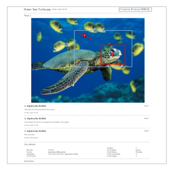

# Drucken und Exportieren von Kommentaren in [!DNL Workfront Proof]

>[!IMPORTANT]
>
>Dieser Artikel bezieht sich auf die Funktionalität im eigenständigen Produkt [!DNL Workfront Proof]. Informationen zum Testen innerhalb von [!DNL Adobe Workfront] finden Sie unter [Testversand](../../../review-and-approve-work/proofing/proofing.md).

## Drucken von Kommentaren

Die Zusammenfassung der Kommentare ist direkt in den folgenden Bereichen abrufbar:

* [Testversand-Viewer](#the-proof-viewer)
* [Die Seite mit den Testdetails](#the-proof-details-page)
* [Das Menü  [!DNL Proof]  Aktionen](#the-proof-actions-menu)

### Testversand-Viewer {#the-proof-viewer}

Sie können die Kommentarzusammenfassung des Testversands, einschließlich der Miniaturansichten oder des Vollbildbilds des Testversands, drucken, indem Sie auf das Symbol **[!UICONTROL Drucken]** im Proof Viewer klicken. Absatz 1

### Die Seite mit den Testdetails {#the-proof-details-page}

Sie können die Kommentarzusammenfassung des Testversands drucken, indem Sie auf der Seite mit den Testversanddetails auf das Symbol **[!UICONTROL Drucken]** klicken. Absatz 2

### Das Menü [!DNL Proof] Aktionen {#the-proof-actions-menu}

Sie können die Kommentarzusammenfassung des Testversands drucken, indem Sie im Menü [!UICONTROL Testversandaktionen] auf das Symbol **[!UICONTROL Drucken]** klicken.

So greifen Sie über eine Listenansicht auf die Seite [!UICONTROL Kommentar-Zusammenfassung] zu:

1. Klicken Sie auf das Menü **[!UICONTROL Aktionen]** . Absatz 3
1. Wählen Sie **[!UICONTROL Kommentare drucken]** aus. Absatz 4

\
Auf der Übersichtsseite Kommentare haben Sie die folgenden Druckoptionen zur Auswahl:

* Miniaturansicht (1)
* Vollständige Seitenansicht (2)
* Seite drucken (3)
* Testversand mit Kommentaren in eine PDF-Datei exportieren (4)
* Exportieren Sie die Testversand-Kommentare in eine [!DNL Excel]-Datei (5)

### Miniaturansicht

Die Miniaturansicht zeigt jeden Kommentar in der richtigen Reihenfolge zusammen mit dem vollständigen Thread für jeden Kommentar an. Sie können auch Kommentare sortieren und die Miniaturansicht für jeden Kommentar mit hinzugefügten Markups anzeigen.

Um die Miniaturansicht zu drucken, klicken Sie auf das Symbol **[!UICONTROL Drucker]** oben rechts auf der Seite und wählen Sie eine der folgenden Optionen aus:

* Sortieren nach Kommentar-ID oder Seite (1)
* Miniaturansicht für jeden Kommentar mit hinzugefügten Markups (2)

### Vollseitenansicht

Die vollständige Seitenansicht zeigt jede Seite in der richtigen Reihenfolge an, zusammen mit den Kommentaren auf dieser Seite und einem Pin, der angibt, wo sich das Markup für den Kommentar auf der Seite befindet.

Um die vollständige Seitenansicht zu drucken, klicken Sie auf das Symbol **[!UICONTROL Drucker]** oben rechts auf der Seite.

## Exportieren einer [!DNL Excel] Zusammenfassung

So laden Sie die [!DNL Excel] -Zusammenfassung herunter:

1. Öffnen Sie das Aktionsmenü des Testversands rechts neben dem Testversand und klicken Sie dann auf **[!UICONTROL [!DNL Excel]summary]** . Absatz 1\
   

So laden Sie die [!DNL Excel] -Zusammenfassung von der Seite mit den Testversanddetails herunter:

1. Klicken Sie auf das Symbol Exportieren in **[!DNL Excel]** . Absatz 2
1. 

## Exportieren nach PDF

Gehen Sie wie folgt vor, um einen Testversand unter Verwendung aller Markierungen und Kommentare an die PDF zu exportieren:

1. Navigieren Sie auf der linken Seite des Bildschirms zu **[!UICONTROL Ansichten]** .
1. Klicken Sie auf das Symbol **[!UICONTROL Mehr]** inline mit einem Testversand und dann auf **[!UICONTROL Kommentare drucken]**.

1. Klicken Sie oben rechts auf der Seite auf das Symbol In PDF exportieren .

   Wenn die PDF fertig ist, erhalten Sie eine E-Mail mit einem Downloadlink.

Alle Kommentare werden im PDF-Reader angezeigt. Wenn einem Kommentar mehrere Markups zugeordnet sind, wird der Kommentar mehrmals in der Kommentarliste angezeigt (einmal pro Markup).

>[!IMPORTANT]
>
>Die Funktion &quot;In PDF exportieren&quot;ist nur für statische Dateien verfügbar.
