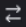

# Korrekturabzüge im Proofing Viewer vergleichen

>[!IMPORTANT]
>
>Dieser Artikel bezieht sich auf Funktionen im eigenständigen [!DNL Workfront Proof]. Informationen zu Proofing in [!DNL Adobe Workfront] finden Sie unter [Proofing](../../../review-and-approve-work/proofing/proofing.md).

Sie können zwei Korrekturabzüge nebeneinander anzeigen. Dabei kann es sich um zwei Versionen desselben Korrekturabzugs oder um zwei komplett separate Korrekturabzüge handeln.

## Korrekturabzugsversionen vergleichen {#compare-proof-versions}

1. Öffnen Sie den Korrekturabzug mit mehreren Versionen, die Sie vergleichen möchten.
1. Klicken Sie in der linken oberen Ecke der angezeigten Proofing-Viewer auf den Namen des Korrekturabzugs. Klicken Sie dann in der angezeigten Liste der Versionen auf das Symbol **Vergleichen** neben der Version, die Sie öffnen und vergleichen möchten.

   

   Die Korrekturabzüge werden nebeneinander angezeigt, die neuere Version auf der linken Seite.

   <!--
   
Separate breadcrumbs above each proof allow you to view and go to the work item associated with the proof:

   -->

   <!--
   
  

   -->

1. Fahren Sie fort mit [Verwenden der Vergleichstools](#use-the-compare-tools).

## Separate Korrekturabzüge vergleichen {#compare-separate-proofs}

Sie können zwei separate Korrekturabzüge vergleichen.

* [Vergleichen von separaten Korrekturabzügen in [!DNL Workfront]](#compare-separate-proofs-in-workfront)
* [Vergleichen von separaten Korrekturabzügen in [!DNL Workfront Proof]](#compare-separate-proofs-in-workfront-proof)

### Vergleichen separater Korrekturabzüge in [!DNL Workfront] {#compare-separate-proofs-in-workfront}

Informationen zum Vergleichen separater Korrekturabzüge aus der Dokumentliste in [!DNL Workfront] finden Sie im Abschnitt [Vergleichen &#x200B;](../../../review-and-approve-work/proofing/reviewing-proofs-within-workfront/review-a-proof/compare-proofs.md#comparing-two-proofs-from-a-document-list) Korrekturabzügen“ im Artikel [Korrekturabzüge vergleichen](../../../review-and-approve-work/proofing/reviewing-proofs-within-workfront/review-a-proof/compare-proofs.md).

### Vergleichen separater Korrekturabzüge in [!DNL Workfront Proof] {#compare-separate-proofs-in-workfront-proof}

>[!NOTE]
>
>Die Testsendungen, die Sie vergleichen, müssen sich im selben Ordner und auf derselben Hierarchieebene innerhalb der Ordnerstruktur befinden. Weitere Informationen zur Verwendung von Ordnern zum Gruppieren von Testsendungen, die Sie vergleichen möchten, finden Sie unter [Arbeiten mit mehreren Testsendungen im Proofing Viewer](../../../workfront-proof/wp-work-proofsfiles/review-proofs-wpv/work-with-multiple-proofs.md)

1. Öffnen Sie einen der Korrekturabzüge, die Sie im Proofing Viewer vergleichen möchten.
1. Klicken Sie auf **[!UICONTROL Symbol &quot;]**&quot;.

   \
   Der Anzeigebereich wird in zwei Hälften geteilt und der Korrekturabzug wird sowohl auf der linken als auch auf der rechten Seite der Korrekturabzugsansicht angezeigt.

   

1. Klicken Sie auf [!UICONTROL Ordner]-Symbol über dem Korrekturabzug entweder auf der linken oder der rechten Seite, um die anderen Korrekturabzüge innerhalb desselben Ordners aufzulisten.

   

1. Klicken Sie in der Liste auf den Namen des Korrekturabzugs, den Sie mit dem derzeit in der Korrekturabzugsansicht geöffneten Korrekturabzug vergleichen möchten.

   

   Beide Korrekturabzüge werden angezeigt.

1. Fahren Sie fort mit [Verwenden der Vergleichstools](#use-the-compare-tools).

## Vergleichstools verwenden {#use-the-compare-tools}

Der Proofing Viewer bietet verschiedene Tools zum effektiven und effizienten Vergleichen von Korrekturabzügen.

* [Korrekturabzüge automatisch vergleichen](#auto-compare-proofs)
* [Testsendungen in einer Überlagerung vergleichen](#compare-proofs-in-an-overlay)
* [Simultaner Navigationsvergleich](#simultaneous-navigation-comparison)

### Korrekturabzüge automatisch vergleichen {#auto-compare-proofs}

Der automatische Vergleich führt einen Pixel-für-Pixel-Vergleich zwischen zwei statischen Korrekturabzügen oder Videoabzügen durch. Alle erkannten Unterschiede werden im Korrekturabzug auf der linken Seite rot hervorgehoben.

Der automatische Vergleich ist beim Vergleichen interaktiver Korrekturabzüge nicht verfügbar.

So vergleichen Sie zwei Korrekturabzüge automatisch:

1. Sie können Korrekturabzüge auf eine der folgenden Arten vergleichen:

   * Vergleichen Sie zwei Versionen desselben Korrekturabzugs (siehe [Korrekturabzugsversionen vergleichen](#compare-proof-versions) in diesem Artikel).
   * Vergleichen Sie zwei separate Korrekturabzüge (siehe [Vergleichen separater Korrekturabzüge](#compare-separate-proofs) in diesem Artikel).

1. Klicken Sie auf das **[!UICONTROL AutoCompare]**-Symbol.

   

   Unterschiede zwischen den beiden Korrekturabzügen werden im Korrekturabzug links rot hervorgehoben.

1. (Optional) Klicken Sie auf **[!UICONTROL Wechseln]**, um die aktive Seite so zu ändern, dass die Unterschiede auf dem Korrekturabzug auf der rechten Seite angezeigt werden. Standardmäßig werden die Unterschiede im Korrekturabzug auf der linken Seite angezeigt.

   

1. (Optional) Klicken Sie auf das Symbol **[!UICONTROL Farbe]**, um die Farbe und Deckkraft zum Hervorheben von Unterschieden zu ändern.

   

### Testsendungen in einer Überlagerung vergleichen {#compare-proofs-in-an-overlay}

Der Überlagerungsvergleich ermöglicht es Ihnen, Unterschiede zwischen zwei statischen Korrekturabzügen anzuzeigen, indem Sie die beiden Korrekturabzüge als einen einzigen Korrekturabzug anzeigen und gleichzeitig eine vertikale Trennlinie in der Mitte des Korrekturabzugs bereitstellen. Wenn Sie den Korrekturabzug über die vertikale Trennlinie schwenken, werden die Unterschiede angezeigt.

>[!NOTE]
>
>Der Überlagerungsvergleich ist beim Vergleichen von Videos oder interaktiven Korrekturabzügen nicht verfügbar.

So aktivieren Sie den Überlagerungsvergleich:

1. Sie können Korrekturabzüge auf eine der folgenden Arten vergleichen:

   * Vergleichen Sie zwei Versionen desselben Korrekturabzugs (siehe [Korrekturabzugsversionen vergleichen](#compare-proof-versions) in diesem Artikel).
   * Vergleichen Sie zwei separate Korrekturabzüge (siehe [Vergleichen separater Korrekturabzüge](#compare-separate-proofs) in diesem Artikel).

1. Klicken Sie auf das **[!UICONTROL Überlagern]**-Symbol.

   

   Die beiden Korrekturabzüge werden als einzelner Korrekturabzug mit einer vertikalen Trennlinie in der Mitte des Korrekturabzugs angezeigt.

1. Führen Sie einen der folgenden Schritte aus:

   * Schwenken Sie den Korrekturabzug über die vertikale Trennlinie. Während Sie schwenken, sehen Sie den Korrekturabzug links auf der linken Seite der vertikalen Trennlinie, während der Korrekturabzug rechts auf der rechten Seite angezeigt wird.
   * Verschieben Sie die vertikale Trennlinie nach links und rechts. Wenn Sie die Trennlinie verschieben, sehen Sie den Korrekturabzug auf der linken Seite der vertikalen Trennlinie, während der Korrekturabzug auf der rechten Seite angezeigt wird.

### Simultaner Navigationsvergleich {#simultaneous-navigation-comparison}

Die gleichzeitige Navigation ist beim Vergleichen von Korrekturabzügen standardmäßig aktiviert. Sie ist verfügbar, wenn Sie einen statischen Korrekturabzug mit einem statischen Korrekturabzug vergleichen oder wenn Sie einen Videokorrektur und einen Videokorrektur vergleichen. Er ist beim Vergleichen eines statischen Korrekturabzugs mit einem Videokorrektur nicht verfügbar.

**Statische Korrekturabzüge:** Wenn sie für statische Korrekturabzüge aktiviert sind, wird durch die gleichzeitige Navigation der Zoom-Faktor und die Position der beiden Korrekturabzüge beim Schwenken oder Scrollen gesperrt. Wenn ein Korrekturabzug mehrere Seiten enthält und die gleichzeitige Navigation aktiviert ist, führt das Ändern der Seiten in einem Korrekturabzug dazu, dass sich die Seite in dem anderen Korrekturabzug ändert.

**Video-Korrekturabzüge:** Wenn diese Option für Video-Korrekturabzüge aktiviert ist, wird bei der gleichzeitigen Navigation die Zeitdifferenz in den Timelines der beiden Korrekturabzüge gespeichert.

So aktivieren Sie die gleichzeitige Navigation, falls noch nicht aktiviert:

1. Sie können Korrekturabzüge auf eine der folgenden Arten vergleichen:

   * Vergleichen Sie zwei Versionen desselben Korrekturabzugs (siehe [Korrekturabzugsversionen vergleichen](#compare-proof-versions) in diesem Artikel).
   * Vergleichen Sie zwei separate Korrekturabzüge (siehe [Vergleichen separater Korrekturabzüge](#compare-separate-proofs) in diesem Artikel).

1. Klicken Sie auf **[!UICONTROL Symbol]** Simultane Navigation“.

   

1. (Optional) Klicken Sie jederzeit auf **[!UICONTROL Zurücksetzen]**, um den Zoom und die Position (für statische Korrekturabzüge) oder die Zeitleiste (für Videoprüfungen) zurückzusetzen.

   

## Vergleichsmodus beenden

1. Schließen Sie den Korrekturabzug, den Sie nicht mehr anzeigen möchten, indem Sie auf das (x)-Symbol in der linken oberen Ecke des Korrekturabzugs klicken.

   

   Der Korrekturabzug, den Sie nicht schließen, bleibt in der Korrekturabzugsansicht geöffnet.
