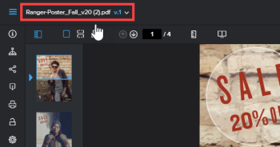

# Anzeigen früherer Korrekturabzugsversionen im Web Proofing Viewer

>[!IMPORTANT]
>
>Dieser Artikel bezieht sich auf Funktionen im eigenständigen [!DNL Workfront Proof]. Informationen zu Proofing in [!DNL Adobe Workfront] finden Sie unter [Proofing](../../../review-and-approve-work/proofing/proofing.md).

>[!NOTE]
>
>Die in diesem Abschnitt beschriebenen Informationen sind nur mit dem Web Proofing Viewer und nur bei der Überprüfung von Videos oder statischen (nicht interaktiven) Korrekturabzügen verfügbar.

Wenn vorhanden, können Sie eine frühere Version eines Korrekturabzugs anzeigen. Frühere Versionen sind standardmäßig gesperrt. Sie können keine Kommentare hinzufügen oder eine Entscheidung in einer gesperrten Version ändern.

So zeigen Sie eine frühere Version an:

1. Öffnen Sie den Korrekturabzug.
1. Klicken Sie in der linken oberen Ecke der Korrekturabzugsansicht auf den Namen des Korrekturabzugs.

   

1. Klicken Sie in der angezeigten Liste auf die Version, die Sie anzeigen möchten.
1. (Optional) Zum Entsperren der Version, wenn Benutzer Kommentare hinzufügen oder eine Entscheidung ändern können sollen, klicken Sie mit entsprechenden Berechtigungen im linken Bereich auf das Symbol **[!UICONTROL Entsperren]** und anschließend auf **[!UICONTROL Ja, Entsperren]**.
